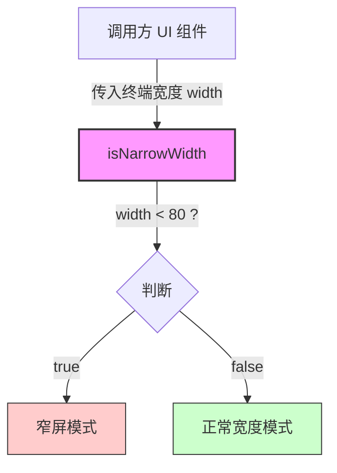

# isNarrowWidth.ts

## 概述

`isNarrowWidth.ts` 是一个极简的工具函数模块，用于判断给定的终端宽度是否属于"窄屏"。该函数在 Gemini CLI 的 UI 渲染层中被广泛使用，以实现响应式终端布局 —— 当终端宽度不足 80 列时，UI 组件可以据此切换为紧凑或简化的显示模式。

**源文件路径**: `packages/cli/src/ui/utils/isNarrowWidth.ts`

## 架构图（Mermaid）

## 核心组件

### `isNarrowWidth(width: number): boolean`

| 属性 | 说明 |
|------|------|
| **参数** | `width: number` — 终端的列宽（字符数） |
| **返回值** | `boolean` — 当 `width < 80` 时返回 `true`，否则返回 `false` |
| **导出方式** | 命名导出（`export function`） |

**阈值说明**: 80 列是终端界面设计中的经典标准宽度（源自早期 VT100 终端的 80 列标准）。当终端宽度低于该值时，许多 UI 元素（如表格、代码块、Markdown 渲染等）可能无法正常显示，因此需要切换到紧凑布局。

## 依赖关系

### 内部依赖

无。该函数是一个纯函数，不依赖项目中的任何其他模块。

### 外部依赖

无。该函数不使用任何第三方库或 Node.js 内置模块。

## 关键实现细节

1. **纯函数设计**: 该函数没有副作用，不依赖全局状态，给定相同输入始终返回相同输出，非常适合在 React/Ink 组件的渲染逻辑中安全调用。

2. **硬编码阈值 80**: 宽度阈值直接硬编码为 `80`，没有通过参数或配置进行外部化。这是一个刻意的设计选择——80 列作为"窄屏"分界线在终端应用中是广泛认可的标准。

3. **严格小于比较**: 使用 `<`（严格小于）而非 `<=`（小于等于），意味着恰好 80 列宽度的终端 **不** 被视为窄屏。这确保了标准 80 列终端能享受完整的 UI 体验。

4. **许可证声明**: 文件头部包含 Apache 2.0 许可证声明，归属 Google LLC，表明该文件是 Google 开源项目的一部分。
