# markdownParsingUtils.ts

## 概述

`markdownParsingUtils.ts` 提供了一套将 **Markdown 内联语法转换为 ANSI 转义码字符串** 的工具函数。与 `MarkdownDisplay.tsx` 中的 Ink/React 组件渲染不同，本模块生成的是**纯 ANSI 字符串**，适用于不通过 React 渲染管线而直接输出到终端的场景（例如日志输出、进度提示、非 Ink 上下文中的文本格式化等）。

其解析逻辑与 `InlineMarkdownRenderer.tsx` 保持一致（镜像实现），支持以下内联 Markdown 语法：

- `***粗斜体***`（粗体 + 斜体）
- `**粗体**`
- `*斜体*` / `_斜体_`
- `~~删除线~~`
- `` `行内代码` ``
- `[链接文本](URL)`
- `<u>下划线</u>`
- 自动识别的裸 URL（`https://...`）

**源文件路径**: `packages/cli/src/ui/utils/markdownParsingUtils.ts`

## 架构图（Mermaid）

```mermaid
graph TD
    A[parseMarkdownToANSI] -->|输入文本| B{快速预检}
    B -->|无 Markdown 标记| C[直接着色返回]
    B -->|含 Markdown 标记| D[正则匹配循环]

    D --> E{匹配类型判断}
    E -->|***...***| F[粗斜体: chalk.bold + chalk.italic]
    E -->|**...**| G[粗体: chalk.bold]
    E -->|*...* / _..._| H[斜体: chalk.italic]
    E -->|~~...~~| I[删除线: chalk.strikethrough]
    E -->|`...`| J[行内代码: accent 着色]
    E -->|链接 文本+URL| K[链接文本 + URL 着色]
    E -->|<u>...</u>| L[下划线: chalk.underline]
    E -->|https://...| M[URL: link 着色]

    F -->|递归| A
    G -->|递归| A
    H -->|递归| A
    I -->|递归| A
    K -->|递归处理链接文本| A
    L -->|递归| A

    D --> N[拼接未匹配段 + 匹配段]
    N --> O[返回 ANSI 字符串]

    subgraph ansiColorize 着色函数
        P[ansiColorize] -->|无颜色| Q[原样返回]
        P -->|# 开头| R[chalk.hex]
        P -->|颜色名映射到 hex| S[chalk.hex 映射]
        P -->|标准颜色名| T[chalk 对应方法]
    end

    A -.->|调用| P
    F -.->|调用| P
    J -.->|调用| P
    K -.->|调用| P
    M -.->|调用| P

    style A fill:#4a9eff,stroke:#333,color:#fff
    style P fill:#66bb6a,stroke:#333,color:#fff
```



## 核心组件

### 1. `parseMarkdownToANSI(text: string, defaultColor?: string): string`

**公开导出的主函数**，将 Markdown 文本转换为带 ANSI 转义码的彩色字符串。

| 属性 | 说明 |
|------|------|
| **参数 `text`** | 输入的 Markdown 文本 |
| **参数 `defaultColor`** | 默认文本颜色（可选，默认为 `theme.text.primary`） |
| **返回值** | 包含 ANSI 转义码的格式化字符串 |

#### 快速预检机制

函数入口处使用正则 `/[*_~`<[https?:]/` 进行快速扫描。若文本中不包含任何可能的 Markdown 标记字符，则跳过解析直接返回着色后的纯文本。这是一项重要的性能优化。

#### 正则匹配引擎

使用一个综合性正则表达式：

```regex
/(\*\*\*.*?\*\*\*|\*\*.*?\*\*|\*.*?\*|_.*?_|~~.*?~~|\[.*?\]\(.*?\)|`+.+?`+|<u>.*?<\/u>|https?:\/\/\S+)/g
```

该正则通过 `|` 交替匹配所有支持的内联语法，采用非贪婪量词 `*?` 确保最短匹配。匹配按优先级排列（`***` > `**` > `*`），利用正则引擎的左优先原则确保正确匹配。

#### 递归解析

对于粗体、斜体、删除线、下划线等语法的**内部文本**，会**递归调用** `parseMarkdownToANSI` 进行处理，从而支持嵌套 Markdown 语法（例如 `**粗体中的*斜体***`）。

#### 斜体的额外验证

斜体匹配 (`*...*` / `_..._`) 有额外的边界检查：
- 匹配前后不能紧邻单词字符（`\w`）
- 匹配前后不能紧邻路径分隔符（`.`/`/`/`\`）

这避免了将文件路径（如 `path/to/file`）或带星号的标识符（如 `some_var_name`）误识别为斜体。

### 2. `ansiColorize(str: string, color: string | undefined): string`

**私有辅助函数**，将给定字符串包装为指定颜色的 ANSI 转义码。

| 颜色格式 | 处理方式 |
|----------|----------|
| `undefined` / 空 | 原样返回 |
| `#RRGGBB` 十六进制 | 使用 `chalk.hex()` |
| Ink 颜色名（映射到 hex） | 通过 `INK_NAME_TO_HEX_MAP` 查找后使用 `chalk.hex()` |
| 标准颜色名（black/red/green 等） | 使用 `chalk` 对应的方法（如 `chalk.red()`） |
| 不可识别的颜色 | 原样返回 |

支持的标准颜色名：`black`、`red`、`green`、`yellow`、`blue`、`magenta`、`cyan`、`white`、`gray`/`grey`。

### 3. 常量定义

| 常量 | 值 | 说明 |
|------|-----|------|
| `BOLD_MARKER_LENGTH` | 2 | `**` 标记长度 |
| `ITALIC_MARKER_LENGTH` | 1 | `*` 或 `_` 标记长度 |
| `STRIKETHROUGH_MARKER_LENGTH` | 2 | `~~` 标记长度 |
| `INLINE_CODE_MARKER_LENGTH` | 1 | `` ` `` 标记长度 |
| `UNDERLINE_TAG_START_LENGTH` | 3 | `<u>` 标签长度 |
| `UNDERLINE_TAG_END_LENGTH` | 4 | `</u>` 标签长度 |

## 依赖关系

### 内部依赖

| 模块 | 导入 | 用途 |
|------|------|------|
| `../themes/color-utils.js` | `resolveColor`, `INK_SUPPORTED_NAMES`, `INK_NAME_TO_HEX_MAP` | 颜色解析和映射工具——将主题颜色名转换为 chalk 可用的格式 |
| `../semantic-colors.js` | `theme` | 语义化颜色主题，提供 `text.primary`、`text.accent`、`text.link` 等颜色 |
| `@google/gemini-cli-core` | `debugLogger` | 调试日志记录器，用于记录解析异常 |

### 外部依赖

| 库 | 导入 | 用途 |
|----|------|------|
| `chalk` | 默认导入 | ANSI 终端颜色/样式库——提供 `bold`、`italic`、`strikethrough`、`underline`、`hex` 等方法 |

## 关键实现细节

1. **与 InlineMarkdownRenderer.tsx 的镜像关系**: 本模块的解析逻辑是 `InlineMarkdownRenderer.tsx`（React/Ink 组件版本）的 ANSI 字符串对等实现。两者处理相同的 Markdown 子集，但输出形式不同——一个输出 React 元素，一个输出 ANSI 字符串。修改其中一个时应同步修改另一个。

2. **颜色解析的三层回退**: `ansiColorize` 函数的颜色解析策略为：
   - 第一层：直接识别 `#RRGGBB` 格式
   - 第二层：通过 `INK_NAME_TO_HEX_MAP` 映射非标准颜色名到 hex
   - 第三层：通过 `INK_SUPPORTED_NAMES` 识别标准颜色名并调用 chalk 对应方法
   - 回退：无法识别则原样返回

3. **行内代码的反引号匹配**: 行内代码使用 `/^(`+)(.+?)\1$/s` 进行匹配，其中 `\1` 反向引用确保开闭反引号数量一致（支持 ``` `` 双反引号 `` ``` 等场景）。`s` 标志使 `.` 匹配换行符。

4. **异常容错**: 每个匹配分支的处理都包裹在 `try-catch` 中。若某个匹配项的处理抛出异常，会通过 `debugLogger.warn` 记录警告并将 `styledPart` 设为空字符串，最终回退到以默认颜色显示原始匹配文本（`result += styledPart || ansiColorize(fullMatch, baseColor)`）。

5. **链接渲染格式**: Markdown 链接 `[text](url)` 被渲染为 `text (url)` 的形式——链接文本保持默认色并递归解析内联格式，URL 使用 `theme.text.link` 着色，括号使用默认色。

6. **粗斜体的优先级处理**: 正则中 `***` 排在 `**` 和 `*` 之前，确保 `***粗斜体***` 被正确识别为粗斜体，而不是被拆分为粗体 + 斜体。
