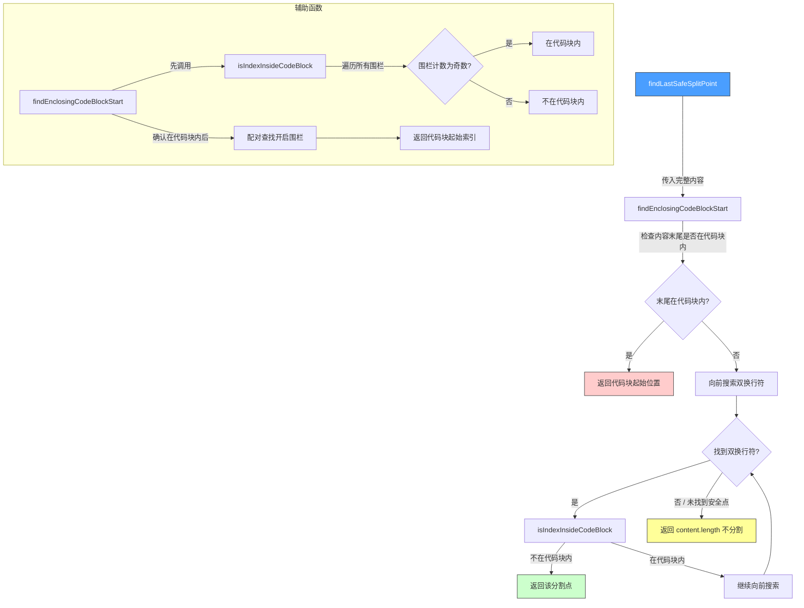

# markdownUtilities.ts

## 概述

`markdownUtilities.ts` 提供了一组用于**安全分割 Markdown 文本**的工具函数。在处理来自 LLM（如 Gemini）的流式或大块 Markdown 内容时，常常需要将文本拆分为多个片段以适配显示（例如消息气泡、终端高度限制等）。朴素的按字符数截断会破坏 Markdown 格式——尤其是代码块（围栏式 ` ``` `），导致渲染异常。

本模块的核心能力是**找到"安全"的分割点**，确保分割不会破坏 Markdown 结构完整性，优先级如下：

1. **代码块完整性**（最高优先级）: 绝不在代码块内部分割
2. **段落边界**: 优先在双换行符（`\n\n`）处分割
3. **保持完整**: 找不到安全分割点时保持内容不拆分

**源文件路径**: `packages/cli/src/ui/utils/markdownUtilities.ts`

## 架构图（Mermaid）



## 核心组件

### 1. `findLastSafeSplitPoint(content: string): number`

**公开导出的主函数**，在给定的 Markdown 内容中查找最后一个安全分割点。

| 属性 | 说明 |
|------|------|
| **参数 `content`** | 完整的 Markdown 文本字符串 |
| **返回值** | 安全分割点的字符索引（`number`） |

#### 分割策略

1. **检查末尾是否在代码块内**: 调用 `findEnclosingCodeBlockStart` 检查 `content.length` 位置是否位于某个未闭合的代码块内。若是，返回该代码块的起始位置作为分割点——这意味着未闭合的代码块将被完整保留到下一个片段中。

2. **搜索安全的双换行符**: 从内容末尾向前搜索 `\n\n`（段落分隔符）。找到后检查该位置是否在代码块内部（通过 `isIndexInsideCodeBlock`）。若不在，返回 `dnlIndex + 2`（即双换行符之后的位置）作为分割点。若在代码块内部，继续向前搜索。

3. **不分割回退**: 若找不到任何安全的分割点，返回 `content.length`——即保持内容不拆分。

### 2. `isIndexInsideCodeBlock(content: string, indexToTest: number): boolean`

**私有辅助函数**，判断给定字符索引是否位于围栏代码块内部。

| 属性 | 说明 |
|------|------|
| **参数 `content`** | 完整的 Markdown 文本 |
| **参数 `indexToTest`** | 要测试的字符索引 |
| **返回值** | `true` 表示在代码块内部，`false` 表示不在 |

#### 算法原理

从字符串开头向前遍历所有 `` ``` `` 围栏标记，统计在 `indexToTest` 之前出现的围栏数量。若围栏计数为**奇数**，说明最后一个围栏是"开启"围栏而尚未有对应的"关闭"围栏，因此该索引位于代码块内部。

### 3. `findEnclosingCodeBlockStart(content: string, index: number): number`

**私有辅助函数**，查找包含给定索引的代码块的起始位置。

| 属性 | 说明 |
|------|------|
| **参数 `content`** | 完整的 Markdown 文本 |
| **参数 `index`** | 要检查的字符索引 |
| **返回值** | 包围该索引的代码块起始位置，不在代码块内则返回 `-1` |

#### 算法原理

1. 首先调用 `isIndexInsideCodeBlock` 确认该索引确实在代码块内部
2. 然后从字符串开头逐对匹配 `` ``` `` 围栏（开启 + 关闭），找到包含目标索引的那一对
3. 返回开启围栏的起始位置

## 依赖关系

### 内部依赖

无。本模块是纯逻辑函数，不依赖项目中的任何其他模块。

### 外部依赖

无。本模块不使用任何第三方库或 Node.js 内置模块。

## 关键实现细节

1. **纯字符串操作**: 所有函数都是纯函数，仅使用 `string.indexOf`、`string.lastIndexOf` 等基础字符串方法，没有使用正则表达式。这使得实现简洁高效，适合处理大块文本。

2. **围栏计数法判断代码块**: `isIndexInsideCodeBlock` 使用"围栏计数奇偶性"判断——这是一种经典且高效的方法。每遇到一个 `` ``` ``，围栏状态就翻转一次（打开/关闭）。奇数次表示当前在代码块内，偶数次表示在代码块外。

3. **仅处理三反引号围栏**: 当前实现只识别 `` ``` ``（三反引号）作为代码块围栏，**不支持** `~~~`（波浪号围栏）。这在大多数场景下足够，因为 LLM 输出通常使用反引号围栏。但若需要完全的 CommonMark 兼容，波浪号围栏是需要补充的。

4. **未闭合代码块的特殊处理**: 当 `findLastSafeSplitPoint` 发现内容末尾位于未闭合的代码块内时（这在流式生成场景中很常见——代码块还在生成中），会将分割点设在代码块起始处之前。这确保了：
   - 前一个片段是完整的 Markdown（不包含未闭合的代码块）
   - 后一个片段以代码块开头（完整性保留给后续处理）

5. **双换行符后置分割**: 搜索双换行符时，返回的分割点是 `dnlIndex + 2`（双换行符之后），而非 `dnlIndex`（双换行符之前）。这意味着双换行符会被包含在前一个片段中，使前一个片段以段落结束的标准格式收尾。

6. **代码块内的换行符安全检查**: 即使找到了双换行符，也会检查该位置是否在代码块内部。代码块中可能包含空行（双换行），在这种位置分割会破坏代码块的完整性。

7. **向前搜索的进度保证**: 当某个双换行符位于代码块内部时，下一次搜索从 `dnlIndex - 1` 开始（即当前双换行符之前），确保搜索不会陷入无限循环。

8. **文件头部的详尽文档注释**: 源文件包含一段极其详尽的块注释，描述了 `findSafeSplitPoint` 函数的设计背景、优先级策略和行为预期。值得注意的是，注释中提到了 `findSafeSplitPoint` 函数名，但实际导出的函数名为 `findLastSafeSplitPoint`——这可能是重构过程中文档未同步更新的结果。
