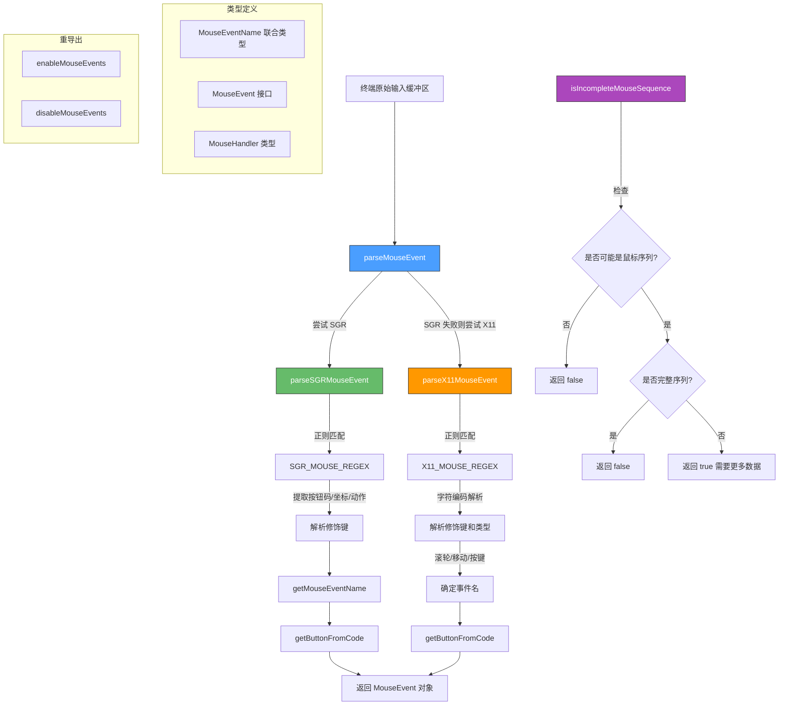

# mouse.ts

## 概述

`mouse.ts` 是 Gemini CLI 的**终端鼠标事件处理模块**，负责解析终端传入的鼠标输入序列并将其转换为结构化的鼠标事件对象。终端应用通过特定的转义序列协议与终端仿真器通信来接收鼠标输入，本模块支持两种主流协议：

- **SGR (Select Graphic Rendition) 扩展鼠标协议**: 现代终端的首选方式，支持大坐标值和精确的按下/释放区分
- **X11 传统鼠标协议**: 兼容更老的终端仿真器，坐标范围有限（最大 223）

该模块支持的鼠标事件类型包括：
- 鼠标按键按下/释放（左键、中键、右键）
- 滚轮滚动（上、下、左、右）
- 鼠标移动
- 双击检测（通过阈值和距离容差）

**源文件路径**: `packages/cli/src/ui/utils/mouse.ts`

## 架构图（Mermaid）



## 核心组件

### 1. 类型定义

#### `MouseEventName` 联合类型

所有可能的鼠标事件名称：

| 事件名 | 说明 |
|--------|------|
| `'left-press'` | 左键按下 |
| `'left-release'` | 左键释放 |
| `'right-press'` | 右键按下 |
| `'right-release'` | 右键释放 |
| `'middle-press'` | 中键按下 |
| `'middle-release'` | 中键释放 |
| `'scroll-up'` | 向上滚动 |
| `'scroll-down'` | 向下滚动 |
| `'scroll-left'` | 向左滚动 |
| `'scroll-right'` | 向右滚动 |
| `'move'` | 鼠标移动 |
| `'double-click'` | 双击 |

#### `MouseEvent` 接口

```typescript
interface MouseEvent {
  name: MouseEventName;   // 事件名称
  col: number;            // 列坐标（从1开始）
  row: number;            // 行坐标（从1开始）
  shift: boolean;         // Shift 键是否按下
  meta: boolean;          // Meta/Alt 键是否按下
  ctrl: boolean;          // Ctrl 键是否按下
  button: 'left' | 'middle' | 'right' | 'none';  // 按钮标识
}
```

#### `MouseHandler` 类型

```typescript
type MouseHandler = (event: MouseEvent) => void | boolean;
```

鼠标事件处理函数类型，返回 `boolean` 时可用于表示事件是否已被消费。

### 2. 常量

| 常量 | 值 | 说明 |
|------|-----|------|
| `DOUBLE_CLICK_THRESHOLD_MS` | 400 | 双击判定的最大时间间隔（毫秒） |
| `DOUBLE_CLICK_DISTANCE_TOLERANCE` | 2 | 双击判定的最大位移容差（字符单位） |

### 3. 核心函数

#### `parseMouseEvent(buffer: string): { event: MouseEvent; length: number } | null`

**统一入口函数**，尝试从输入缓冲区解析鼠标事件。优先尝试 SGR 协议，失败后尝试 X11 协议。

| 属性 | 说明 |
|------|------|
| **参数 `buffer`** | 终端输入缓冲区字符串 |
| **返回值** | `{ event, length }` 或 `null`。`length` 表示消耗的字符数 |

#### `parseSGRMouseEvent(buffer: string): { event: MouseEvent; length: number } | null`

解析 SGR 扩展鼠标协议序列。SGR 序列格式：`ESC [ < Cb ; Cx ; Cy M/m`

- `Cb`: 按钮码（十进制数字）
- `Cx`: 列坐标（十进制数字）
- `Cy`: 行坐标（十进制数字）
- `M`: 按下事件 / `m`: 释放事件

**按钮码的位字段解码**:

| 位 | 掩码 | 含义 |
|----|------|------|
| 0-1 | `& 3` | 按钮编号（0=左, 1=中, 2=右） |
| 2 | `& 4` | Shift 键 |
| 3 | `& 8` | Meta/Alt 键 |
| 4 | `& 16` | Ctrl 键 |
| 5 | `& 32` | 移动事件标记 |
| 6 | `& 64` | 滚轮事件标记 |

特殊按钮码：`66` = 向左滚动, `67` = 向右滚动。

#### `parseX11MouseEvent(buffer: string): { event: MouseEvent; length: number } | null`

解析 X11 传统鼠标协议序列。X11 序列格式：`ESC [ M Cb Cx Cy`

- `Cb`, `Cx`, `Cy` 各为单字节，值 = 字符 ASCII 码 - 32

**与 SGR 的关键区别**:
- X11 协议中释放事件的按钮码为 `3`（不区分释放的是哪个按钮），模块将其默认解析为 `'left-release'`
- 坐标范围受限于 ASCII 可打印字符范围（最大 223）
- 不支持向左/向右滚动

#### `getMouseEventName(buttonCode: number, isRelease: boolean): MouseEventName | null`

根据 SGR 按钮码和释放标志确定事件名称。

**判定优先级**:
1. 按钮码 66/67 -> 水平滚动
2. 第 6 位（`& 64`）-> 垂直滚动（第 0 位区分上/下）
3. 第 5 位（`& 32`）-> 鼠标移动
4. 其他 -> 按键按下/释放（由低 2 位和 `isRelease` 决定）

#### `getButtonFromCode(code: number): MouseEvent['button']`

**私有辅助函数**，从按钮码提取按钮标识。

| 低 2 位值 | 返回 |
|-----------|------|
| 0 | `'left'` |
| 1 | `'middle'` |
| 2 | `'right'` |
| 其他 | `'none'` |

#### `isIncompleteMouseSequence(buffer: string): boolean`

判断输入缓冲区是否包含一个**不完整的**鼠标事件序列（即前缀匹配但尚未接收完毕）。用于输入缓冲管理——当检测到不完整序列时，应等待更多数据而非将其作为普通输入处理。

**判定逻辑**:
1. 调用 `inputCouldBeMouseSequence` 检查缓冲区是否有可能是鼠标序列前缀
2. 若已是完整序列（`parseMouseEvent` 成功），则不是"不完整的"
3. X11 协议：前缀后需恰好 3 字节才完整
4. SGR 协议：需以 `m` 或 `M` 结尾才完整（加 50 字符长度上限防止垃圾数据阻塞）
5. 其他情况（如仅有 `ESC` 或 `ESC [`）也视为不完整

### 4. 重导出

| 函数 | 来源 | 说明 |
|------|------|------|
| `enableMouseEvents` | `@google/gemini-cli-core` | 启用终端鼠标事件报告 |
| `disableMouseEvents` | `@google/gemini-cli-core` | 禁用终端鼠标事件报告 |

## 依赖关系

### 内部依赖

| 模块 | 导入 | 用途 |
|------|------|------|
| `@google/gemini-cli-core` | `enableMouseEvents`, `disableMouseEvents` | 终端鼠标事件的启用/禁用（通过终端转义序列控制） |
| `./input.js` | `SGR_MOUSE_REGEX`, `X11_MOUSE_REGEX`, `SGR_EVENT_PREFIX`, `X11_EVENT_PREFIX`, `couldBeMouseSequence` | 鼠标事件的正则表达式模式和前缀常量 |

### 外部依赖

无。本模块不使用任何第三方库。

## 关键实现细节

1. **双协议支持与优先级**: `parseMouseEvent` 优先尝试 SGR 协议（现代、精确），失败后回退到 X11 协议（兼容性更好）。这种设计确保了在不同终端仿真器下的广泛兼容性。

2. **位字段解码**: 鼠标按钮码使用位字段编码——不同的位代表不同信息（按钮、修饰键、事件类型）。通过位运算 `&`（与）提取各字段，是终端协议编程的标准做法。

3. **X11 释放事件的局限性**: X11 协议在释放事件中不标识具体的按钮（统一使用码 `3`），模块将其默认解析为 `'left-release'`。注释中明确说明这是一种"最佳努力猜测"。若需精确追踪按钮释放，需要在上层维护按钮状态。

4. **X11 坐标偏移量 32**: X11 协议将坐标编码为 `实际值 + 32` 的 ASCII 字符，这是为了避免控制字符（ASCII 0-31）干扰终端。解码时需减去 32。

5. **SGR 水平滚动支持**: 按钮码 66 和 67 被映射为向左/向右滚动——这是 SGR 扩展协议的特性，X11 协议不支持此功能。

6. **不完整序列检测的实用性**: `isIncompleteMouseSequence` 对于正确处理终端输入至关重要。终端输入可能以分片形式到达（尤其在网络终端中），如果将鼠标序列的前半部分当作普通键盘输入处理，会导致乱码和意外行为。SGR 协议的不完整检测额外加入了 50 字符的长度上限，防止垃圾数据导致无限期等待。

7. **双击检测参数**: 模块导出了 `DOUBLE_CLICK_THRESHOLD_MS`（400ms）和 `DOUBLE_CLICK_DISTANCE_TOLERANCE`（2字符），但双击检测的实际逻辑不在本模块中——这些常量供上层组件使用，结合时间戳和坐标差异来判定双击。`'double-click'` 事件名被包含在 `MouseEventName` 类型中，但本模块的解析函数不会直接生成该事件。

8. **长度返回值的作用**: 解析函数返回的 `length` 字段表示该鼠标事件在原始缓冲区中消耗的字符数。调用方可用此值从缓冲区中移除已处理的部分，正确处理同一缓冲区中包含多个事件的情况。

9. **事件命名的一致性模式**: 所有按键事件使用 `{button}-{action}` 格式（如 `left-press`、`right-release`），滚动事件使用 `scroll-{direction}` 格式，移动事件为 `move`。这种统一命名使上层处理逻辑更加清晰。
