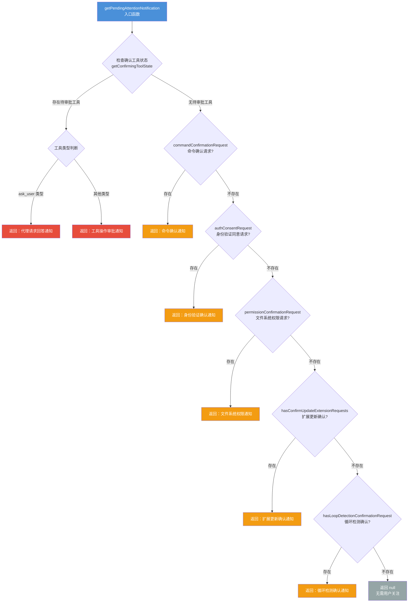

# pendingAttentionNotification.ts

## 概述

`pendingAttentionNotification.ts` 是 Gemini CLI 用户界面中的**待处理注意力通知**模块。它负责检测当前会话中是否存在需要用户关注的事件（如工具审批、命令确认、身份验证同意、文件系统权限请求、扩展更新确认、循环检测确认等），并生成结构化的通知对象。该通知最终会被终端通知系统消费，以系统级通知（如 OSC 9 序列）的方式提醒用户回到终端进行操作。

该模块的核心设计思想是**优先级链式判断**：按照预定义的优先级顺序逐一检查六种需要用户注意的情况，返回第一个匹配的通知，保证同一时刻只弹出最重要的那个通知。

## 架构图（Mermaid）



## 核心组件

### 1. 接口 `PendingAttentionNotification`

```typescript
export interface PendingAttentionNotification {
  key: string;                          // 唯一标识符，用于通知去重
  event: RunEventNotificationEvent;     // 通知事件载荷
}
```

- **`key`**：由通知类型前缀和上下文标识拼接而成（如 `ask_user:{callId}`、`command_confirmation:{promptKey}`），确保同一事件不会重复触发通知。
- **`event`**：包含 `type`（固定为 `'attention'`）、`heading`（通知标题）、`detail`（通知详情文本）三个字段。

### 2. 辅助函数 `keyFromReactNode`

```typescript
function keyFromReactNode(node: ReactNode): string
```

将 React 节点递归转换为字符串 key。处理三种情况：
- **字符串/数字**：直接转为字符串。
- **数组**：递归映射每个元素，用 `|` 分隔连接。
- **其他类型**（React 元素、Fragment 等）：返回固定字符串 `'react-node'`。

该函数用于从 `ConfirmationRequest.prompt`（类型为 `ReactNode`）中提取稳定的去重 key。

### 3. 核心函数 `getPendingAttentionNotification`

```typescript
export function getPendingAttentionNotification(
  pendingHistoryItems: HistoryItemWithoutId[],
  commandConfirmationRequest: ConfirmationRequest | null,
  authConsentRequest: ConfirmationRequest | null,
  permissionConfirmationRequest: PermissionConfirmationRequest | null,
  hasConfirmUpdateExtensionRequests: boolean,
  hasLoopDetectionConfirmationRequest: boolean,
): PendingAttentionNotification | null
```

**参数说明：**

| 参数 | 类型 | 说明 |
|------|------|------|
| `pendingHistoryItems` | `HistoryItemWithoutId[]` | 待处理的历史条目，包含工具调用等信息 |
| `commandConfirmationRequest` | `ConfirmationRequest \| null` | 命令确认请求（如 shell 命令执行确认） |
| `authConsentRequest` | `ConfirmationRequest \| null` | 身份验证同意请求 |
| `permissionConfirmationRequest` | `PermissionConfirmationRequest \| null` | 文件系统权限确认请求（含 `files` 字段） |
| `hasConfirmUpdateExtensionRequests` | `boolean` | 是否有扩展更新确认请求 |
| `hasLoopDetectionConfirmationRequest` | `boolean` | 是否有循环检测确认请求 |

**返回值：** `PendingAttentionNotification | null`，null 表示当前无需用户关注。

**优先级顺序（从高到低）：**

1. **工具审批通知**（通过 `getConfirmingToolState` 检测）
   - 子类型 `ask_user`：代理向用户提问，key 前缀为 `ask_user:`
   - 子类型 其他：工具操作审批，key 前缀为 `tool_confirmation:`
2. **命令确认通知**：key 前缀为 `command_confirmation:`
3. **身份验证确认通知**：key 前缀为 `auth_consent:`
4. **文件系统权限通知**：key 前缀为 `filesystem_permission_confirmation:`，使用文件路径列表作为 key 后缀
5. **扩展更新确认通知**：固定 key `extension_update_confirmation`
6. **循环检测确认通知**：固定 key `loop_detection_confirmation`

## 依赖关系

### 内部依赖

| 模块 | 导入内容 | 用途 |
|------|----------|------|
| `../types.js` | `ConfirmationRequest`, `HistoryItemWithoutId`, `PermissionConfirmationRequest` | UI 层类型定义 |
| `../../utils/terminalNotifications.js` | `RunEventNotificationEvent` | 通知事件类型，定义了 `attention` 和 `session_complete` 两种事件格式 |
| `./confirmingTool.js` | `getConfirmingToolState` | 从待处理历史条目中提取当前需要审批的工具状态 |

### 外部依赖

| 包 | 导入内容 | 用途 |
|---|----------|------|
| `react` | `ReactNode` | React 节点类型，用于 `keyFromReactNode` 函数的参数类型声明 |

## 关键实现细节

1. **链式短路求值**：函数使用 `if-return` 链式结构，一旦匹配到某个需要关注的情况就立即返回，不会继续检查低优先级的情况。这确保了在多个同时存在的确认请求中，用户只会收到最重要的那一个通知。

2. **通知去重机制**：每个通知都有唯一的 `key`，由类型前缀和上下文标识（如 `callId`、文件路径列表等）组成。上游消费者可通过比较 key 来判断通知是否已经发送过，避免对同一事件重复弹出通知。

3. **ReactNode 到 key 的转换**：`keyFromReactNode` 函数是一个优雅的降级策略——对于简单文本类型的 prompt 可以生成精确的 key，而对于复杂的 React 组件则降级为通用字符串 `'react-node'`。这在大多数情况下已足够去重，因为同时存在两个复杂 React 组件作为 prompt 的场景极为罕见。

4. **`ask_user` 特殊处理**：当工具的确认详情类型为 `ask_user` 时，通知标题从默认的"Approval required"变为"Answer requested by agent"，detail 内容取第一个问题的 header，使通知信息更贴合实际场景。

5. **与终端通知系统的对接**：返回的 `event` 对象的 `type` 固定为 `'attention'`，这对应 `RunEventNotificationEvent` 联合类型中的一种。终端通知系统（`terminalNotifications.ts`）会根据此类型使用 OSC 9 转义序列向操作系统发送桌面通知，从而在用户切换到其他窗口时也能收到提醒。
