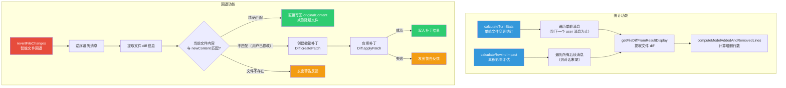

# rewindFileOps.ts

## 概述

`rewindFileOps.ts` 是 Gemini CLI 的**对话回退文件操作**模块，实现了"时间旅行"式的对话回退（Rewind）功能中与文件系统交互的核心逻辑。该模块提供三大能力：

1. **单轮统计**（`calculateTurnStats`）：计算单次对话轮次中模型对文件的增删行数和涉及的文件数量。
2. **累积影响评估**（`calculateRewindImpact`）：评估从某个消息到对话末尾之间所有文件变更的总体影响。
3. **智能文件回退**（`revertFileChanges`）：实际执行文件回退操作，支持精确匹配回退和基于 diff 补丁的智能回退。

该模块是 Rewind 功能的底层引擎，为上层 UI 展示回退影响预览和执行回退操作提供了基础。

## 架构图（Mermaid）



## 核心组件

### 1. 接口定义

#### `FileChangeDetail`

```typescript
export interface FileChangeDetail {
  fileName: string;   // 文件名
  diff: string;       // diff 文本内容
}
```

记录单个文件的变更详情，包含文件名和对应的 diff 文本。在 `calculateRewindImpact` 中用于收集所有受影响文件的详细 diff 信息。

#### `FileChangeStats`

```typescript
export interface FileChangeStats {
  addedLines: number;           // 新增行数
  removedLines: number;         // 删除行数
  fileCount: number;            // 涉及的文件数量
  details?: FileChangeDetail[]; // 可选的文件变更详情列表
}
```

文件变更的聚合统计数据。`details` 字段仅在 `calculateRewindImpact` 中填充，`calculateTurnStats` 不填充此字段。

### 2. 函数 `calculateTurnStats`

```typescript
export function calculateTurnStats(
  conversation: ConversationRecord,
  userMessage: MessageRecord,
): FileChangeStats | null
```

**功能：** 计算单个对话轮次的文件变更统计。

**工作流程：**
1. 在对话消息列表中定位 `userMessage` 的位置。
2. 从该位置的下一条消息开始向前遍历。
3. 遇到下一条 `user` 类型消息时停止（单轮边界）。
4. 对每条 `gemini` 类型消息中的 `toolCalls`，调用 `getFileDiffFromResultDisplay` 提取文件 diff。
5. 使用 `computeModelAddedAndRemovedLines` 计算增删行数。
6. 使用 `Set` 对文件去重计数。

**返回值：** 无编辑操作时返回 `null`。

### 3. 函数 `calculateRewindImpact`

```typescript
export function calculateRewindImpact(
  conversation: ConversationRecord,
  userMessage: MessageRecord,
): FileChangeStats | null
```

**功能：** 计算从指定消息到对话结束的累积文件变更影响。

**与 `calculateTurnStats` 的关键区别：**
- **不在 user 消息处停止**：遍历到对话末尾，跨越多个轮次。
- **收集 details**：填充 `FileChangeDetail[]`，包含每个文件的具体 diff 文本。
- 适用于向用户展示"如果回退到这里，将丢失多少文件变更"的预览信息。

### 4. 函数 `revertFileChanges`（异步）

```typescript
export async function revertFileChanges(
  conversation: ConversationRecord,
  targetMessageId: string,
): Promise<void>
```

**功能：** 实际执行文件回退操作，将文件恢复到指定消息之后模型修改之前的状态。

**核心算法 — 三级回退策略：**

| 策略 | 条件 | 操作 |
|------|------|------|
| 精确匹配回退 | 当前文件内容 === 模型写入内容 | 直接写回原始内容；新文件则删除 |
| 智能补丁回退 | 当前内容 !== 模型写入内容（用户已额外修改） | 创建 undo 补丁并应用到当前内容 |
| 回退失败警告 | 文件已不存在或补丁应用失败 | 发出警告日志，跳过该文件 |

**逆序遍历设计：** 函数从对话末尾向目标消息方向逆序遍历，对每条消息内的工具调用也逆序处理。这确保了在同一文件被多次修改的场景下，按照正确的顺序逐步撤销，避免中间状态冲突。

**智能补丁（Smart Revert）流程：**
1. 使用 `Diff.createPatch(fileName, newContent, originalText)` 创建一个从"模型修改后"到"原始状态"的补丁。
2. 使用 `Diff.applyPatch(currentContent, undoPatch)` 将此补丁应用到"当前内容"（可能包含用户后续修改）上。
3. 如果补丁结果为空字符串且文件原本不存在（`isNewFile`），则删除该文件。
4. 补丁应用失败时（返回 `false`），发出警告反馈。

## 依赖关系

### 内部依赖

| 模块 | 导入内容 | 用途 |
|------|----------|------|
| `@google/gemini-cli-core` | `ConversationRecord`, `MessageRecord` | 对话和消息的类型定义 |
| `@google/gemini-cli-core` | `coreEvents` | 核心事件总线，用于发送错误/警告反馈 |
| `@google/gemini-cli-core` | `debugLogger` | 调试日志记录器 |
| `@google/gemini-cli-core` | `getFileDiffFromResultDisplay` | 从工具调用的 resultDisplay 中提取文件 diff 信息 |
| `@google/gemini-cli-core` | `computeModelAddedAndRemovedLines` | 从 diff 统计中计算模型增删行数 |

### 外部依赖

| 包 | 导入内容 | 用途 |
|---|----------|------|
| `node:fs/promises` | `fs`（默认导入） | 异步文件系统操作：`readFile`、`writeFile`、`unlink` |
| `diff` | `Diff`（命名空间导入） | JavaScript diff/patch 库，用于创建和应用文件补丁 |

## 关键实现细节

1. **逆序遍历保证正确性**：`revertFileChanges` 从对话末尾向目标消息逆序遍历，且对每条消息内的 toolCalls 也逆序处理（`for (let j = msg.toolCalls.length - 1; j >= 0; j--)`）。这是因为同一文件可能在对话中被多次修改，逆序撤销确保每步还原的上下文都是正确的。

2. **ENOENT 的优雅处理**：在读取当前文件内容时，如果文件不存在（`ENOENT`），不会抛出错误，而是将 `currentContent` 保持为 `null`，后续逻辑会将其解释为"文件已被用户删除"并发出警告。这是合理的降级处理，因为用户可能在对话过程中手动删除了某些文件。

3. **新文件的特殊处理**：通过 `fileDiff.isNewFile` 标识模型创建的新文件。在精确匹配回退时，新文件会被 `unlink`（删除）而非写回空内容。智能补丁回退时，如果补丁结果为空字符串且 `isNewFile` 为 true，也会删除该文件。

4. **`calculateTurnStats` vs `calculateRewindImpact` 的设计分离**：两个函数虽然逻辑相似，但有明确的语义区分——`calculateTurnStats` 只看单轮（在 user 消息处 break），而 `calculateRewindImpact` 看累积影响（不 break）。这种分离使得 UI 层可以分别展示"这一轮改了什么"和"回退到这里会丢失什么"。

5. **文件去重使用 Set**：两个统计函数都使用 `Set<string>` 来跟踪文件名，确保同一文件被多次修改时只计数一次。`fileCount` 反映的是"涉及的独立文件数"，而非"文件操作次数"。

6. **错误反馈通过事件总线**：回退过程中的错误和警告通过 `coreEvents.emitFeedback` 发出，而非直接抛出异常。这确保了即使某个文件的回退失败，其他文件的回退仍能继续执行。但有一个值得注意的地方：在 `ENOENT` 以外的读取错误处理中使用了 `return` 而非 `continue`，这意味着非 ENOENT 的读取错误会终止整个回退过程。
