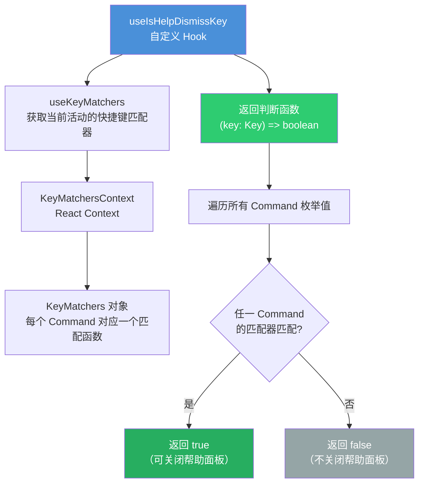
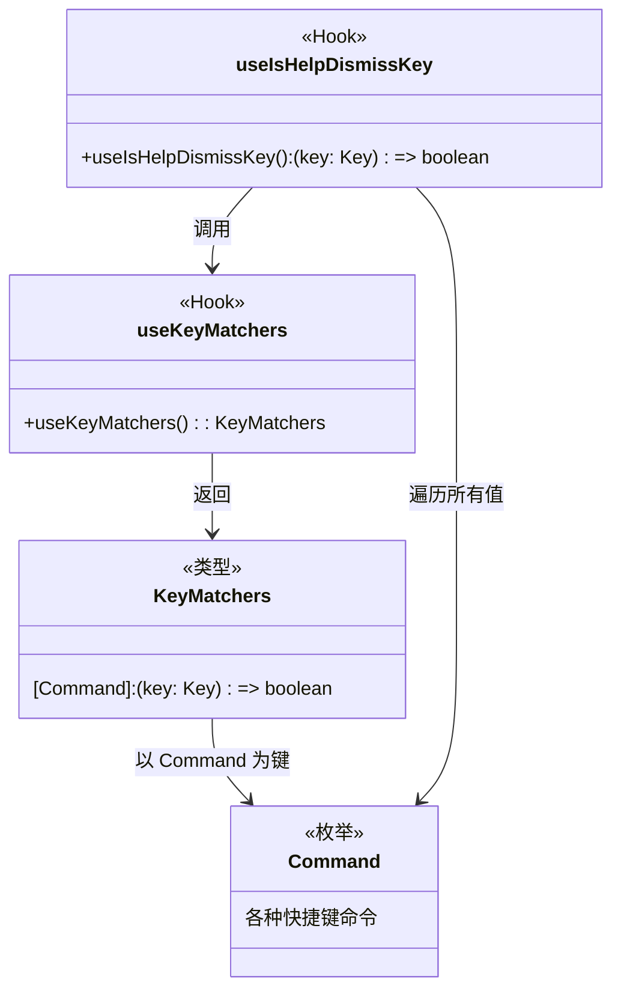

# shortcutsHelp.ts

## 概述

`shortcutsHelp.ts` 是 Gemini CLI 用户界面中的**快捷键帮助面板**辅助模块。它提供了一个自定义 React Hook —— `useIsHelpDismissKey`，用于判断用户按下的键是否属于任何已注册的命令快捷键。当帮助面板处于展示状态时，该 Hook 使得任意命令快捷键的按下都能关闭帮助面板，实现"按任意快捷键关闭帮助"的交互体验。

该模块设计精简，仅 6 行核心代码，充分利用了项目已有的快捷键匹配基础设施。

## 架构图（Mermaid）





## 核心组件

### 自定义 Hook `useIsHelpDismissKey`

```typescript
export function useIsHelpDismissKey(): (key: Key) => boolean {
  const keyMatchers = useKeyMatchers();
  return (key: Key) =>
    Object.values(Command).some((command) => keyMatchers[command](key));
}
```

**功能：** 返回一个判断函数，该函数接收一个 `Key` 对象，判断该按键是否匹配任何已注册的命令快捷键。

**工作流程：**

1. **获取快捷键匹配器**：通过 `useKeyMatchers()` 从 React Context 中获取当前活动的 `KeyMatchers` 对象。该对象是一个映射，每个 `Command` 枚举值对应一个 `(key: Key) => boolean` 匹配函数。

2. **返回判断闭包**：返回的函数使用 `Object.values(Command).some(...)` 遍历所有命令枚举值，逐一调用对应的匹配器来检测传入的按键。只要有任何一个命令的快捷键匹配成功，就返回 `true`。

**使用场景：** 在帮助面板组件中，将此 Hook 返回的函数作为键盘事件处理器的一部分。当用户在帮助面板打开时按下任意已注册的快捷键，面板即被关闭。这是一种常见的 UI 模式——帮助面板本身不拦截快捷键，而是让快捷键穿透执行其原本的功能，同时顺便关闭帮助面板。

## 依赖关系

### 内部依赖

| 模块 | 导入内容 | 用途 |
|------|----------|------|
| `../key/keyMatchers.js` | `Command` | 命令枚举，定义了所有可用的快捷键命令标识 |
| `../hooks/useKeypress.js` | `Key`（类型） | 按键对象类型定义，描述一次键盘按键事件的结构 |
| `../hooks/useKeyMatchers.js` | `useKeyMatchers` | 自定义 Hook，从 `KeyMatchersContext` 中获取当前的快捷键匹配器集合 |

### 外部依赖

无直接外部依赖。所有依赖均为项目内部模块。

间接依赖链：
- `useKeyMatchers` -> React 的 `useContext`
- `Command` -> `keyBindings.js`（快捷键绑定配置）
- `Key` -> `KeypressContext.js`（按键上下文）

## 关键实现细节

1. **`Object.values(Command).some(...)` 的短路特性**：`some` 方法在找到第一个匹配时立即返回 `true`，不会继续检查剩余命令。这提供了良好的性能，尤其在命令数量较多时避免了不必要的匹配计算。

2. **与自定义快捷键的兼容性**：由于 `useKeyMatchers()` 返回的匹配器可能包含用户自定义的快捷键绑定（通过 `loadCustomKeybindings` 加载），因此 `useIsHelpDismissKey` 自动兼容用户自定义的快捷键配置。用户重新绑定的快捷键同样可以关闭帮助面板。

3. **React Hook 规范**：该函数以 `use` 前缀命名，遵循 React Hook 的命名约定。内部调用了 `useKeyMatchers()`（一个基于 `useContext` 的 Hook），因此必须在 React 函数组件或其他 Hook 中调用，不能在普通函数或条件语句中使用。

4. **关闭策略的设计意图**：该模块判断的是"是否为已注册的命令快捷键"，而非"是否为任意按键"。这意味着普通字符输入（如字母键、数字键）不会触发帮助面板关闭，只有 Ctrl+C、Esc 等快捷键组合才会。这是一种合理的 UX 设计，避免用户误触关闭帮助面板。
