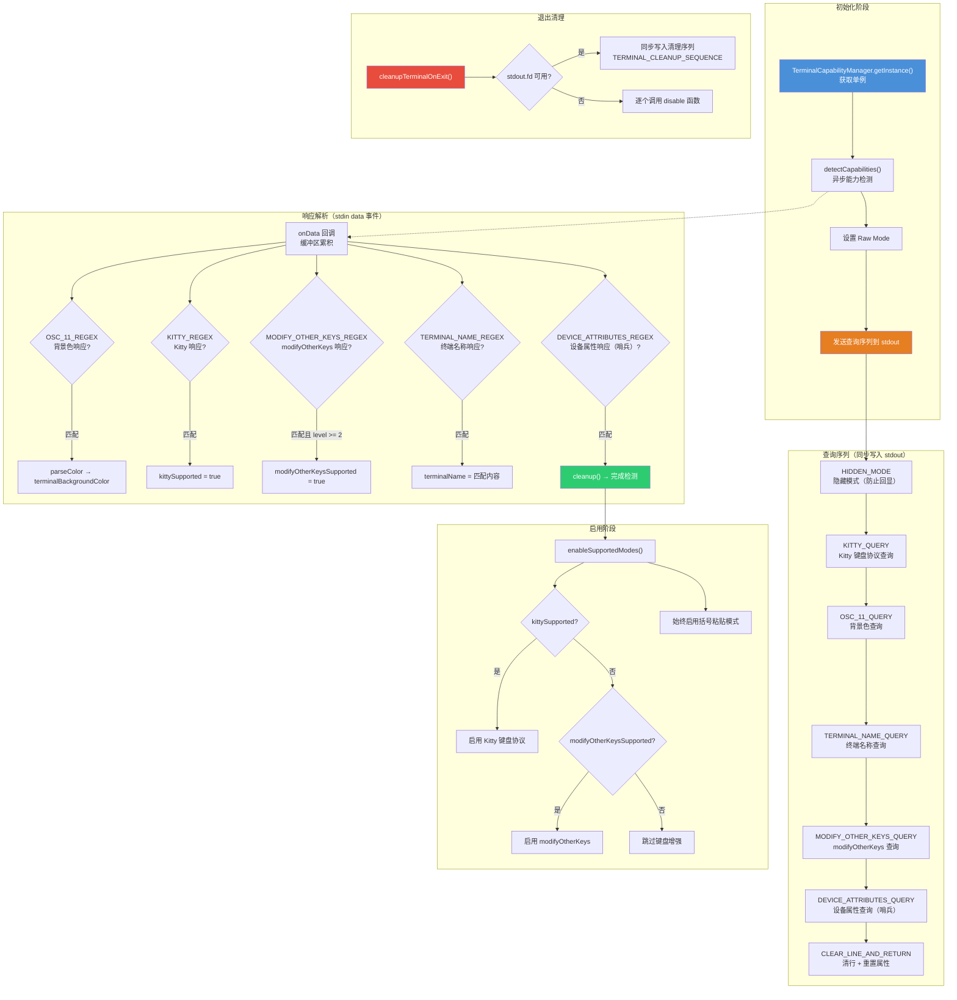

# terminalCapabilityManager.ts

## 概述

`terminalCapabilityManager.ts` 是 Gemini CLI 的**终端能力检测与管理**模块，负责在应用启动时探测终端仿真器支持的各项高级特性，并据此启用相应的输入/输出模式。这是整个 CLI 应用中终端兼容性适配的核心基础设施。

该模块检测和管理的终端能力包括：
- **Kitty 键盘协议**：支持更丰富的键盘事件报告（如按键修饰符、释放事件等）。
- **modifyOtherKeys 模式**：xterm 的扩展键盘报告协议。
- **终端背景色**：通过 OSC 11 查询获取，用于动态调整主题（深色/浅色模式）。
- **终端名称/版本**：用于判断终端特定的功能支持（如 OSC 9 通知）。
- **括号粘贴模式**：区分用户输入和粘贴内容。
- **OSC 9 通知支持**：判断终端是否支持桌面通知。

该模块采用**单例模式**，确保全局只有一个实例进行能力检测和状态管理。

## 架构图（Mermaid）



## 核心组件

### 1. 类型定义

```typescript
export type TerminalBackgroundColor = string | undefined;
```

终端背景色类型，格式为 `#RRGGBB` 十六进制字符串，或 `undefined`（未检测到）。

### 2. 函数 `cleanupTerminalOnExit`

```typescript
export function cleanupTerminalOnExit(): void
```

进程退出时的终端清理函数。注册在 `exit`、`SIGTERM`、`SIGINT` 信号处理器上。

**双重策略：**
- **首选方案**：使用 `fs.writeSync` 同步写入预拼接的 `TERMINAL_CLEANUP_SEQUENCE` 转义序列。这是最可靠的方式，因为在 `exit` 事件处理器中异步操作不被保证执行。
- **降级方案**：如果同步写入失败（如 stdout 已关闭），逐个调用 `disable*` 函数。

**`TERMINAL_CLEANUP_SEQUENCE` 解析：**

```
\x1b[<u          → 禁用 Kitty 键盘协议
\x1b[>4;0m       → 禁用 modifyOtherKeys
\x1b[?2004l      → 禁用括号粘贴模式
\x1b[?1000l      → 禁用鼠标点击事件
\x1b[?1002l      → 禁用鼠标按钮事件跟踪
\x1b[?1003l      → 禁用所有鼠标移动事件
\x1b[?1006l      → 禁用 SGR 鼠标编码模式
```

### 3. 类 `TerminalCapabilityManager`

#### 静态常量 — 查询序列

| 常量 | 转义序列 | 用途 |
|------|----------|------|
| `KITTY_QUERY` | `\x1b[?u` | 查询 Kitty 键盘协议支持 |
| `OSC_11_QUERY` | `\x1b]11;?\x1b\\` | 查询终端背景色 |
| `TERMINAL_NAME_QUERY` | `\x1b[>q` | 查询终端名称和版本 |
| `DEVICE_ATTRIBUTES_QUERY` | `\x1b[c` | 查询主设备属性（用作哨兵） |
| `MODIFY_OTHER_KEYS_QUERY` | `\x1b[>4;?m` | 查询 modifyOtherKeys 支持级别 |
| `HIDDEN_MODE` | `\x1b[8m` | 设置隐藏文本模式（防止回显） |
| `CLEAR_LINE_AND_RETURN` | `\x1b[2K\r` | 清除当前行并回到行首 |
| `RESET_ATTRIBUTES` | `\x1b[0m` | 重置所有文本属性 |

#### 静态常量 — 响应匹配正则

| 常量 | 匹配内容 |
|------|----------|
| `KITTY_REGEX` | Kitty 键盘协议响应 `CSI ? flags u` |
| `TERMINAL_NAME_REGEX` | 终端名称响应 `DCS > \| text ST` |
| `DEVICE_ATTRIBUTES_REGEX` | 主设备属性响应 `CSI ? ID ; ... c` |
| `OSC_11_REGEX`（public） | 背景色响应 `OSC 11 ; rgb:RRRR/GGGG/BBBB ST` |
| `MODIFY_OTHER_KEYS_REGEX` | modifyOtherKeys 响应 `CSI > 4 ; level m` |

#### 实例属性

| 属性 | 类型 | 默认值 | 说明 |
|------|------|--------|------|
| `detectionComplete` | `boolean` | `false` | 检测是否已完成 |
| `terminalBackgroundColor` | `TerminalBackgroundColor` | `undefined` | 终端背景色 |
| `kittySupported` | `boolean` | `false` | 终端是否支持 Kitty 键盘协议 |
| `kittyEnabled` | `boolean` | `false` | Kitty 协议是否已启用 |
| `modifyOtherKeysSupported` | `boolean` | `false` | 是否支持 modifyOtherKeys |
| `terminalName` | `string \| undefined` | `undefined` | 终端名称/版本字符串 |

#### 方法详解

##### `static getInstance(): TerminalCapabilityManager`

单例获取方法。首次调用时创建实例，后续调用返回同一实例。

##### `static resetInstanceForTesting(): void`

测试辅助方法，重置单例实例为 `undefined`，用于单元测试间的状态隔离。

##### `static queryBackgroundColor(stdout)`

静态辅助方法，向指定的 stdout 流写入 OSC 11 查询序列。用于在实例方法之外独立查询背景色。

##### `async detectCapabilities(): Promise<void>`

核心方法，执行终端能力检测。

**完整流程：**

1. **幂等性检查**：若 `detectionComplete` 为 true，直接返回。
2. **TTY 检查**：若 stdin 或 stdout 不是 TTY，标记完成并返回。
3. **注册退出清理**：先移除旧的监听器（防止重复注册），再注册 `cleanupTerminalOnExit` 到 `exit`、`SIGTERM`、`SIGINT` 信号。
4. **切换 Raw Mode**：保存原始 Raw Mode 状态，临时启用 Raw Mode 以接收终端响应。
5. **发送查询**：通过 `fs.writeSync` 同步写入所有查询序列到 stdout。查询被包裹在 `HIDDEN_MODE` 和 `CLEAR_LINE_AND_RETURN + RESET_ATTRIBUTES` 之间，防止某些终端回显查询内容。
6. **监听响应**：在 stdin 上监听 `data` 事件，将数据追加到缓冲区，逐一用正则匹配各项响应。
7. **哨兵终止**：当匹配到 `DEVICE_ATTRIBUTES_REGEX`（主设备属性响应）时，调用 `cleanup()` 完成检测。由于 DA 查询最后发送，其响应意味着终端已处理完所有前面的查询。
8. **超时保护**：1000ms 超时后强制完成检测，防止终端不响应时永久挂起。
9. **清理**：恢复 Raw Mode 状态，移除 data 监听器。

##### `enableSupportedModes(): void`

根据检测结果启用相应的键盘增强模式。

**优先级策略：**
- Kitty 协议优先于 modifyOtherKeys（两者互斥）。
- 括号粘贴模式始终启用（不支持时会被终端忽略，无副作用）。

##### `getTerminalBackgroundColor(): TerminalBackgroundColor`

返回检测到的终端背景色。

##### `getTerminalName(): string | undefined`

返回检测到的终端名称。

##### `isKittyProtocolEnabled(): boolean`

返回 Kitty 键盘协议是否已启用。

##### `supportsOsc9Notifications(env?): boolean`

判断终端是否支持 OSC 9 桌面通知。

**排除逻辑：** 如果存在 `WT_SESSION` 环境变量（Windows Terminal），直接返回 `false`。

**支持判断：** 按以下顺序检查终端签名：
1. 检测到的终端名称（`terminalName`）
2. 环境变量 `TERM_PROGRAM`
3. 环境变量 `TERM`

**支持的终端：** WezTerm、Ghostty、iTerm、Kitty。

##### `private hasOsc9TerminalSignature(value?): boolean`

私有辅助方法，检查字符串（大小写不敏感）是否包含已知支持 OSC 9 的终端名称关键词。

### 4. 导出的单例

```typescript
export const terminalCapabilityManager = TerminalCapabilityManager.getInstance();
```

模块级别导出的单例实例，供整个应用直接使用。

## 依赖关系

### 内部依赖

| 模块 | 导入内容 | 用途 |
|------|----------|------|
| `@google/gemini-cli-core` | `debugLogger` | 调试日志记录 |
| `@google/gemini-cli-core` | `enableKittyKeyboardProtocol`, `disableKittyKeyboardProtocol` | Kitty 键盘协议的启用/禁用 |
| `@google/gemini-cli-core` | `enableModifyOtherKeys`, `disableModifyOtherKeys` | modifyOtherKeys 模式的启用/禁用 |
| `@google/gemini-cli-core` | `enableBracketedPasteMode`, `disableBracketedPasteMode` | 括号粘贴模式的启用/禁用 |
| `@google/gemini-cli-core` | `disableMouseEvents` | 鼠标事件的禁用 |
| `../themes/color-utils.js` | `parseColor` | 将 OSC 11 响应中的 RGB 十六进制分量解析为 `#RRGGBB` 格式的颜色字符串 |

### 外部依赖

| 包 | 导入内容 | 用途 |
|---|----------|------|
| `node:fs` | `fs`（命名空间导入） | 同步文件系统操作：`writeSync` 用于向 stdout fd 写入转义序列 |

## 关键实现细节

1. **哨兵查询（Sentinel Query）模式**：`DEVICE_ATTRIBUTES_QUERY`（`CSI c`）被特意放在所有查询序列的最后发送。由于终端按顺序处理查询，DA 响应的到达意味着前面所有查询都已被处理。这是一种经典的终端编程技巧，避免了为每个查询设置独立的超时或等待逻辑。

2. **隐藏模式防回显**：查询序列被包裹在 `\x1b[8m`（隐藏模式）和 `\x1b[2K\r\x1b[0m`（清行+重置）之间。某些终端可能会回显查询序列的部分内容（特别是 modifyOtherKeys 查询可能导致 "m" 字符被打印），隐藏模式确保用户看不到这些回显。

3. **同步写入的必要性**：使用 `fs.writeSync` 而非 `process.stdout.write` 发送查询序列。这确保所有查询在一次系统调用中原子写入，避免被异步写入的其他内容打断。同样地，`cleanupTerminalOnExit` 也使用同步写入，因为在 `exit` 事件中异步操作不可靠。

4. **信号处理器去重**：在注册退出清理处理器前，先调用 `process.off` 移除可能已存在的旧处理器。这防止了 `detectCapabilities` 被多次调用时（虽然有幂等性检查，但作为防御性编程）注册重复的清理处理器。

5. **Kitty 与 modifyOtherKeys 的互斥性**：`enableSupportedModes` 中使用 `else if` 使两者互斥——Kitty 协议优先，因为它提供了更丰富的键盘事件信息。如果终端同时支持两者，只启用 Kitty 协议。

6. **Windows Terminal 的 OSC 9 排除**：虽然 Windows Terminal 理论上支持某些通知机制，但通过检测 `WT_SESSION` 环境变量将其排除在 OSC 9 支持之外。这可能是因为 Windows Terminal 的 OSC 9 实现有已知问题或行为不一致。

7. **1000ms 超时的合理性**：代码注释指出"所有终端都应该响应 DA 查询"，因此超时不太可能在正常情况下触发。1000ms 的超时足够大以应对慢速的 SSH 连接等场景，同时不至于在启动时造成明显的延迟。

8. **Raw Mode 的保存与恢复**：`detectCapabilities` 在切换到 Raw Mode 前保存了原始状态（`originalRawMode`），并在清理时恢复。这确保了检测过程不会影响 stdin 的原始状态配置。

9. **缓冲区累积解析**：所有终端响应被追加到同一个 `buffer` 字符串中，每次 data 事件都对整个缓冲区运行所有未匹配的正则。这种策略虽然简单，但在响应可能被分片传输的情况下是必要的——某个响应可能被拆分在两个 data 事件中。
