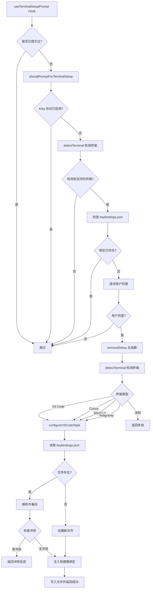

# terminalSetup.ts

## 概述

`terminalSetup.ts` 是终端配置工具模块，负责自动检测当前运行的终端模拟器类型，并为其配置 `Shift+Enter` 和 `Ctrl+Enter` 多行输入支持。该模块主要面向 VS Code 及其分支编辑器（Cursor、Windsurf、Antigravity），通过修改各编辑器的 `keybindings.json` 文件来注入自定义快捷键绑定，使用户能够在终端中方便地输入多行内容。

模块还提供了一个 React Hook `useTerminalSetupPrompt`，用于在首次使用时弹出一次性提示，征求用户同意后自动完成终端配置。

## 架构图（Mermaid）

## 核心组件

### 1. 常量与类型

| 名称 | 类型 | 说明 |
|------|------|------|
| `VSCODE_SHIFT_ENTER_SEQUENCE` | `string` | 值为 `'\\\r\n'`，VS Code 终端发送的转义序列，表示反斜杠 + 回车换行 |
| `SupportedTerminal` | 联合类型 | `'vscode' \| 'cursor' \| 'windsurf' \| 'antigravity'` |
| `TerminalSetupResult` | 接口 | 配置结果，包含 `success`、`message`、`requiresRestart` |
| `TerminalData` | 接口 | 终端元数据，包含 `terminalName`（显示名称）和 `appName`（配置目录名称） |
| `TERMINAL_DATA` | Record | 所有支持终端的元数据映射表 |
| `Keybinding` | 类型 | 快捷键绑定对象结构，包含 `key`、`command`、`args` |
| `TERMINAL_SETUP_CONSENT_MESSAGE` | `string` | 请求用户同意配置终端的提示消息 |

### 2. 工具函数

#### `stripJsonComments(content: string): string`
移除 JSON 字符串中的单行注释（`// ...`），以支持 VS Code 风格的带注释 JSON 文件解析。使用正则 `/^\s*\/\/.*$/gm` 匹配行首注释。

#### `isKeybinding(kb: unknown): kb is Keybinding`
类型守卫函数，判断一个未知值是否为 `Keybinding` 对象。

#### `hasOurBinding(keybindings: unknown[], key: string): boolean`
检查快捷键数组中是否已包含我们特定的绑定（匹配 `key`、`command` 为 `workbench.action.terminal.sendSequence`、`args.text` 为 `VSCODE_SHIFT_ENTER_SEQUENCE`）。

#### `getSupportedTerminalData(terminal: SupportedTerminal): TerminalData | null`
根据终端 ID 查找对应的显示名称和应用名称。

### 3. 终端检测

#### `getTerminalProgram(): SupportedTerminal | null`（导出）
通过环境变量检测当前终端类型：
- **Cursor**：检查 `CURSOR_TRACE_ID` 或 `VSCODE_GIT_ASKPASS_MAIN` 包含 "cursor"
- **Windsurf**：检查 `VSCODE_GIT_ASKPASS_MAIN` 包含 "windsurf"
- **Antigravity**：检查 `VSCODE_GIT_ASKPASS_MAIN` 包含 "antigravity"
- **VS Code**：检查 `TERM_PROGRAM === 'vscode'` 或存在 `VSCODE_GIT_IPC_HANDLE`

注意：分支编辑器（fork）优先检测，避免因它们也设置了 VS Code 环境变量而产生误判。

#### `detectTerminal(): Promise<SupportedTerminal | null>`（内部）
两步检测策略：
1. 先调用 `getTerminalProgram()` 通过环境变量检测
2. 若失败，在非 Windows 平台上通过 `ps -o comm= -p $PPID` 检查父进程名称

### 4. 配置功能

#### `getVSCodeStyleConfigDir(appName: string): string | null`
根据操作系统返回 VS Code 风格编辑器的配置目录：
- **macOS**：`~/Library/Application Support/{appName}/User`
- **Windows**：`%APPDATA%/{appName}/User`
- **Linux**：`~/.config/{appName}/User`

#### `backupFile(filePath: string): Promise<void>`
在修改配置文件前创建带时间戳的备份文件，格式为 `{原文件名}.backup.{ISO时间戳}`。

#### `configureVSCodeStyle(terminalName, appName): Promise<TerminalSetupResult>`
VS Code 风格编辑器的核心配置逻辑：
1. 确定配置目录并确保其存在
2. 读取已有的 `keybindings.json`（支持带注释的 JSON）
3. 创建备份
4. 检查是否已配置、是否存在冲突
5. 注入 6 个快捷键绑定：
   - `shift+enter`：发送 `\\\r\n`（多行输入）
   - `ctrl+enter`：发送 `\\\r\n`（多行输入）
   - `cmd+z`：发送 CSI 序列 `\x1b[122;9u`（撤销）
   - `alt+z`：发送 CSI 序列 `\x1b[122;3u`（撤销）
   - `shift+cmd+z`：发送 CSI 序列 `\x1b[122;10u`（重做）
   - `shift+alt+z`：发送 CSI 序列 `\x1b[122;4u`（重做）
6. 使用 `unshift` 将新绑定添加到数组开头（高优先级）

### 5. 主函数

#### `terminalSetup(): Promise<TerminalSetupResult>`（导出）
主入口函数，流程：
1. 检查 Kitty 键盘协议是否已启用（若已启用则跳过）
2. 检测终端类型
3. 调用 `configureVSCodeStyle` 进行配置

#### `shouldPromptForTerminalSetup(): Promise<boolean>`（导出）
判断是否需要提示用户进行终端配置。满足所有条件时返回 `true`：
- Kitty 协议未启用
- 运行在受支持的终端中
- 快捷键绑定尚未配置

#### `formatTerminalSetupResultMessage(result): string`（导出）
格式化配置结果消息，若需要重启则追加重启提示。

### 6. React Hook

#### `useTerminalSetupPrompt({ addConfirmUpdateExtensionRequest, addItem }): void`（导出）
React Hook，在组件挂载时执行一次性终端配置提示：
1. 检查持久化状态 `terminalSetupPromptShown` 是否已标记
2. 调用 `shouldPromptForTerminalSetup` 判断是否需要提示
3. 标记已提示状态
4. 通过 `requestConsentInteractive` 请求用户同意
5. 同意后执行 `terminalSetup`
6. 将结果添加到历史记录

支持通过 `cancelled` 标志在组件卸载时取消异步操作。

## 依赖关系

### 内部依赖

| 模块路径 | 导入内容 | 用途 |
|----------|----------|------|
| `./terminalCapabilityManager.js` | `terminalCapabilityManager` | 检测 Kitty 键盘协议是否已启用 |
| `@google/gemini-cli-core` | `debugLogger`, `homedir` | 调试日志和获取用户主目录 |
| `../../utils/persistentState.js` | `persistentState` | 持久化状态管理（记录是否已提示过） |
| `../../config/extensions/consent.js` | `requestConsentInteractive` | 交互式请求用户同意 |
| `../types.js` | `ConfirmationRequest` | 确认请求类型定义 |
| `../hooks/useHistoryManager.js` | `UseHistoryManagerReturn` | 历史管理器返回类型（提取 `addItem` 方法类型） |

### 外部依赖

| 模块 | 导入内容 | 用途 |
|------|----------|------|
| `node:fs` | `promises as fs` | 异步文件读写操作 |
| `node:os` | `os` | 获取操作系统平台信息 |
| `node:path` | `path` | 文件路径拼接 |
| `node:child_process` | `exec` | 执行子进程命令（父进程检测） |
| `node:util` | `promisify` | 将回调函数转为 Promise |
| `react` | `useEffect` | React 副作用 Hook |

## 关键实现细节

1. **终端检测优先级**：分支编辑器（Cursor、Windsurf、Antigravity）优先于 VS Code 检测，因为这些分支可能也会设置 `TERM_PROGRAM=vscode` 或 `VSCODE_GIT_IPC_HANDLE` 等环境变量，先检测分支避免误判。

2. **双重检测策略**：先通过环境变量检测（`getTerminalProgram`），若失败再通过父进程名称检测（`ps -o comm= -p $PPID`），提高检测覆盖率。

3. **JSON 注释处理**：VS Code 的 `keybindings.json` 支持注释，但标准 JSON 解析器不支持。模块使用 `stripJsonComments` 在解析前移除注释。

4. **冲突避免**：若用户已有相同 key 的自定义绑定但内容不同，模块不会覆盖，而是返回冲突信息让用户手动处理。

5. **备份机制**：修改前自动创建带时间戳的备份文件，即使备份失败也不会阻断主流程。

6. **绑定注入位置**：使用 `unshift` 将新绑定添加到数组开头，确保在 VS Code 的快捷键解析中具有更高优先级。

7. **CSI 序列**：除了 `Shift+Enter` / `Ctrl+Enter` 外，还配置了 `Cmd+Z`（撤销）和 `Shift+Cmd+Z`（重做）的 CSI u 编码序列，用于在终端中正确传递这些组合键。

8. **一次性提示**：`useTerminalSetupPrompt` 通过 `persistentState` 确保整个应用生命周期内只提示一次，即使用户拒绝也不会再次提示。

9. **异步取消**：Hook 中使用 `cancelled` 标志配合 `useEffect` 的清理函数，防止组件卸载后仍执行状态更新。

10. **Kitty 协议优先**：若终端已支持 Kitty 键盘协议（modifyOtherKeys），则认为终端已具备最佳键盘支持，无需额外配置。
