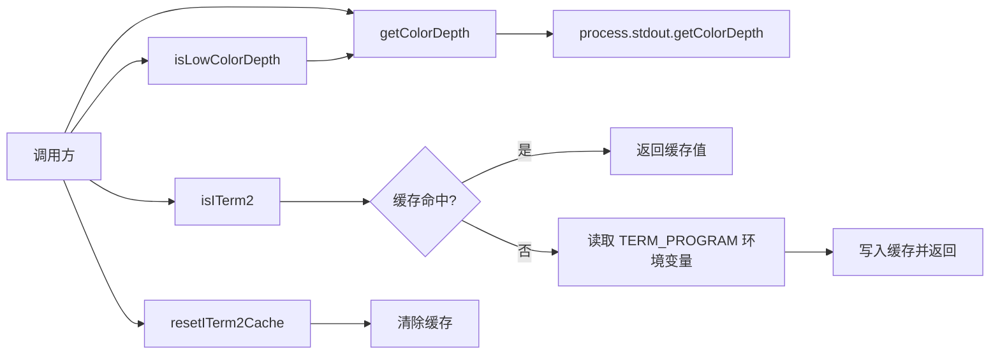

# terminalUtils.ts

## 概述

`terminalUtils.ts` 是一个轻量级终端环境检测工具模块，提供三项核心能力：终端颜色深度检测、低色深判断、以及 iTerm2 终端识别。该模块在 UI 渲染层被广泛使用，用于根据终端能力动态调整输出样式和功能。

## 架构图（Mermaid）

## 核心组件

### 1. `getColorDepth(): number`

返回当前终端的颜色深度（color depth）。

- 若 `process.stdout.getColorDepth` 方法可用，直接调用获取实际色深
- 若不可用（例如非 TTY 环境），默认返回 `24`（TrueColor，即 24 位真彩色）

**返回值说明**：
| 值 | 含义 |
|----|------|
| 1 | 2 色（单色） |
| 4 | 16 色 |
| 8 | 256 色 |
| 24 | 1600 万色（TrueColor） |

### 2. `isLowColorDepth(): boolean`

判断终端是否为低色深模式。当颜色深度小于 24（即非 TrueColor）时返回 `true`。此函数常用于决定是否降级 UI 渲染效果，例如在低色深终端中使用更简单的颜色方案。

### 3. `isITerm2(): boolean`

检测当前终端是否为 iTerm2。通过检查环境变量 `TERM_PROGRAM` 是否等于 `'iTerm.app'` 来判断。

**缓存机制**：使用模块级变量 `cachedIsITerm2` 缓存检测结果，避免每次调用都读取环境变量。首次调用后，后续调用直接返回缓存值。

### 4. `resetITerm2Cache(): void`

重置 iTerm2 检测的缓存值，将 `cachedIsITerm2` 设为 `undefined`。主要用于测试场景，允许在修改环境变量后重新检测。

## 依赖关系

### 内部依赖

无。该模块是独立的工具模块，不依赖项目中的其他模块。

### 外部依赖

| 模块 | 导入内容 | 用途 |
|------|----------|------|
| `node:process` | `process`（默认导入） | 访问 `stdout.getColorDepth()` 方法和 `env` 环境变量 |

## 关键实现细节

1. **默认 TrueColor 假设**：当无法获取实际色深时（例如管道输出、CI 环境等），默认假设终端支持 TrueColor（24 位）。这是一个安全的默认值，因为大多数现代终端都支持 TrueColor，而在不支持的环境中最多导致颜色显示异常而不会崩溃。

2. **缓存设计**：`isITerm2` 的缓存使用 `undefined` 作为"未初始化"标记，与 `false`（非 iTerm2）区分。这使得缓存可以正确存储 `false` 值而不会被误判为未缓存。

3. **环境变量检测**：`TERM_PROGRAM` 是终端模拟器自行设置的标准环境变量。iTerm2 会将其设置为 `'iTerm.app'`，这是可靠的检测方式。

4. **模块简洁性**：整个模块只有 46 行代码，无状态副作用（缓存除外），函数间职责单一，便于维护和测试。`getColorDepth` 不缓存结果，因为终端色深在某些场景下可能动态变化（如窗口移动到不同显示器）。
