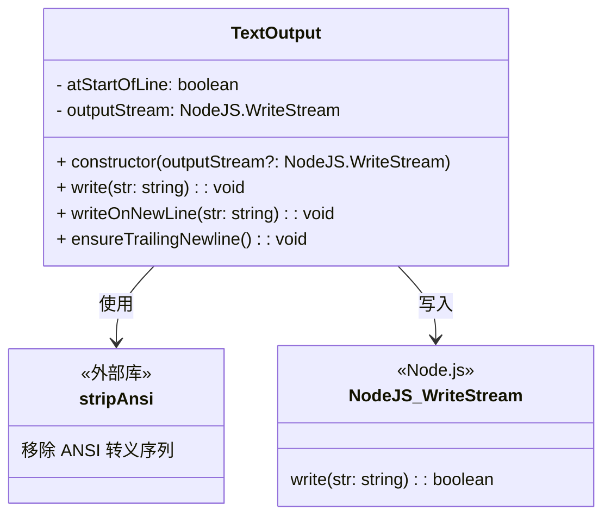

# textOutput.ts

## 概述

`textOutput.ts` 提供了 `TextOutput` 类，用于管理向标准输出流（stdout）写入文本的过程。该类的核心价值在于**自动追踪光标是否位于行首**，从而确保换行符的处理在整个应用程序中保持一致和健壮，避免多余的空行或缺失的换行。

这在 CLI 应用中尤为重要，因为多个组件可能交替向终端输出内容，如果不统一管理换行状态，很容易出现格式混乱的问题。

## 架构图（Mermaid）



## 核心组件

### `TextOutput` 类

#### 私有属性

| 属性名 | 类型 | 默认值 | 说明 |
|--------|------|--------|------|
| `atStartOfLine` | `boolean` | `true` | 追踪当前光标是否位于行首。初始化为 `true`，表示输出流刚开始时处于行首 |
| `outputStream` | `NodeJS.WriteStream` | `process.stdout` | 输出流对象，默认为标准输出 |

#### 构造函数

```typescript
constructor(outputStream: NodeJS.WriteStream = process.stdout)
```

接受一个可选的输出流参数，默认使用 `process.stdout`。这种设计便于测试时注入模拟流。

#### `write(str: string): void`

向输出流写入字符串。核心逻辑：
1. 空字符串直接返回，不做任何操作
2. 将字符串写入输出流
3. 使用 `stripAnsi` 移除 ANSI 转义序列后检查最后一个字符
4. 如果剥离后的字符串非空，则根据是否以 `'\n'` 结尾来更新 `atStartOfLine` 状态

**关键细节**：判断是否在行首时先剥离 ANSI 转义码，因为 ANSI 序列（如颜色代码 `\x1b[31m`）不会影响光标位置。如果仅写入了纯 ANSI 序列（剥离后为空），则不更新行首状态。

#### `writeOnNewLine(str: string): void`

确保从新行开始写入。如果当前光标不在行首，先输出一个换行符，然后再写入内容。这防止了内容粘连在上一行末尾的问题。

#### `ensureTrailingNewline(): void`

确保输出以换行符结尾。如果当前光标不在行首（意味着最后一次输出没有以换行符结尾），则补充输出一个换行符。

## 依赖关系

### 内部依赖

无。该类是一个独立的工具类。

### 外部依赖

| 模块 | 导入内容 | 用途 |
|------|----------|------|
| `strip-ansi` | `stripAnsi`（默认导入） | 从字符串中移除 ANSI 转义序列，用于准确判断文本内容是否以换行符结尾 |

## 关键实现细节

1. **ANSI 感知的行首追踪**：`write` 方法使用 `stripAnsi` 先剥离 ANSI 转义码再判断换行状态。这至关重要，因为诸如 `\x1b[0m`（重置样式）这样的序列虽然被写入了输出流，但不会移动光标。如果不剥离，可能会错误地认为光标不在行首。

2. **纯 ANSI 写入不影响状态**：当写入的字符串在剥离 ANSI 后为空字符串时（`strippedStr.length === 0`），不会更新 `atStartOfLine` 状态。这确保了连续写入颜色代码等操作不会干扰换行判断。

3. **空字符串短路**：`write` 方法在字符串为空时直接返回，避免不必要的 `stripAnsi` 调用和流写入操作。

4. **初始状态为行首**：`atStartOfLine` 初始化为 `true`，这是合理的，因为程序启动时光标默认在行首。

5. **可注入的输出流**：构造函数接受自定义 `WriteStream`，使得该类在单元测试中可以轻松使用内存流替代真实 stdout，便于断言输出内容。

6. **防重复换行**：`writeOnNewLine` 和 `ensureTrailingNewline` 都只在 `atStartOfLine === false` 时才添加换行符，避免产生多余空行。多次连续调用 `ensureTrailingNewline` 只会产生一个换行符。
