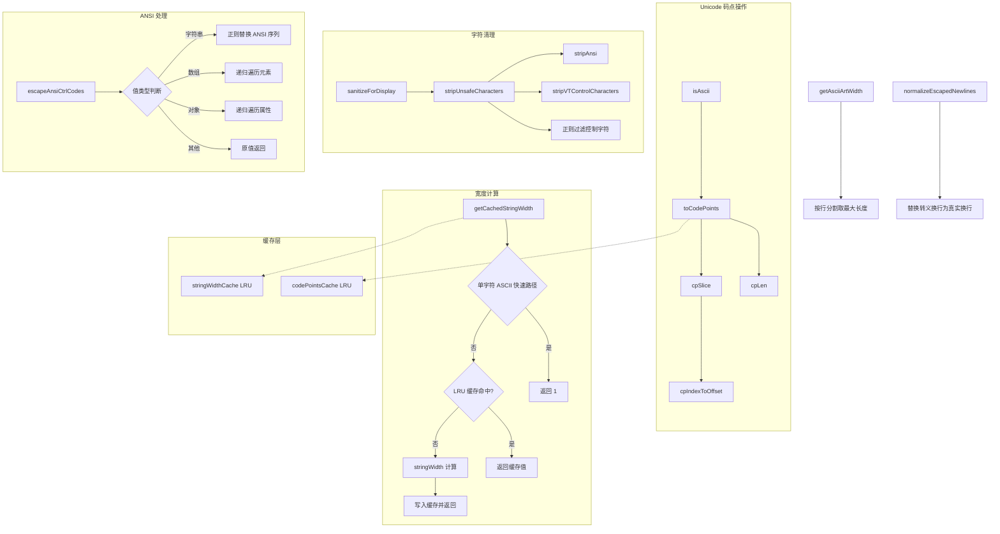

# textUtils.ts

## 概述

`textUtils.ts` 是一个功能丰富的文本处理工具模块，提供 Unicode 感知的字符串操作、不安全字符清理、显示宽度计算、ANSI 转义码处理等核心能力。该模块是 UI 渲染层的基础设施，被终端缓冲区、文本布局、输入处理等多个上层模块广泛依赖。

模块的设计重点在于**性能优化**和**Unicode 正确性**：通过 LRU 缓存减少重复计算，通过码点级（code point）操作而非 UTF-16 码元级操作确保 emoji 等特殊字符被正确处理。

## 架构图（Mermaid）

## 核心组件

### 1. ASCII Art 宽度计算

#### `getAsciiArtWidth(asciiArt: string): number`

计算多行 ASCII 艺术字符串的最大宽度。将输入按 `\n` 分割为行，返回最长行的字符长度（使用 `str.length`，即 UTF-16 码元计数）。空字符串返回 0。

### 2. Unicode 码点操作工具

这组函数在码点（code point）级别而非 UTF-16 码元（code unit）级别操作字符串，确保代理对（surrogate pair）组成的 emoji 被视为单个"字符"。

#### `isAscii(str: string): boolean`

逐字符检查字符串是否仅包含 ASCII 字符（码值 0-127）。用作其他函数的快速路径判断。

#### `toCodePoints(str: string): string[]`

将字符串拆分为码点数组。实现了三层优化：
1. **ASCII 快速路径**：若字符串是纯 ASCII，直接用 `str.split('')` 拆分
2. **LRU 缓存**：长度不超过 1000 的非 ASCII 字符串结果被缓存
3. **通用路径**：使用 `Array.from(str)` 按码点迭代

缓存使用 `mnemonist` 库的 `LRUCache`，容量为 `LRU_BUFFER_PERF_CACHE_LIMIT`（20000 条）。

#### `cpLen(str: string): number`

返回字符串的码点长度。ASCII 字符串直接返回 `str.length`，非 ASCII 字符串通过 `toCodePoints` 计算。

#### `cpSlice(str: string, start: number, end?: number): string`

按码点索引切片字符串。ASCII 字符串直接使用原生 `str.slice()`，非 ASCII 字符串先转为码点数组再切片并拼接。

#### `cpIndexToOffset(str: string, cpIndex: number): number`

将码点索引转换为 UTF-16 码元偏移量。实现方式为 `cpSlice(str, 0, cpIndex).length`，利用切片后的 UTF-16 长度作为偏移量。

### 3. 字符清理

#### `stripUnsafeCharacters(str: string): string`

移除可能破坏终端渲染的危险字符，分三步处理：
1. `stripAnsi`：移除 ANSI 转义序列
2. `stripVTControlCharacters`：移除 VT 控制序列
3. 正则替换：移除剩余的不安全控制字符

**移除的字符类别**：
| 类别 | 范围 | 说明 |
|------|------|------|
| C0 控制字符 | `0x00-0x08`, `0x0B`, `0x0C`, `0x0E-0x1F` | 保留 TAB(0x09)、LF(0x0A)、CR(0x0D) |
| C1 控制字符 | `0x80-0x9F` | 可能导致显示异常 |
| BiDi 控制字符 | `U+200E`, `U+200F`, `U+202A-U+202E`, `U+2066-U+2069` | 双向文本控制 |
| 零宽字符 | `U+200B`(ZWSP), `U+FEFF`(BOM) | 不可见但可能影响布局 |

**保留的特殊字符**：
- ZWJ (`U+200D`)：emoji 组合所需
- ZWNJ (`U+200C`)：零宽非连接符
- DEL (`0x7F`)：由 `applyOperations` 函数功能性处理
- CR/LF、TAB：正常文本格式化所需

#### `sanitizeForDisplay(str: string, maxLength?: number): string`

为内联 UI 组件（帮助、建议等）清理字符串：
1. 调用 `stripUnsafeCharacters` 移除危险字符
2. 将所有连续空白字符折叠为单个空格
3. 若指定 `maxLength` 且超长，截断并添加 `...` 后缀

### 4. 换行符规范化

#### `normalizeEscapedNewlines(value: string): string`

将字符串中的转义换行符转换为真实换行符：
- `\\r\\n` -> `\n`（先处理 Windows 风格）
- `\\n` -> `\n`（再处理 Unix 风格）

### 5. 字符串显示宽度

#### `getCachedStringWidth(str: string): number`

计算字符串在终端中的显示宽度（考虑全角字符、emoji 等），带 LRU 缓存。三层优化策略：

1. **单字符 ASCII 快速路径**：若字符串长度为 1 且码值在 `0x20-0x7E`（可打印 ASCII），直接返回 1
2. **LRU 缓存查找**：命中则直接返回
3. **`stringWidth` 计算**：调用 `string-width` 库计算实际显示宽度

**容错处理**：当 `string-width` 对某些特殊字符（如 `U+0602`）崩溃时，回退到使用码点数量作为近似宽度。

### 6. ANSI 控制码转义

#### `escapeAnsiCtrlCodes<T>(obj: T): T`

递归遍历类 JSON 结构（对象、数组、原始值），将所有字符串值中的 ANSI 控制字符转义为可读形式。

**写时复制（Copy-on-Write）策略**：
- 只在实际需要修改时才创建新对象/数组
- 若无任何字符串需要转义，返回原始引用
- 这对于大型数据结构来说显著减少了内存分配

**转义方式**：使用 `JSON.stringify(match).slice(1, -1)` 将 ANSI 序列转换为其 JSON 转义表示（如 `\u001b[31m`）。

**类型处理**：
| 类型 | 处理方式 |
|------|----------|
| `string` | 用正则匹配并替换 ANSI 序列 |
| `null` / 非对象 | 直接返回 |
| `Array` | 递归处理每个元素 |
| `object` | 递归处理每个属性值 |

## 依赖关系

### 内部依赖

| 模块路径 | 导入内容 | 用途 |
|----------|----------|------|
| `../constants.js` | `LRU_BUFFER_PERF_CACHE_LIMIT` | LRU 缓存容量上限，值为 20000 |

### 外部依赖

| 模块 | 导入内容 | 用途 |
|------|----------|------|
| `strip-ansi` | `stripAnsi` | 从字符串中移除 ANSI 转义序列 |
| `ansi-regex` | `ansiRegex` | 获取匹配 ANSI 转义序列的正则表达式 |
| `node:util` | `stripVTControlCharacters` | Node.js 内置的 VT 控制字符移除工具 |
| `string-width` | `stringWidth` | 计算字符串在终端中的可视宽度 |
| `mnemonist` | `LRUCache` | 高性能 LRU 缓存实现 |

## 关键实现细节

1. **ASCII 快速路径**：多个函数（`toCodePoints`、`cpLen`、`cpSlice`）都先检查 `isAscii`。纯 ASCII 字符串（CLI 中最常见的情况）可以直接使用原生字符串操作，跳过昂贵的码点分解。这是极为重要的性能优化。

2. **双重缓存系统**：模块维护两个独立的 LRU 缓存：
   - `codePointsCache`：缓存码点分解结果（仅缓存长度 <= 1000 的字符串）
   - `stringWidthCache`：缓存宽度计算结果

   两者容量均为 20000，使用 `mnemonist` 库的 `LRUCache` 实现，比简单的 Map 具有更好的内存效率。

3. **string-width 崩溃防护**：`getCachedStringWidth` 用 try-catch 包裹 `stringWidth` 调用。某些 Unicode 字符（如阿拉伯数字格式控制符 `U+0602`）会导致 `string-width` 抛出异常。回退方案使用码点数量近似，虽不完全精确但足够使用。

4. **ansiRegex 全局正则注意点**：`escapeAnsiCtrlCodes` 中使用的 `regex` 是全局正则（`/g` 标志），在 `search` 后需要手动重置 `lastIndex` 为 0，否则后续的 `replace` 调用可能跳过开头的匹配。

5. **写时复制的优势**：`escapeAnsiCtrlCodes` 的 COW 策略在处理大量工具输出时尤为重要。大部分数据不包含 ANSI 序列，COW 避免了为这些数据创建不必要的深拷贝。

6. **stripUnsafeCharacters 的三层清理**：先用 `stripAnsi` 移除标准 ANSI 序列，再用 Node.js 内置的 `stripVTControlCharacters` 处理更广泛的 VT 序列，最后用自定义正则处理剩余边缘情况。这种分层设计既保证了覆盖率又利用了现有库的可靠性。

7. **normalizeEscapedNewlines 的处理顺序**：先处理 `\\r\\n` 再处理 `\\n`，避免 `\\r\\n` 中的 `\\n` 被先替换导致 `\\r` 残留。
