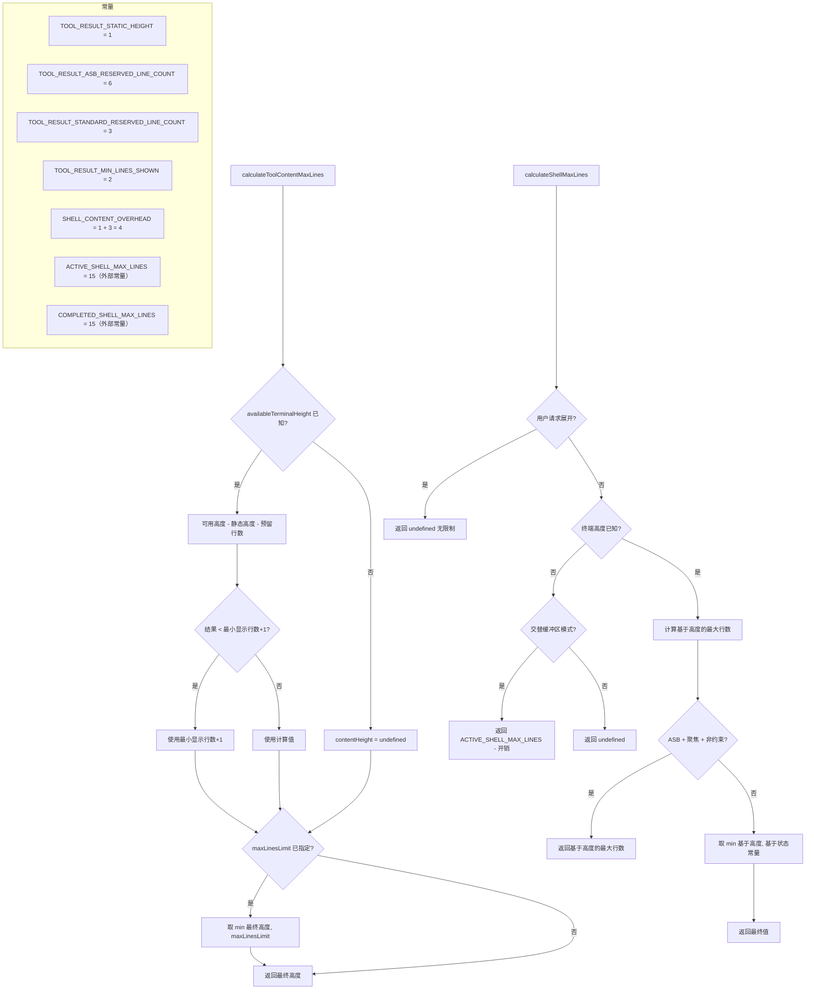

# toolLayoutUtils.ts

## 概述

`toolLayoutUtils.ts` 是工具结果显示的布局计算模块，负责在有限的终端高度内合理分配工具输出（特别是 Shell 命令输出）的可见行数。该模块处理两种关键的布局场景：

1. **通用工具结果内容高度计算** — 根据终端可用高度、渲染模式（标准模式 vs 交替屏幕缓冲区）计算工具输出的最大显示行数。
2. **Shell 命令输出高度计算** — 在通用计算基础上，额外考虑 Shell 进程的执行状态（运行中 vs 已完成）、焦点状态、用户是否请求展开等因素。

模块定义了一组常量用于预留 UI 元素（标题、边框、提示信息）所占的空间，确保 `ToolGroupMessage` 组件（溢出检测）和 `ToolResultDisplay` 组件（实际截断）之间的计算保持一致。

## 架构图（Mermaid）

## 核心组件

### 1. 布局常量

| 常量名 | 值 | 说明 |
|--------|-----|------|
| `TOOL_RESULT_STATIC_HEIGHT` | `1` | 工具消息的静态高度（工具名称/状态行） |
| `TOOL_RESULT_ASB_RESERVED_LINE_COUNT` | `6` | 交替屏幕缓冲区（ASB）模式下为提示和内边距预留的行数 |
| `TOOL_RESULT_STANDARD_RESERVED_LINE_COUNT` | `3` | 标准模式下为提示和内边距预留的行数 |
| `TOOL_RESULT_MIN_LINES_SHOWN` | `2` | 工具结果最少显示的行数，确保至少有可读内容 |
| `SHELL_CONTENT_OVERHEAD` | `4`（1+3） | Shell UI 元素（标题行 + 上下边框）占用的垂直空间 |

**一致性要求**：这些常量必须在 `ToolGroupMessage`（溢出检测）和 `ToolResultDisplay`（实际截断）两个组件之间保持同步，否则会出现溢出检测与实际显示不一致的 bug。

### 2. `calculateToolContentMaxLines(options): number | undefined`

计算工具结果内容区域的最大可显示行数。

**参数**：

| 参数 | 类型 | 说明 |
|------|------|------|
| `availableTerminalHeight` | `number \| undefined` | 终端可用高度（行数）。标准模式历史中可能为 `undefined` |
| `isAlternateBuffer` | `boolean` | 是否处于交替屏幕缓冲区（ASB）模式 |
| `maxLinesLimit` | `number \| undefined` | 可选的硬性行数上限 |

**计算逻辑**：

1. 根据渲染模式选择预留行数：ASB 模式预留 6 行，标准模式预留 3 行
2. 若 `availableTerminalHeight` 已知：
   - `contentHeight = availableTerminalHeight - TOOL_RESULT_STATIC_HEIGHT - reservedLines`
   - 下限保护：至少为 `TOOL_RESULT_MIN_LINES_SHOWN + 1 = 3` 行
3. 若未知，`contentHeight` 为 `undefined`（不限制）
4. 若指定了 `maxLinesLimit`，取 `contentHeight` 和 `maxLinesLimit` 的较小值

**返回值**：`number | undefined`。`undefined` 表示不限制行数。

### 3. `calculateShellMaxLines(options): number | undefined`

计算 Shell 命令输出的最大显示行数。相比通用工具计算，额外考虑了 Shell 特有的状态因素。

**参数**：

| 参数 | 类型 | 说明 |
|------|------|------|
| `status` | `CoreToolCallStatus` | Shell 进程状态（`Executing` 或已完成） |
| `isAlternateBuffer` | `boolean` | 是否处于 ASB 模式 |
| `isThisShellFocused` | `boolean` | 用户是否正在与此 Shell 交互 |
| `availableTerminalHeight` | `number \| undefined` | 终端可用高度 |
| `constrainHeight` | `boolean` | 是否需要约束高度（如历史记录中的条目） |
| `isExpandable` | `boolean \| undefined` | 用户是否可通过 Ctrl+O 展开 |

**计算逻辑（按优先级）**：

1. **用户展开**：若 `!constrainHeight && isExpandable`，返回 `undefined`（无限制）
2. **高度未知**：
   - ASB 模式：返回 `ACTIVE_SHELL_MAX_LINES - SHELL_CONTENT_OVERHEAD = 15 - 4 = 11` 行
   - 标准模式：返回 `undefined`（不限制）
3. **ASB 聚焦展开**：若在 ASB 模式、Shell 获得焦点、且非约束状态，允许占满全部可用高度
4. **默认回退**：基于进程状态选择常量上限
   - 执行中：`ACTIVE_SHELL_MAX_LINES - SHELL_CONTENT_OVERHEAD = 11` 行
   - 已完成：`COMPLETED_SHELL_MAX_LINES - SHELL_CONTENT_OVERHEAD = 11` 行
   - 最终取 `min(基于高度的最大行数, 基于状态的常量上限)`

## 依赖关系

### 内部依赖

| 模块路径 | 导入内容 | 用途 |
|----------|----------|------|
| `../constants.js` | `ACTIVE_SHELL_MAX_LINES` | 活跃 Shell 进程的最大显示行数，值为 15 |
| `../constants.js` | `COMPLETED_SHELL_MAX_LINES` | 已完成 Shell 进程的最大显示行数，值为 15 |

### 外部依赖

| 模块 | 导入内容 | 用途 |
|------|----------|------|
| `@google/gemini-cli-core` | `CoreToolCallStatus` | 工具调用状态枚举，用于判断 Shell 是否正在执行 |

## 关键实现细节

1. **ASB 与标准模式的差异**：交替屏幕缓冲区（Alternate Screen Buffer）模式需要预留更多空间（6 行 vs 3 行），因为 ASB 模式下需要为状态栏、导航提示等额外 UI 元素留出空间。

2. **最小行数保护**：`calculateToolContentMaxLines` 确保内容区域至少有 `TOOL_RESULT_MIN_LINES_SHOWN + 1 = 3` 行，即使终端非常小也能保证基本可读性。

3. **焦点驱动的高度分配**：在 ASB 模式下，聚焦的 Shell（即用户正在查看的）可以占据全部可用高度（`maxLinesBasedOnHeight`），而非聚焦的 Shell 受到常量限制。这实现了类似"焦点放大"的效果。

4. **用户展开机制**：用户通过 `Ctrl+O` 可以请求展开 Shell 输出。当 `constrainHeight === false && isExpandable === true` 时，返回 `undefined` 表示完全不限制高度，让所有输出都可见。

5. **ACTIVE 与 COMPLETED 常量相同**：当前 `ACTIVE_SHELL_MAX_LINES` 和 `COMPLETED_SHELL_MAX_LINES` 都是 15，但代码仍然分别引用它们，预留了未来独立调整的灵活性（例如已完成的命令可能希望折叠显示更少行数）。

6. **SHELL_CONTENT_OVERHEAD 的组成**：`TOOL_RESULT_STATIC_HEIGHT(1) + TOOL_RESULT_STANDARD_RESERVED_LINE_COUNT(3) = 4`，代表 Shell UI 框架占用的固定行数（1 行标题 + 上下边框及提示共 3 行）。

7. **undefined 的双重语义**：
   - 作为输入参数（`availableTerminalHeight`）：表示终端高度未知
   - 作为返回值：表示不限制行数

   这种设计在标准模式的历史记录中特别有用 — 历史条目不需要受高度限制，因为用户可以自由滚动。

8. **`maxLinesBasedOnHeight` 的下限保护**：使用 `Math.max(1, ...)` 确保基于高度的行数至少为 1，防止极端情况下出现 0 或负数的行数。
