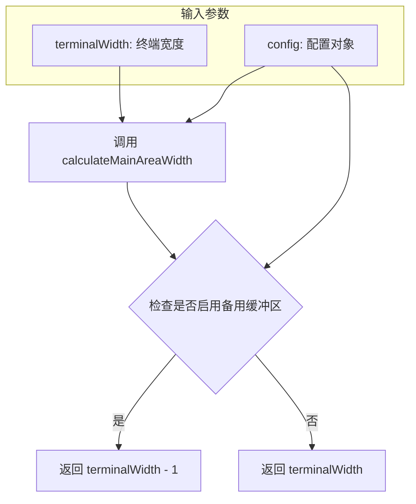

# ui-sizing.ts

## 概述

`ui-sizing.ts` 是 Gemini CLI 终端 UI 的尺寸计算工具模块。它提供了用于计算终端主显示区域宽度的工具函数，核心逻辑是根据是否启用了"备用缓冲区"（Alternate Buffer）模式来决定是否对终端宽度进行微调。当启用备用缓冲区时，主区域宽度会减去 1 像素（列），以避免边界溢出或滚动条遮挡等渲染问题；否则直接使用终端的完整宽度。

**文件路径**: `packages/cli/src/ui/utils/ui-sizing.ts`

## 架构图（Mermaid）

## 核心组件

### `calculateMainAreaWidth(terminalWidth, config): number`

**功能**: 计算终端 UI 主显示区域的可用宽度。

**参数**:

| 参数名 | 类型 | 描述 |
|--------|------|------|
| `terminalWidth` | `number` | 当前终端的总列宽（字符数） |
| `config` | `Config` | 来自 `@google/gemini-cli-core` 的全局配置对象 |

**返回值**: `number` — 主区域可用宽度（字符数）。

**逻辑说明**:

1. 调用 `isAlternateBufferEnabled(config)` 判断当前配置是否启用了备用缓冲区模式。
2. 若启用，返回 `terminalWidth - 1`。减去 1 的目的是为备用缓冲区模式下的边框/滚动条预留空间，防止内容溢出。
3. 若未启用，直接返回完整的 `terminalWidth`。

## 依赖关系

### 内部依赖

| 依赖模块 | 导入内容 | 用途 |
|----------|----------|------|
| `../hooks/useAlternateBuffer.js` | `isAlternateBufferEnabled` | 判断当前是否启用了备用缓冲区模式 |

### 外部依赖

| 依赖包 | 导入内容 | 用途 |
|--------|----------|------|
| `@google/gemini-cli-core` | `Config`（类型） | 提供应用程序配置的类型定义 |

## 关键实现细节

1. **备用缓冲区宽度修正**: 终端的备用缓冲区（Alternate Screen Buffer）是终端模拟器提供的一种独立画面缓冲区，常用于全屏 TUI 应用（如 vim、less）。在备用缓冲区模式下，终端可能会显示滚动条或边框元素，因此需要将可用宽度减少 1 列来避免渲染溢出。

2. **纯函数设计**: `calculateMainAreaWidth` 是一个纯函数，不产生副作用，仅根据输入参数计算输出，便于测试和复用。

3. **类型安全**: 使用 `import type` 语法导入 `Config` 类型，确保类型导入不会产生运行时开销，仅用于 TypeScript 的编译时类型检查。

4. **模块导出**: 该函数通过 `export const` 导出，可被 UI 层的其他组件直接导入使用，通常用于布局组件计算内容区域的宽度约束。
