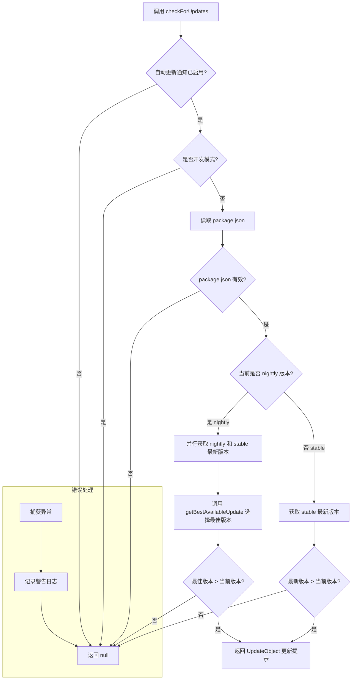

# updateCheck.ts

## 概述

`updateCheck.ts` 是 Gemini CLI 的版本更新检查模块。它负责在用户运行 CLI 时自动检测是否有新版本可用，并返回格式化的更新提示信息。该模块同时支持 **stable（稳定版）** 和 **nightly（夜间构建版）** 两种发布通道，能够智能地为不同通道的用户推荐最佳可用更新版本。

**文件路径**: `packages/cli/src/ui/utils/updateCheck.ts`

## 架构图（Mermaid）

## 核心组件

### 接口定义

#### `UpdateInfo`

更新信息数据结构，复制自 `update-notifier` 包中所需的字段。

| 字段 | 类型 | 描述 |
|------|------|------|
| `latest` | `string` | 最新可用版本号 |
| `current` | `string` | 当前已安装版本号 |
| `name` | `string` | npm 包名称 |
| `type` | `semver.ReleaseType \| undefined` | 版本变更类型（major / minor / patch / prerelease 等） |

#### `UpdateObject`

更新通知的完整对象，包含人类可读的消息和详细的更新信息。

| 字段 | 类型 | 描述 |
|------|------|------|
| `message` | `string` | 面向用户的更新提示消息 |
| `update` | `UpdateInfo` | 详细的版本更新信息 |
| `isUpdating` | `boolean \| undefined` | 可选标志，指示是否正在执行更新 |

### 常量

#### `FETCH_TIMEOUT_MS`

- **值**: `2000`（2 秒）
- **用途**: 版本获取的超时时间（导出供外部使用，但当前文件内未直接引用——可能在调用层或测试中使用）。

### 函数

#### `getBestAvailableUpdate(nightly?, stable?): string | null`

**可见性**: 模块内部私有函数（未导出）。

**功能**: 从 nightly 版本和 stable 版本中选择"最佳"推荐更新版本。

**选择规则**:
1. 如果只有其中一个版本存在，返回该版本。
2. 如果两者的基础版本号相同（通过 `semver.coerce` 去除预发布标签后比较），优先推荐 nightly 版本（因为 nightly 包含最新特性）。
3. 如果基础版本不同，返回版本号更高的那个。

**参数**:

| 参数名 | 类型 | 描述 |
|--------|------|------|
| `nightly` | `string \| undefined` | nightly 通道的最新版本号 |
| `stable` | `string \| undefined` | stable 通道的最新版本号 |

**返回值**: `string | null` — 推荐的最佳版本号，若均不可用则返回 `null`。

#### `checkForUpdates(settings): Promise<UpdateObject | null>`

**可见性**: 导出（`export async function`）。

**功能**: 执行完整的版本更新检查流程。

**参数**:

| 参数名 | 类型 | 描述 |
|--------|------|------|
| `settings` | `LoadedSettings` | 已加载的用户设置对象，用于检查是否启用了自动更新通知 |

**返回值**: `Promise<UpdateObject | null>` — 有更新时返回 `UpdateObject`，无更新或检查失败时返回 `null`。

**执行流程**:

1. **检查开关**: 读取 `settings.merged.general.enableAutoUpdateNotification`，若为 `false` 则跳过。
2. **开发模式跳过**: 若环境变量 `DEV` 为 `'true'`，跳过检查（避免从源码运行时触发更新提示）。
3. **读取当前版本**: 通过 `getPackageJson(__dirname)` 获取当前包的 `name` 和 `version`。
4. **分通道检查**:
   - **Nightly 用户**: 并行请求 nightly 和 stable 两个通道的最新版本，通过 `getBestAvailableUpdate` 选择最优版本。
   - **Stable 用户**: 仅请求 stable 通道的最新版本。
5. **版本比较**: 使用 `semver.gt` 判断最新版本是否高于当前版本。
6. **构建提示**: 若有更新，构建包含版本变更描述的 `UpdateObject`。
7. **异常处理**: 任何错误（网络超时、npm 注册表不可达等）均被捕获并记录为警告日志，不会中断 CLI 运行。

## 依赖关系

### 内部依赖

| 依赖模块 | 导入内容 | 用途 |
|----------|----------|------|
| `@google/gemini-cli-core` | `getPackageJson` | 读取当前项目的 `package.json` 文件 |
| `@google/gemini-cli-core` | `debugLogger` | 输出调试/警告日志 |
| `../../config/settings.js` | `LoadedSettings`（类型） | 用户设置的类型定义 |

### 外部依赖

| 依赖包 | 导入内容 | 用途 |
|--------|----------|------|
| `latest-version` | `latestVersion` | 从 npm 注册表获取指定包的最新版本号，支持按发布标签（tag）查询 |
| `semver` | `semver` | 语义化版本号的解析、比较和差异计算 |
| `node:url` | `fileURLToPath` | 将 ESM 的 `import.meta.url` 转换为文件系统路径 |
| `node:path` | `path` | 路径操作，用于获取当前文件的目录路径 |

## 关键实现细节

1. **ESM 兼容的 `__dirname` 模拟**: 由于 ESM 模块系统不提供 `__dirname` 全局变量，代码通过 `fileURLToPath(import.meta.url)` + `path.dirname()` 手动构造等效的 `__dirname`，用于传递给 `getPackageJson` 来定位 `package.json`。

2. **双通道并行查询**: 对于 nightly 用户，使用 `Promise.all` 同时请求 nightly 和 stable 两个通道的最新版本，避免串行请求导致的延迟加倍，提升用户体验。

3. **Nightly 优先策略**: `getBestAvailableUpdate` 在基础版本相同时优先推荐 nightly 版本。这是因为 nightly 用户本身就选择了"尝鲜"通道，当 nightly 和 stable 基于同一基础版本时，nightly 通常包含更多最新修复和特性。

4. **优雅降级**: 整个 `checkForUpdates` 函数被 `try-catch` 包裹，确保网络故障、npm 注册表不可达、超时等异常不会影响 CLI 的正常运行。失败时仅记录警告日志并返回 `null`。

5. **开发模式保护**: 通过检测环境变量 `DEV === 'true'` 来跳过更新检查，避免开发者在本地开发时看到不必要的更新提示。

6. **版本变更类型识别**: 使用 `semver.diff()` 计算当前版本与最新版本之间的差异类型（如 `major`、`minor`、`patch`、`prerelease`），供 UI 层显示不同级别的更新提示样式。

7. **FETCH_TIMEOUT_MS 导出**: 超时常量被导出但在当前文件中未直接使用，推测是在调用层（如 UI 组件或集成测试）中用于控制更新检查的最大等待时间。
