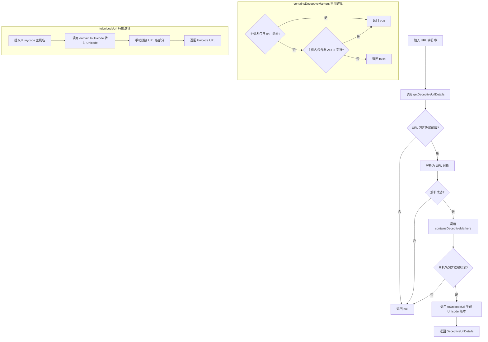

# urlSecurityUtils.ts

## 概述

`urlSecurityUtils.ts` 是 Gemini CLI 的 URL 安全检测工具模块，专门用于识别和防范**国际化域名（IDN）同形异义字攻击**（Homograph Attack）。这种攻击利用 Unicode 字符与 ASCII 字符在视觉上的相似性来伪装恶意域名（例如用西里尔字母 "а" 替代拉丁字母 "a"）。

该模块能够检测 URL 中是否包含非 ASCII 字符或 Punycode 编码标记（`xn--`），并提供将 Punycode URL 转换回 Unicode 显示形式的功能，以便在 UI 中向用户展示"视觉欺骗版本"和"真实 Punycode 版本"的对比，从而提醒用户注意潜在的钓鱼风险。

**文件路径**: `packages/cli/src/ui/utils/urlSecurityUtils.ts`

## 架构图（Mermaid）

## 核心组件

### 接口定义

#### `DeceptiveUrlDetails`

描述一个潜在欺骗性 URL 的详细信息。

| 字段 | 类型 | 描述 |
|------|------|------|
| `originalUrl` | `string` | URL 的 Unicode 显示版本（视觉欺骗形式，即用户可能看到的样子） |
| `punycodeUrl` | `string` | URL 的 ASCII 安全 Punycode 版本（浏览器实际解析的形式） |

### 函数

#### `containsDeceptiveMarkers(hostname): boolean`（私有）

**可见性**: 模块内部私有函数（未导出）。

**功能**: 检测主机名中是否包含可能用于视觉欺骗的标记。

**检测规则**（满足任一即返回 `true`）:
1. 主机名（小写化后）包含 `xn--` 前缀 — 这是 Punycode 编码的标识符，表明域名中原本包含非 ASCII 字符。
2. 主机名匹配正则 `/[^\x00-\x7F]/` — 即包含任何 ASCII 范围 (0x00-0x7F) 之外的字符。

**参数**:

| 参数名 | 类型 | 描述 |
|--------|------|------|
| `hostname` | `string` | 要检测的主机名 |

**返回值**: `boolean` — 包含欺骗标记则为 `true`。

#### `toUnicodeUrl(urlInput): string`（导出）

**功能**: 将 URL 转换为其 Unicode 显示形式，绕过 WHATWG URL 类的自动 Punycode 转换。

**参数**:

| 参数名 | 类型 | 描述 |
|--------|------|------|
| `urlInput` | `string \| URL` | 输入的 URL 字符串或 URL 对象 |

**返回值**: `string` — 主机名为 Unicode 的 URL 字符串。

**实现逻辑**:
1. 将输入转为 `URL` 对象。
2. 通过 `url.domainToUnicode()` 将 Punycode 主机名转回 Unicode。
3. 手动拼接 URL 各组成部分（协议、凭据、主机名、端口、路径、查询参数、锚点），因为直接设置 `URL.hostname` 会触发自动 Punycode 编码。
4. 异常时返回原始输入。

#### `getDeceptiveUrlDetails(urlString): DeceptiveUrlDetails | null`（导出）

**功能**: 检测给定 URL 是否为潜在的欺骗性 URL，并返回其详细信息。

**参数**:

| 参数名 | 类型 | 描述 |
|--------|------|------|
| `urlString` | `string` | 待检测的 URL 字符串 |

**返回值**: `DeceptiveUrlDetails | null` — 检测到欺骗性 URL 时返回详情对象，否则返回 `null`。

**执行流程**:
1. 快速预检：若 URL 不包含 `://`，直接返回 `null`（非标准 URL 格式）。
2. 使用 `new URL()` 解析 URL。
3. 调用 `containsDeceptiveMarkers` 检测主机名。
4. 若检测到欺骗标记，调用 `toUnicodeUrl` 生成 Unicode 版本，并与 Punycode 版本一起返回。
5. URL 解析失败时返回 `null`。

## 依赖关系

### 内部依赖

无内部依赖。该模块是一个独立的纯工具模块。

### 外部依赖

| 依赖包 | 导入内容 | 用途 |
|--------|----------|------|
| `node:url` | `url`（默认导入） | 使用 `url.domainToUnicode()` 将 Punycode 域名转换为 Unicode 显示形式 |

## 关键实现细节

1. **IDN 同形异义字攻击防护**: 该模块的核心目的是防范国际化域名欺骗。攻击者可以注册看起来与知名域名几乎相同的域名（例如 `аpple.com` 使用西里尔字母 "а" 代替拉丁字母 "a"），在 Punycode 中表示为 `xn--pple-43d.com`。模块通过检测这类特征来警示用户。

2. **手动 URL 重构绕过 WHATWG 限制**: `toUnicodeUrl` 函数不能简单地设置 `URL.hostname` 为 Unicode 主机名，因为 WHATWG URL 标准的实现会自动将 Unicode 主机名编码回 Punycode。因此代码必须手动拼接 URL 的各个组成部分：`protocol + credentials + unicodeHost + port + pathname + search + hash`。

3. **双重检测策略**: `containsDeceptiveMarkers` 同时检测两种情况：
   - **Punycode 已编码域名**（包含 `xn--`）：浏览器/URL 解析器已将 Unicode 域名编码为 Punycode。
   - **原始 Unicode 域名**（包含非 ASCII 字符）：URL 字符串直接使用了 Unicode 字符，尚未被编码。
   这确保了无论 URL 以何种形式传入，都能被正确检测。

4. **优雅的错误处理**: 所有函数都使用 `try-catch` 包裹核心逻辑，确保无效 URL 不会导致异常抛出。`toUnicodeUrl` 在异常时返回原始输入，`getDeceptiveUrlDetails` 在异常时返回 `null`。

5. **快速预检优化**: `getDeceptiveUrlDetails` 首先检查 URL 是否包含 `://`，这是一个轻量级的字符串检查，可以快速排除大量非 URL 字符串，避免不必要的 `new URL()` 解析开销。

6. **凭据保留**: `toUnicodeUrl` 在重构 URL 时完整保留了用户名和密码凭据信息（`username:password@`），确保转换后的 URL 在语义上与原始 URL 完全等价。

7. **大小写不敏感检测**: 在检测 `xn--` 前缀时，先将主机名转为小写（`.toLowerCase()`），确保即使 Punycode 前缀大小写不一致也能被正确识别。
