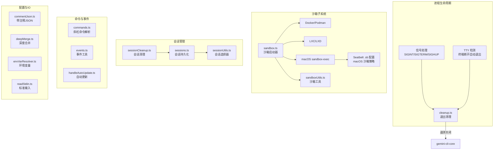
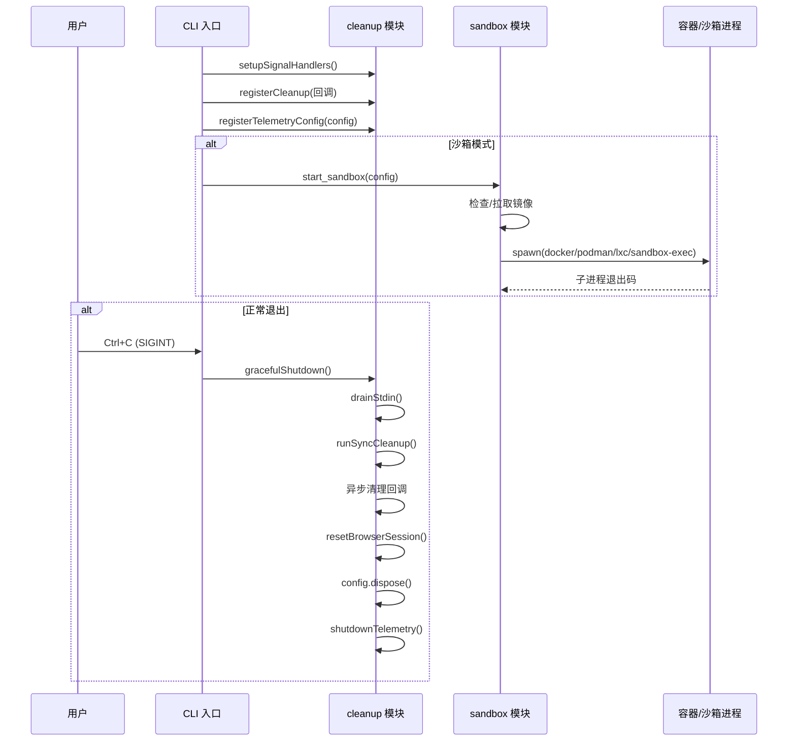

# utils (CLI 工具集)

## 概述

`utils` 目录是 Gemini CLI 的通用工具函数和基础设施集合，包含进程生命周期管理、沙箱执行环境、命令解析、会话管理、自动更新、Git 操作、安全沙箱等关键子系统。这些工具被 CLI 的各个层（UI、核心、配置、ACP）广泛引用。

## 目录结构

```
utils/
├── cleanup.ts                 # 进程退出清理（信号处理、遥测关闭、TTY 检测）
├── sandbox.ts                 # 沙箱执行环境（Docker/Podman/macOS Seatbelt/LXC/gVisor）
├── sandboxUtils.ts            # 沙箱辅助函数（容器路径、端口、入口点）
├── sandbox-macos-*.sb         # macOS Seatbelt 沙箱配置文件（6 种模式）
├── commands.ts                # 斜杠命令解析器（TUI 模式用）
├── sessions.ts                # 会话持久化与列表管理
├── sessionUtils.ts            # 会话选择器（按 ID/最近选择会话）
├── sessionCleanup.ts          # 过期会话自动清理
├── handleAutoUpdate.ts        # CLI 自动更新检测与执行
├── gitUtils.ts                # Git 仓库信息获取工具
├── worktreeSetup.ts           # Git worktree 环境设置
├── activityLogger.ts          # 用户活动日志记录
├── agentSettings.ts           # Agent 设置管理工具
├── agentUtils.ts              # Agent 循环相关工具函数
├── commentJson.ts             # 带注释的 JSON 解析器
├── deepMerge.ts               # 深度合并对象工具
├── devtoolsService.ts         # DevTools 远程调试服务
├── dialogScopeUtils.ts        # 对话框作用域工具
├── envVarResolver.ts          # 环境变量解析（$VAR 替换）
├── errors.ts                  # 错误处理工具
├── events.ts                  # 事件发射与监听工具
├── featureToggleUtils.ts      # 功能开关工具
├── hookSettings.ts            # Hook 配置设置
├── hookUtils.ts               # Hook 执行工具
├── installationInfo.ts        # CLI 安装信息检测
├── jsonoutput.ts              # JSON 输出格式化
├── logCleanup.ts              # 日志文件清理
├── math.ts                    # 数学工具函数
├── persistentState.ts         # 持久状态存储（跨会话）
├── processUtils.ts            # 进程操作工具
├── readStdin.ts               # 标准输入读取
├── relaunch.ts                # CLI 重启逻辑
├── resolvePath.ts             # 路径解析工具
├── settingsUtils.ts           # 设置文件读写工具
├── skillSettings.ts           # Skill 配置管理
├── skillUtils.ts              # Skill 执行工具
├── spawnWrapper.ts            # 子进程 spawn 包装器
├── startupWarnings.ts         # 启动警告检测
├── userStartupWarnings.ts     # 用户级启动警告
├── terminalNotifications.ts   # 终端通知（macOS/Linux）
├── terminalTheme.ts           # 终端主题检测
├── tierUtils.ts               # 用户层级/配额工具
├── updateEventEmitter.ts      # 更新事件发射器
└── windowTitle.ts             # 终端窗口标题管理
```

## 架构图



## 核心组件

### 1. `cleanup.ts` — 进程退出清理

提供完整的进程生命周期管理：
- `registerCleanup()` / `registerSyncCleanup()` — 注册异步/同步清理回调
- `setupSignalHandlers()` — 监听 SIGHUP/SIGTERM/SIGINT 信号
- `setupTtyCheck()` — 定时检测 TTY 丢失（终端关闭时自动退出）
- `runExitCleanup()` — 执行清理链：排空 stdin → 同步清理 → 异步清理 → 关闭浏览器会话 → 释放 Config → 关闭遥测

### 2. `sandbox.ts` — 沙箱执行环境

`start_sandbox()` 支持多种沙箱后端：
- **macOS Seatbelt** (`sandbox-exec`) — 使用 `.sb` 策略文件限制文件/网络访问，支持 6 种配置（permissive/restrictive/strict x open/proxied）
- **Docker/Podman** — 容器化沙箱，挂载工作区、配置目录、gcloud 凭证等，支持代理和自定义网络
- **gVisor** (`runsc`) — 使用 `--runtime=runsc` 的 Docker 容器
- **LXC/LXD** — 使用已有的 LXC 容器，通过设备挂载映射工作区

核心功能包括：镜像管理（检查/拉取）、环境变量传递、代理配置、用户 UID/GID 映射。

### 3. `commands.ts` — 斜杠命令解析

`parseSlashCommand()` 将用户输入的斜杠命令（如 `/memory add 内容`）解析为：
- `commandToExecute` — 匹配的命令对象
- `args` — 命令参数
- `canonicalPath` — 规范化命令路径

支持主名称匹配和别名匹配，支持嵌套子命令。

### 4. `sessions.ts` / `sessionUtils.ts` — 会话管理

管理对话会话的创建、持久化（JSON 文件）、列表展示和恢复选择。`SessionSelector` 支持按 ID 精确选择或选择最近的会话。

### 5. `handleAutoUpdate.ts` — 自动更新

检测 CLI 新版本并在后台执行自动更新，记录更新状态到持久存储。

## 依赖关系

| 依赖方向 | 目标 | 说明 |
|---------|------|------|
| `@google/gemini-cli-core` | 核心库 | Config、Storage、遥测、调试日志、事件系统 |
| `../ui/commands/types.ts` | UI 层 | SlashCommand 类型定义（TUI 模式命令系统） |
| `../ui/utils/ConsolePatcher.ts` | UI 层 | 控制台输出拦截（沙箱模式下使用） |
| `shell-quote` | 外部库 | Shell 命令安全引用/解析 |
| Node.js `child_process` | 运行时 | 子进程管理（沙箱启动） |

## 数据流


