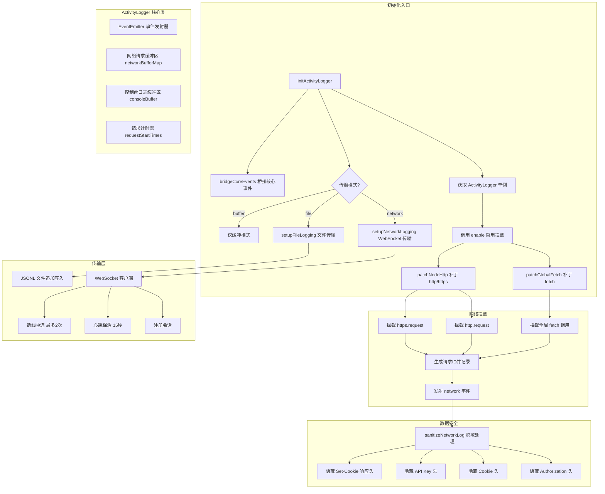

# activityLogger.ts

## 概述

`activityLogger.ts` 是 Gemini CLI 的**会话活动记录器**，负责捕获和记录 CLI 运行期间的所有网络请求和控制台日志。它通过对 Node.js 的 `http.request`、`https.request` 以及全局 `fetch` API 进行猴子补丁（Monkey Patching）实现透明的网络请求拦截，支持流式分块记录和响应体自动解压（gzip/deflate）。

捕获到的活动数据可通过三种传输模式（transport）持久化：
1. **WebSocket 网络传输** — 实时推送到远端调试服务器
2. **文件传输** — 以 JSONL 格式追加写入本地日志文件
3. **缓冲模式** — 仅拦截并缓存在内存中，不进行任何持久化

该模块基于 Node.js 的 `EventEmitter` 模式，外部可监听 `network` 和 `console` 事件来获取实时活动数据。

**文件路径**: `packages/cli/src/utils/activityLogger.ts`

## 架构图（Mermaid）



## 核心组件

### 常量

| 常量名 | 值 | 描述 |
|--------|-----|------|
| `ACTIVITY_ID_HEADER` | `'x-activity-request-id'` | 注入到 HTTP 请求头中的活动追踪 ID，用于关联请求和响应 |
| `MAX_BUFFER_SIZE` | `100` | WebSocket 传输缓冲区的最大容量 |

### 接口定义

#### `NetworkLog`

完整的网络请求日志记录。

| 字段 | 类型 | 描述 |
|------|------|------|
| `id` | `string` | 请求的唯一标识符 |
| `timestamp` | `number` | 请求发起时间戳 |
| `method` | `string` | HTTP 方法（GET、POST 等） |
| `url` | `string` | 请求的完整 URL |
| `headers` | `Record<string, string>` | 请求头（key 统一小写） |
| `body` | `string \| undefined` | 请求体内容 |
| `pending` | `boolean \| undefined` | 请求是否仍在进行中 |
| `chunk` | `{ index, data, timestamp } \| undefined` | 流式响应的分块数据 |
| `response` | `{ status, headers, body, durationMs } \| undefined` | 完整的响应信息 |
| `error` | `string \| undefined` | 请求失败时的错误信息 |

#### `PartialNetworkLog`

网络日志的部分更新（必须包含 `id` 字段，其余字段可选）。用于在请求生命周期中发射增量更新事件。

```typescript
type PartialNetworkLog = { id: string } & Partial<NetworkLog>;
```

### 类: `ActivityLogger`（继承自 `EventEmitter`）

单例模式的活动日志捕获器，是整个模块的核心。

#### 私有属性

| 属性名 | 类型 | 描述 |
|--------|------|------|
| `instance` | `ActivityLogger`（静态） | 单例实例 |
| `isInterceptionEnabled` | `boolean` | 是否已启用 HTTP 拦截 |
| `requestStartTimes` | `Map<string, number>` | 记录每个请求的开始时间，用于计算响应耗时 |
| `networkLoggingEnabled` | `boolean` | 网络日志传输是否已启用 |
| `networkBufferMap` | `Map<string, Array<...>>` | 按请求 ID 分组的网络日志缓冲区 |
| `networkBufferIds` | `string[]` | 有序的请求 ID 列表，用于 FIFO 驱逐 |
| `consoleBuffer` | `Array<...>` | 控制台日志的环形缓冲区 |
| `bufferLimit` | `number`（readonly, 10） | 缓冲区中保存的最大请求组数量 |

#### 公开方法

| 方法名 | 返回值 | 描述 |
|--------|--------|------|
| `getInstance()` | `ActivityLogger` | 获取单例实例（静态方法） |
| `enableNetworkLogging()` | `void` | 启用网络日志传输并触发 `network-logging-enabled` 事件 |
| `disableNetworkLogging()` | `void` | 禁用网络日志传输 |
| `isNetworkLoggingEnabled()` | `boolean` | 查询网络日志传输是否启用 |
| `drainBufferedLogs()` | `{ network, console }` | 原子性地获取并清空所有缓冲日志，防止读取与清除之间的数据丢失 |
| `getBufferedLogs()` | `{ network, console }` | 获取当前缓冲日志的快照（不清空） |
| `clearBufferedLogs()` | `void` | 清空所有缓冲日志 |
| `enable()` | `void` | 启用 HTTP 请求拦截（补丁 fetch 和 http/https） |
| `emitNetworkEvent(payload)` | `void` | 手动发射网络事件（`@internal`，仅供测试使用） |
| `logConsole(payload)` | `void` | 记录控制台日志，添加时间戳并发射 `console` 事件 |

#### 私有方法

| 方法名 | 描述 |
|--------|------|
| `stringifyHeaders(headers)` | 将各种头部格式（`Headers` 对象、普通对象）统一转为 `Record<string, string>`，key 小写化 |
| `sanitizeNetworkLog(log)` | 对日志进行安全脱敏，隐藏敏感头部（`authorization`、`cookie`、`x-goog-api-key`、`set-cookie`） |
| `safeEmitNetwork(payload)` | 脱敏后将日志加入缓冲区（FIFO 驱逐），并发射 `network` 事件 |
| `patchGlobalFetch()` | 猴子补丁全局 `fetch` API，拦截所有 fetch 请求 |
| `patchNodeHttp()` | 猴子补丁 `http.request` 和 `https.request`，拦截所有 Node.js 原生 HTTP 请求 |

### 独立函数

#### `setupFileLogging(capture, config, customPath?)`（私有）

配置基于文件的 JSONL 日志传输。

- 日志文件路径优先使用 `customPath`，否则使用 `config.storage` 提供的项目临时日志目录。
- 自动创建日志目录（`recursive: true`）。
- 监听 `console` 和 `network` 事件，将日志条目以 JSON 行格式异步追加到文件。
- 每条日志包含 `type`、`payload`、`sessionId`、`timestamp` 字段。

#### `setupNetworkLogging(capture, host, port, config, onReconnectFailed?)`（私有）

配置基于 WebSocket 的实时网络日志传输。

- 连接到 `ws://{host}:{port}/ws`。
- 支持会话注册（`register`）、心跳保活（每 15 秒发送 `pong`）、断线重连（最多 2 次）。
- 未连接或未启用网络日志时，消息缓冲到 `transportBuffer`（最大 100 条）。
- 连接建立后自动刷新（flush）所有缓冲日志。
- 进程退出时自动清理 WebSocket 连接。

#### `bridgeCoreEvents(capture)`（私有）

将 `@google/gemini-cli-core` 的 `coreEvents` 中的 `ConsoleLog` 事件桥接到 `ActivityLogger`。使用 `bridgeAttached` 标志确保只桥接一次。

#### `initActivityLogger(config, options)`（导出）

活动日志系统的主初始化入口。

**参数**:

| 参数名 | 类型 | 描述 |
|--------|------|------|
| `config` | `Config` | CLI 配置对象 |
| `options` | 联合类型 | 传输模式配置（见下方） |

**options 联合类型**:

| 模式 | 字段 | 描述 |
|------|------|------|
| `network` | `host`, `port`, `onReconnectFailed?` | WebSocket 实时传输 |
| `file` | `filePath?` | JSONL 文件传输 |
| `buffer` | 无额外字段 | 仅内存缓冲 |

#### `addNetworkTransport(config, host, port, onReconnectFailed?)`（导出）

向已初始化的 `ActivityLogger` 单例追加 WebSocket 传输。用于"模式升级"场景（例如从 buffer 模式提升为 network 模式），不会重复桥接 `coreEvents`。

### 辅助类型守卫函数（私有）

| 函数名 | 用途 |
|--------|------|
| `isHeaderRecord(h)` | 判断 HTTP 头部是否为 `OutgoingHttpHeaders` 记录类型（非数组） |
| `isRequestOptions(value)` | 判断值是否为 `http.RequestOptions` 对象（排除 URL 和数组） |
| `isIncomingMessageCallback(value)` | 判断值是否为响应回调函数 |

### 辅助调用函数（私有）

#### `callHttpRequest(originalFn, args)`

类型安全地调用原始 `http.request` 函数。由于 `http.request` 有多种重载签名，此函数根据参数个数和类型分发到正确的重载形式，避免 TypeScript 类型推断问题。

## 依赖关系

### 内部依赖

| 依赖模块 | 导入内容 | 用途 |
|----------|----------|------|
| `@google/gemini-cli-core` | `CoreEvent` | 核心事件枚举常量 |
| `@google/gemini-cli-core` | `coreEvents` | 核心事件发射器实例 |
| `@google/gemini-cli-core` | `debugLogger` | 调试日志输出 |
| `@google/gemini-cli-core` | `ConsoleLogPayload`（类型） | 控制台日志载荷的类型定义 |
| `@google/gemini-cli-core` | `Config`（类型） | CLI 配置对象的类型定义 |

### 外部依赖

| 依赖包 | 导入内容 | 用途 |
|--------|----------|------|
| `node:http` | `http` | Node.js HTTP 模块，被拦截的目标之一 |
| `node:https` | `https` | Node.js HTTPS 模块，被拦截的目标之一 |
| `node:zlib` | `zlib` | 响应体解压缩（支持 gzip 和 deflate） |
| `node:fs` | `fs` | 文件系统操作（创建日志目录、追加写入日志文件） |
| `node:path` | `path` | 路径拼接操作 |
| `node:events` | `EventEmitter` | 事件发射器基类 |
| `ws` | `WebSocket` | WebSocket 客户端，用于实时日志传输 |

## 关键实现细节

1. **猴子补丁策略**: 通过替换 `global.fetch`、`http.request`、`https.request` 实现透明拦截。对于 `http/https` 模块使用 `Object.defineProperty` 替换（而非直接赋值），确保属性描述符正确设置（`writable: true, configurable: true`）。

2. **本地请求豁免**: 对 `127.0.0.1` 和 `localhost` 的请求自动跳过拦截，避免记录本地通信（如与本地 WebSocket 调试服务器的通信）导致的无限递归。

3. **活动 ID 去重**: 通过在 fetch 请求中注入 `x-activity-request-id` 头部，并在 `patchNodeHttp` 中检测该头部来避免重复拦截。如果 HTTP 请求已包含该头部，说明它是由已被补丁的 fetch 发起的，因此 http 层会跳过拦截。

4. **流式分块记录**: 对于流式响应（如 SSE），拦截器会逐块（chunk）发射增量更新事件（包含 `chunk.index`、`chunk.data`、`chunk.timestamp`），使调试工具可以实时展示流式数据。

5. **响应体自动解压**: 在 Node.js HTTP 拦截中，根据 `content-encoding` 响应头自动使用 `zlib.gunzip`（gzip）或 `zlib.inflate`（deflate）解压响应体。解压失败时降级使用原始 buffer。

6. **敏感信息脱敏**: `sanitizeNetworkLog` 方法在日志发射前自动将 `authorization`、`cookie`、`x-goog-api-key` 请求头和 `set-cookie` 响应头替换为 `[REDACTED]`，防止敏感凭据泄露到日志中。

7. **FIFO 环形缓冲**: 网络日志缓冲区采用按请求 ID 分组的 Map 结构，配合有序 ID 列表实现 FIFO 驱逐策略。当缓冲请求组数超过 `bufferLimit`（10）时，最旧的请求组被移除。控制台日志同样有容量限制。

8. **原子性 drain 操作**: `drainBufferedLogs` 方法在单次调用中获取并清空所有缓冲日志，避免"先获取、再清空"两步操作之间有新事件到达导致数据丢失。

9. **WebSocket 重连机制**: 断线后以 1 秒间隔自动重连，最多重试 2 次。超过重试次数后调用 `onReconnectFailed` 回调（可用于通知上层进行传输模式降级）。

10. **传输模式升级**: `addNetworkTransport` 函数支持在运行时向已初始化的 ActivityLogger 追加 WebSocket 传输，无需重新初始化或重复桥接核心事件，实现了从 buffer 模式到 network 模式的平滑升级。

11. **进程退出清理**: 在 `process.on('exit')` 回调中关闭 WebSocket 连接并清理定时器，确保资源正确释放。

12. **`callHttpRequest` 类型安全调用**: 由于 `http.request` 有复杂的函数重载签名（URL/options/callback 的各种组合），直接调用会导致 TypeScript 类型推断问题。`callHttpRequest` 通过逐一匹配参数数量和类型，将调用正确地分发到对应的重载形式。
