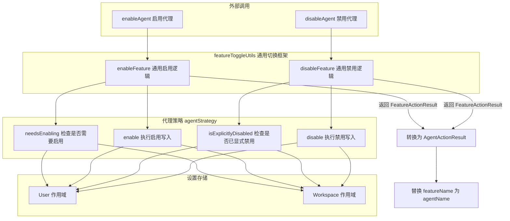

# agentSettings.ts

## 概述

`agentSettings.ts` 是 Gemini CLI 的**代理（Agent）设置管理模块**，提供启用和禁用代理的功能。它采用**策略模式（Strategy Pattern）**，通过实现 `FeatureToggleStrategy` 接口来定义代理特有的启用/禁用逻辑，然后委托给通用的 `featureToggleUtils` 框架执行实际的多作用域设置操作。

代理的启用状态通过设置路径 `agents.overrides.<agentName>.enabled` 进行管理，支持在 **User（用户级）** 和 **Workspace（工作区级）** 两个可写作用域中进行配置。代理采用**白名单模式**——默认不启用，需要显式设置 `enabled: true` 才会生效。

**文件路径**: `packages/cli/src/utils/agentSettings.ts`

## 架构图（Mermaid）



## 核心组件

### 类型定义

#### `AgentActionStatus`

代理操作状态的类型别名。

```typescript
type AgentActionStatus = 'success' | 'no-op' | 'error';
```

| 值 | 描述 |
|-----|------|
| `'success'` | 操作成功执行，设置已变更 |
| `'no-op'` | 代理已处于目标状态，无需操作 |
| `'error'` | 操作失败（如无效的作用域） |

#### `AgentActionResult`

代理操作结果的接口，继承自 `FeatureActionResult`（排除 `featureName` 字段），添加 `agentName` 字段。

```typescript
interface AgentActionResult extends Omit<FeatureActionResult, 'featureName'> {
  agentName: string;
}
```

| 字段 | 类型 | 描述 |
|------|------|------|
| `status` | `AgentActionStatus` | 操作结果状态 |
| `agentName` | `string` | 操作的代理名称 |
| `action` | `'enable' \| 'disable'` | 执行的操作类型 |
| `modifiedScopes` | `ModifiedScope[]` | 实际发生变更的作用域列表 |
| `alreadyInStateScopes` | `ModifiedScope[]` | 已处于目标状态的作用域列表 |
| `error` | `string \| undefined` | 错误描述（仅当 `status === 'error'` 时） |

### 策略对象: `agentStrategy`（私有）

实现了 `FeatureToggleStrategy` 接口的代理特定策略对象，定义了代理的白名单启用/禁用语义。

| 方法 | 逻辑 | 读写路径 |
|------|------|----------|
| `needsEnabling(settings, scope, agentName)` | 检查 `agents.overrides[agentName].enabled` 是否**不为** `true`。若非 `true`（包括 `undefined` 和 `false`），则表示需要启用。 | 读: `settings.forScope(scope).settings.agents?.overrides` |
| `enable(settings, scope, agentName)` | 将 `agents.overrides.<agentName>.enabled` 设置为 `true`。 | 写: `settings.setValue(scope, ...)` |
| `isExplicitlyDisabled(settings, scope, agentName)` | 检查 `agents.overrides[agentName].enabled` 是否**严格等于** `false`。仅当显式设置为 `false` 时返回 `true`，`undefined` 不算。 | 读: `settings.forScope(scope).settings.agents?.overrides` |
| `disable(settings, scope, agentName)` | 将 `agents.overrides.<agentName>.enabled` 设置为 `false`。 | 写: `settings.setValue(scope, ...)` |

### 导出函数

#### `enableAgent(settings, agentName): AgentActionResult`

启用指定代理。

**参数**:

| 参数名 | 类型 | 描述 |
|--------|------|------|
| `settings` | `LoadedSettings` | 已加载的用户/工作区设置 |
| `agentName` | `string` | 要启用的代理名称 |

**返回值**: `AgentActionResult` — 包含操作状态和受影响作用域的结果对象。

**行为**:
- 委托给 `enableFeature(settings, agentName, agentStrategy)`。
- 该函数会遍历 `Workspace` 和 `User` 两个可写作用域，在所有需要启用的作用域中将 `agents.overrides.<agentName>.enabled` 设置为 `true`。
- 将返回的 `FeatureActionResult` 中的 `featureName` 字段替换为 `agentName`。

#### `disableAgent(settings, agentName, scope): AgentActionResult`

在指定作用域禁用代理。

**参数**:

| 参数名 | 类型 | 描述 |
|--------|------|------|
| `settings` | `LoadedSettings` | 已加载的用户/工作区设置 |
| `agentName` | `string` | 要禁用的代理名称 |
| `scope` | `SettingScope` | 禁用操作的目标作用域 |

**返回值**: `AgentActionResult` — 包含操作状态和受影响作用域的结果对象。

**行为**:
- 委托给 `disableFeature(settings, agentName, scope, agentStrategy)`。
- 仅在指定的单个作用域中将 `agents.overrides.<agentName>.enabled` 设置为 `false`。
- 将返回的 `FeatureActionResult` 中的 `featureName` 字段替换为 `agentName`。

## 依赖关系

### 内部依赖

| 依赖模块 | 导入内容 | 用途 |
|----------|----------|------|
| `../config/settings.js` | `SettingScope`（类型） | 设置作用域枚举类型 |
| `../config/settings.js` | `LoadedSettings`（类型） | 已加载设置对象的类型定义 |
| `./featureToggleUtils.js` | `FeatureActionResult`（类型） | 功能切换操作结果的类型定义 |
| `./featureToggleUtils.js` | `FeatureToggleStrategy`（类型） | 功能切换策略接口 |
| `./featureToggleUtils.js` | `enableFeature` | 通用功能启用函数 |
| `./featureToggleUtils.js` | `disableFeature` | 通用功能禁用函数 |

### 外部依赖

无外部依赖。该模块完全依赖于项目内部的设置基础架构。

## 关键实现细节

1. **策略模式（Strategy Pattern）**: 模块通过实现 `FeatureToggleStrategy` 接口来分离"代理的启用/禁用语义"与"通用的多作用域切换逻辑"。这使得新增功能类型（如 Skills、Plugins）时只需定义新的策略对象，无需修改通用切换框架。

2. **白名单 vs 黑名单语义**: 代理采用白名单模式 —— `needsEnabling` 检查的是值是否"不为 `true`"（即 `!== true`），这意味着 `undefined`（未配置）和 `false`（显式禁用）都视为"需要启用"。而 `isExplicitlyDisabled` 则只匹配 `=== false`，区分了"未配置"和"显式禁用"两种状态。这与 Skills 可能采用的黑名单模式（默认启用，显式禁用）形成对比。

3. **三态语义**: 代理的 `enabled` 字段实际上是三态的：
   - `true` — 显式启用
   - `false` — 显式禁用
   - `undefined` — 未配置（视为未启用，但不同于显式禁用）

4. **结果字段重映射**: `enableAgent` 和 `disableAgent` 函数使用解构赋值 + 展开运算符将 `FeatureActionResult` 中的 `featureName` 替换为更具语义的 `agentName`，保持 API 的领域特定性。

5. **非对称的作用域操作**:
   - **启用**时遍历所有可写作用域（Workspace + User），确保代理在所有层级都被启用。
   - **禁用**时只操作指定的单个作用域，给予调用者更精细的控制权。
   这种设计允许"在工作区级禁用但用户级保持启用"的复杂配置场景。

6. **设置路径约定**: 代理设置使用点号分隔的路径格式 `agents.overrides.<agentName>.enabled`，支持动态的代理名称。`setValue` 方法负责将此路径解析为嵌套对象结构并写入对应的设置文件。

7. **幂等操作**: 如果代理已处于目标状态，操作返回 `no-op` 而非抛出错误，确保重复调用是安全的。`alreadyInStateScopes` 字段告知调用者哪些作用域已经是目标状态。
