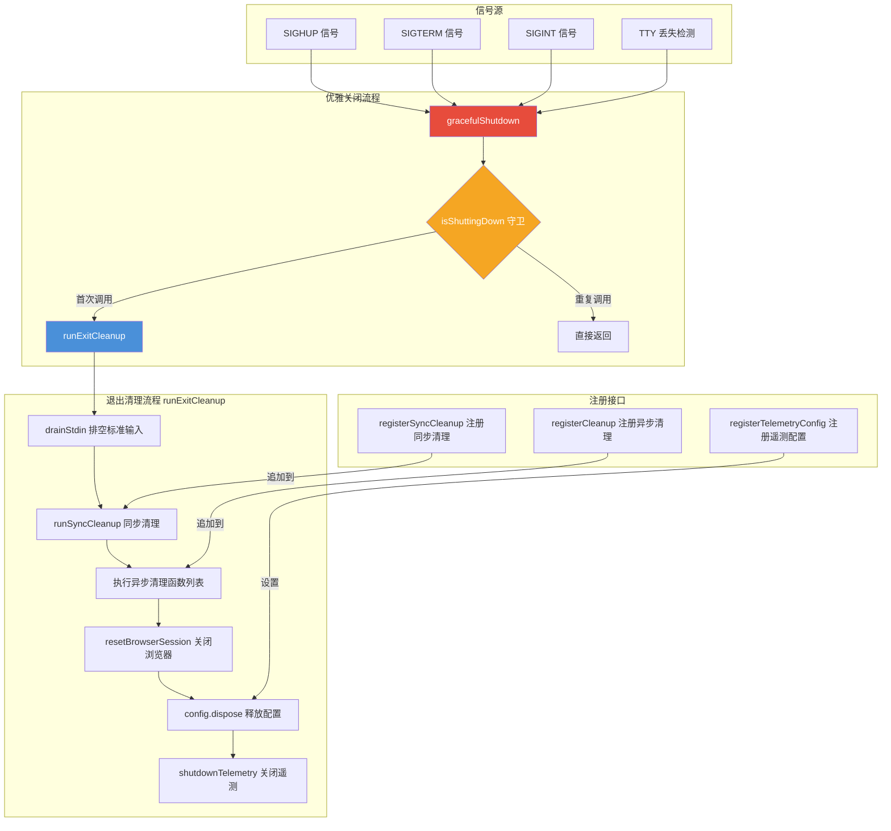

# cleanup.ts

## 概述

`cleanup.ts` 是 Gemini CLI 的**进程生命周期清理管理模块**。它负责在应用退出时（无论是正常退出、收到系统信号、还是 TTY 断开）确保所有资源被正确释放，包括执行注册的清理函数、关闭浏览器会话、释放配置资源以及刷新遥测数据。

该模块采用**注册 - 执行**模式：各子系统在初始化时将自己的清理逻辑注册到此模块，退出时由本模块统一协调执行。同时，模块内置了优雅关闭机制，防止并发信号导致清理逻辑重复执行。

**文件路径**: `packages/cli/src/utils/cleanup.ts`
**许可证**: Apache-2.0 (Copyright 2025 Google LLC)

## 架构图（Mermaid）



## 核心组件

### 模块级状态变量

| 变量 | 类型 | 描述 |
|------|------|------|
| `cleanupFunctions` | `Array<(() => void) \| (() => Promise<void>)>` | 异步/同步清理函数列表，退出时按注册顺序依次执行 |
| `syncCleanupFunctions` | `Array<() => void>` | 仅同步清理函数列表，优先于异步清理执行 |
| `configForTelemetry` | `Config \| null` | 用于遥测关闭的 Config 实例引用 |
| `isShuttingDown` | `boolean` | 关闭守卫标志，防止并发关闭导致重复清理 |

---

### `registerCleanup(fn)` 函数

```typescript
export function registerCleanup(fn: (() => void) | (() => Promise<void>)): void
```

注册一个清理函数（同步或异步均可）。在 `runExitCleanup` 执行时，这些函数将按注册顺序依次被 `await` 调用。

---

### `registerSyncCleanup(fn)` 函数

```typescript
export function registerSyncCleanup(fn: () => void): void
```

注册一个**纯同步**清理函数。这类函数在 `runSyncCleanup` 中执行，先于异步清理函数运行。

---

### `registerTelemetryConfig(config)` 函数

```typescript
export function registerTelemetryConfig(config: Config): void
```

注册 Config 实例，用于后续的遥测关闭和资源释放。必须在应用生命周期早期调用。

---

### `resetCleanupForTesting()` 函数

```typescript
export function resetCleanupForTesting(): void
```

**仅用于测试**。重置所有内部状态（清理函数列表、配置引用、关闭标志），使测试可以在隔离环境中运行，无需 `vi.resetModules()`。

---

### `runSyncCleanup()` 函数

```typescript
export function runSyncCleanup(): void
```

遍历并执行所有已注册的同步清理函数。每个函数在 `try-catch` 中执行，错误被静默忽略。执行完毕后清空列表。

---

### `runExitCleanup()` 函数

```typescript
export async function runExitCleanup(): Promise<void>
```

核心退出清理函数，按以下严格顺序执行：

1. **`drainStdin()`** - 排空标准输入缓冲区，防止退出时终端打印乱码
2. **`runSyncCleanup()`** - 执行所有同步清理函数
3. **遍历 `cleanupFunctions`** - 依次 `await` 每个异步清理函数
4. **`resetBrowserSession()`** - 关闭持久化浏览器会话
5. **`configForTelemetry.dispose()`** - 释放配置资源
6. **`shutdownTelemetry(configForTelemetry)`** - **最后**关闭遥测 SDK，确保所有 SessionEnd 钩子和遥测数据已正确刷新

> 重要设计：遥测关闭必须在所有其他清理之后执行，以确保最终的遥测事件（如会话结束）不会丢失。

---

### `drainStdin()` 函数（私有）

```typescript
async function drainStdin(): Promise<void>
```

排空标准输入缓冲区的内部工具函数。工作原理：
1. 检查 `process.stdin` 是否为 TTY，非 TTY 则跳过
2. 调用 `resume()` 恢复读取
3. 移除所有 `data` 监听器，附加一个空操作监听器来消费缓冲区
4. 等待 50ms 让操作系统缓冲区刷新

解决的问题：退出时终端打印垃圾字符（参见 [#16801](https://github.com/google-gemini/gemini-cli/issues/16801)）。

---

### `gracefulShutdown(reason)` 函数（私有）

```typescript
async function gracefulShutdown(_reason: string): Promise<void>
```

优雅关闭的核心入口。通过 `isShuttingDown` 标志实现**幂等性**：
- 首次调用时设置标志，执行 `runExitCleanup()`，然后 `process.exit(ExitCodes.SUCCESS)`
- 后续调用直接返回，不重复执行

解决并发信号竞争问题（参见 [#15874](https://github.com/google-gemini/gemini-cli/issues/15874)）。

---

### `setupSignalHandlers()` 函数

```typescript
export function setupSignalHandlers(): void
```

注册 POSIX 信号处理器，将 `SIGHUP`、`SIGTERM`、`SIGINT` 三个信号都路由到 `gracefulShutdown`。

---

### `setupTtyCheck()` 函数

```typescript
export function setupTtyCheck(): () => void
```

设置定时 TTY 检测，每 **5 秒**检查一次标准输入和标准输出是否仍为 TTY。如果两者都不是 TTY（表示终端会话已丢失），则触发优雅关闭。

**特殊逻辑**：
- 在沙箱环境（`process.env['SANDBOX']`）中跳过检测
- 使用 `isCheckingTty` 防止检测逻辑重入
- 定时器调用 `.unref()`，不会阻止 Node.js 进程自然退出
- 返回一个清理函数用于停止定时器

---

### `cleanupCheckpoints()` 函数

```typescript
export async function cleanupCheckpoints(): Promise<void>
```

清理项目临时目录下的 `checkpoints` 文件夹。使用 `Storage` 类获取项目临时目录路径，然后递归删除 `checkpoints` 子目录。错误被静默忽略。

## 依赖关系

### 内部依赖

| 依赖模块 | 导入内容 | 用途 |
|----------|----------|------|
| `@google/gemini-cli-core` | `Storage` | 获取项目临时目录路径，用于清理检查点 |
| `@google/gemini-cli-core` | `shutdownTelemetry` | 关闭遥测 SDK，刷新遥测数据 |
| `@google/gemini-cli-core` | `isTelemetrySdkInitialized` | 检查遥测 SDK 是否已初始化 |
| `@google/gemini-cli-core` | `ExitCodes` | 退出码常量，使用 `ExitCodes.SUCCESS` |
| `@google/gemini-cli-core` | `resetBrowserSession` | 关闭持久化浏览器会话 |
| `@google/gemini-cli-core` | `Config`（type-only） | Config 类型定义 |

### 外部依赖

| 依赖 | 用途 |
|------|------|
| `node:fs`（promises API） | 文件系统操作，用于递归删除检查点目录 |
| `node:path` | 路径拼接（`join`） |

## 关键实现细节

1. **幂等关闭守卫**：`isShuttingDown` 标志确保 `gracefulShutdown` 只执行一次。在多信号并发场景下（例如用户按 Ctrl+C 的同时终端窗口关闭），只有第一个触发的信号会真正执行清理。

2. **清理顺序的重要性**：`runExitCleanup` 中的执行顺序经过精心设计：
   - 先排空 stdin（避免清理过程中被中断）
   - 再执行业务清理（同步优先于异步）
   - 然后关闭浏览器和配置
   - **最后**关闭遥测（因为前面的清理可能产生遥测事件）

3. **错误静默策略**：所有清理步骤都在 `try-catch` 中执行且错误被忽略。这是因为清理发生在进程退出路径上，此时抛出异常无法被有意义地处理，且可能阻止后续清理步骤执行。

4. **TTY 丢失检测**：使用 `setInterval` + `unref()` 实现后台 TTY 检测。`unref()` 确保定时器不会阻止 Node.js 进程在所有其他任务完成后自然退出。5 秒的检测间隔在及时性和性能之间取得平衡。

5. **stdin 排空技巧**：通过 `resume()` + 移除所有 `data` 监听器 + 附加空操作监听器来消费缓冲区中的剩余数据，加上 50ms 延迟让操作系统缓冲区有时间刷新，解决了退出时终端显示乱码的问题。

6. **测试友好设计**：`resetCleanupForTesting` 通过将数组 `.length` 设为 0（原地清空，保持引用不变）来重置状态，避免了测试之间的状态泄漏。

7. **沙箱环境适配**：TTY 检测在 `SANDBOX` 环境变量存在时跳过，因为沙箱环境中可能没有真正的 TTY，避免误触发关闭。
