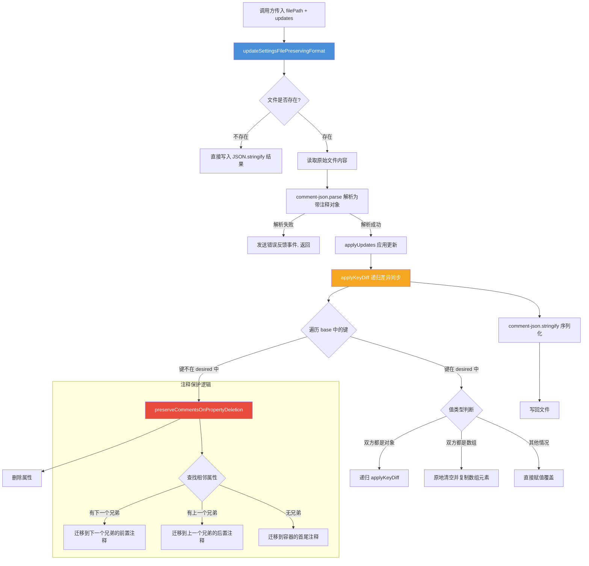

# commentJson.ts

## 概述

`commentJson.ts` 是 Gemini CLI 的**带注释 JSON 文件更新模块**。它解决了一个常见的配置文件管理难题：在程序化更新 JSON 配置文件时，如何保留用户手写的注释和原始格式。

该模块基于 `comment-json` 库实现，核心功能是读取含注释的 JSON 文件（如 `settings.json`）、应用增量更新（添加/修改/删除键），并将结果写回文件，同时尽可能保留原文件中的注释。当属性被删除时，模块会智能地将附着在该属性上的注释迁移到相邻属性，避免注释丢失。

**文件路径**: `packages/cli/src/utils/commentJson.ts`
**许可证**: Apache-2.0 (Copyright 2025 Google LLC)

## 架构图（Mermaid）



## 核心组件

### `CommentedRecord` 类型

```typescript
type CommentedRecord = Record<string | symbol, unknown>;
```

表示可能包含 Symbol 键（用于存储注释元数据）的对象。`comment-json` 库使用 `Symbol.for('before:key')` 和 `Symbol.for('after:key')` 等 Symbol 键来附着注释信息。

---

### `updateSettingsFilePreservingFormat` 函数

```typescript
export function updateSettingsFilePreservingFormat(
  filePath: string,
  updates: Record<string, unknown>,
): void
```

主入口函数。更新指定路径的 JSON 文件，同时保留注释和格式。

#### 参数说明

| 参数 | 类型 | 描述 |
|------|------|------|
| `filePath` | `string` | JSON 文件的绝对路径 |
| `updates` | `Record<string, unknown>` | 要应用的更新数据，表示文件的**目标完整状态** |

#### 执行流程

1. **文件不存在**：直接用 `JSON.stringify` 将 `updates` 写入文件（2 空格缩进），不需要保留注释
2. **文件存在**：
   - 读取原始文件内容
   - 使用 `comment-json.parse` 解析（保留注释元数据）
   - 如果解析失败，通过 `coreEvents.emitFeedback` 发送错误通知并返回（不覆盖损坏的文件）
   - 调用 `applyUpdates` 应用差异更新
   - 使用 `comment-json.stringify` 序列化（保留注释）
   - 写回文件

#### 使用示例

```typescript
// 更新 settings.json，添加新主题配置
updateSettingsFilePreservingFormat('/path/to/settings.json', {
  theme: 'dark',
  editor: { fontSize: 14 },
  // 注意：未包含的顶层键会被删除（sync-by-omission 语义）
});
```

---

### `preserveCommentsOnPropertyDeletion` 函数（私有）

```typescript
function preserveCommentsOnPropertyDeletion(
  container: Record<string, unknown>,
  propName: string,
): void
```

在从 `comment-json` 解析对象中删除属性前，将该属性上附着的注释迁移到相邻属性，防止注释丢失。

#### 注释迁移策略

`comment-json` 使用 Symbol 键存储注释：
- `Symbol.for('before:propName')` — 属性前的注释（行注释、块注释）
- `Symbol.for('after:propName')` — 属性后的注释

迁移优先级（对于前置注释和后置注释分别执行）：

| 优先级 | 条件 | 迁移目标 |
|--------|------|----------|
| 1 | 存在下一个兄弟属性 | 下一个兄弟的 `before:nextKey` |
| 2 | 存在上一个兄弟属性 | 上一个兄弟的 `after:prevKey` |
| 3 | 无兄弟属性 | 容器的 `before` / `after` |

内部使用 `appendToSymbol` 辅助函数，将注释**追加**到目标位置（而非替换），避免覆盖目标位置已有的注释。

---

### `applyKeyDiff` 函数（私有）

```typescript
function applyKeyDiff(
  base: Record<string, unknown>,
  desired: Record<string, unknown>,
): void
```

实现 **sync-by-omission（缺省同步）** 语义的递归差异合并算法。将 `base` 对象同步为与 `desired` 一致。

#### 核心逻辑

**第一遍：删除多余键**
- 遍历 `base` 的所有自有属性名
- 如果 `desired` 中不存在该键，先调用 `preserveCommentsOnPropertyDeletion` 保护注释，然后 `delete` 该属性

**第二遍：添加/更新键**
- 遍历 `desired` 的所有自有属性名
- 根据 `base` 和 `desired` 中对应值的类型分三种情况处理：

| base 值类型 | desired 值类型 | 处理方式 |
|-------------|----------------|----------|
| 对象 | 对象 | 递归调用 `applyKeyDiff`，保留 base 对象引用（从而保留其注释 Symbol） |
| 数组 | 数组 | 原地清空 base 数组并逐个 push desired 元素（保留 `CommentArray` 上的注释） |
| 其他 | 任意 | 直接赋值 `base[key] = desired[key]` |

#### 为什么选择原地修改

该算法始终在 `base` 对象上原地修改，而不是创建新对象。这是因为 `comment-json` 的注释信息以 Symbol 键的形式附着在原始对象上。如果创建新对象，这些注释就会丢失。

---

### `applyUpdates` 函数（私有）

```typescript
function applyUpdates(
  current: Record<string, unknown>,
  updates: Record<string, unknown>,
): Record<string, unknown>
```

`applyKeyDiff` 的简单包装，调用差异同步并返回更新后的对象引用。

## 依赖关系

### 内部依赖

| 依赖模块 | 导入内容 | 用途 |
|----------|----------|------|
| `@google/gemini-cli-core` | `coreEvents` | 发送错误反馈事件（JSON 解析失败时通知上层） |

### 外部依赖

| 依赖 | 导入内容 | 用途 |
|------|----------|------|
| `node:fs` | `fs`（同步 API） | 文件读写操作：`existsSync`、`readFileSync`、`writeFileSync` |
| `comment-json` | `parse`, `stringify` | 解析含注释的 JSON 字符串为对象（保留注释元数据），将对象序列化回含注释的 JSON 字符串 |

## 关键实现细节

1. **Symbol 键注释模型**：`comment-json` 库使用 ES6 Symbol 作为对象键来存储注释元数据。例如，`Symbol.for('before:theme')` 存储 `theme` 属性前方的注释。普通的 `Object.keys()` 和 `JSON.stringify` 会忽略 Symbol 键，但 `comment-json.stringify` 能识别并还原这些注释。

2. **sync-by-omission 语义**：`updates` 参数代表文件的**完整目标状态**，而非增量补丁。任何在 `updates` 中不存在但在原文件中存在的键，都会被视为需要删除。这种语义简化了调用方的逻辑，但要求调用方传入完整的目标配置。

3. **注释保护的重要性**：用户可能在 `settings.json` 中手写了大量注释来解释各配置项。如果简单地删除属性，这些注释会随之消失。`preserveCommentsOnPropertyDeletion` 通过将注释迁移到相邻属性，确保注释在键被删除后仍然存在于文件中。

4. **数组原地修改**：对于数组类型的值，代码先 `baseArr.length = 0` 清空原数组，再逐个 `push` 新元素。这种方式保留了 `comment-json` 的 `CommentArray` 实例引用及其附着的注释，而不是用新数组替换。

5. **错误处理策略**：当 JSON 解析失败时，模块选择**不覆盖**原文件，而是发送一个错误反馈事件然后返回。这是一种保守策略，避免在文件已损坏的情况下进一步丢失数据。

6. **同步 I/O**：文件读写使用同步 API（`readFileSync`、`writeFileSync`），这意味着操作会阻塞事件循环。这在设置文件更新场景下是可接受的，因为设置文件通常很小，且更新操作不频繁。

7. **新建文件降级**：当目标文件不存在时，直接使用标准 `JSON.stringify`（无注释功能），因为没有需要保留的注释。
