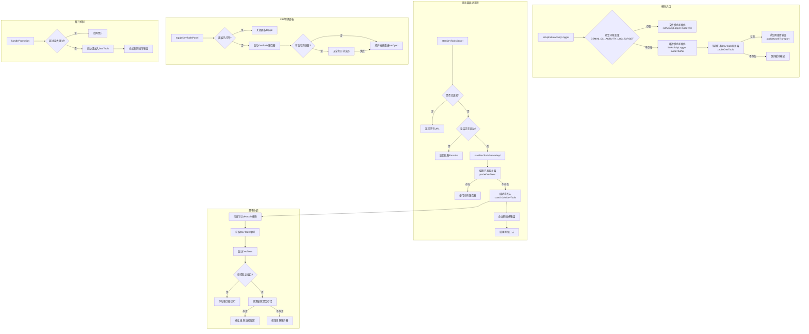

# devtoolsService.ts

## 概述

`devtoolsService.ts` 是 Gemini CLI 开发者工具（DevTools）的服务管理模块。它负责 DevTools 服务器的生命周期管理，包括启动、探测、竞争协调（多实例场景下的端口争夺）以及活动日志传输层的初始化。该模块实现了一套完整的"探测-启动-加入"策略，确保在多个 CLI 实例并发运行时只有一个 DevTools 服务器处于活跃状态，其余实例以客户端身份连接到已有服务器。

## 架构图（Mermaid）

## 核心组件

### 1. 接口 `IDevTools`

定义了 DevTools 实例的标准接口：

| 方法 | 返回值 | 说明 |
|------|--------|------|
| `start()` | `Promise<string>` | 启动 DevTools 服务器，返回 URL |
| `stop()` | `Promise<void>` | 停止 DevTools 服务器 |
| `getPort()` | `number` | 获取服务器实际监听端口 |

### 2. 模块级状态变量

| 变量 | 类型 | 说明 |
|------|------|------|
| `DEFAULT_DEVTOOLS_PORT` | `number` (25417) | DevTools 默认端口号 |
| `DEFAULT_DEVTOOLS_HOST` | `string` ('127.0.0.1') | DevTools 默认主机地址 |
| `MAX_PROMOTION_ATTEMPTS` | `number` (3) | 最大晋升重试次数 |
| `promotionAttempts` | `number` | 当前晋升尝试计数 |
| `serverStartPromise` | `Promise<string> \| null` | 去重用的启动 Promise |
| `connectedUrl` | `string \| null` | 已连接的 DevTools URL |

### 3. 函数 `probeDevTools(host, port)`

**功能**: 通过 WebSocket 握手探测指定地址是否已有 DevTools 服务器在运行。

- 连接路径: `ws://{host}:{port}/ws`
- 超时时间: 500ms
- 返回 `true` 表示有活跃服务器, `false` 表示无

### 4. 函数 `startOrJoinDevTools(defaultHost, defaultPort)`

**功能**: 尝试启动 DevTools 服务器，并处理端口竞争。

**竞争协调逻辑**:
1. 动态导入 `@google/gemini-cli-devtools` 模块
2. 通过单例模式获取 DevTools 实例并启动
3. 比较实际端口与默认端口：
   - 相同 -- 本实例赢得端口，作为服务器运行
   - 不同 -- 探测默认端口的赢家是否存活：
     - 存活 -- 停止自身服务器，连接赢家
     - 不存活 -- 保留自身服务器（赢家可能也在竞争中失败）

### 5. 函数 `handlePromotion(config)`

**功能**: 处理"晋升"逻辑 -- 当网络重连失败时，尝试自身启动或加入 DevTools 服务器。

- 最多尝试 `MAX_PROMOTION_ATTEMPTS` (3) 次
- 每次成功后通过 `addNetworkTransport` 添加新的网络传输层
- 递归设置自身为重连失败回调，形成重试链

### 6. 导出函数 `setupInitialActivityLogger(config)`

**功能**: 初始化活动日志记录器，CLI 启动时调用。

**两种模式**:
- **文件模式**: 当环境变量 `GEMINI_CLI_ACTIVITY_LOG_TARGET` 存在时，直接写入指定文件
- **缓冲模式**: 默认模式，先缓冲日志，异步探测已有 DevTools 服务器，若找到则立即建立网络传输

### 7. 导出函数 `startDevToolsServer(config)`

**功能**: 启动 DevTools 服务器并返回 UI URL。

**去重机制**:
- 已连接 (`connectedUrl` 非空) -- 直接返回已有 URL
- 正在启动 (`serverStartPromise` 非空) -- 返回已有 Promise
- 否则启动新的服务器流程

### 8. 导出函数 `toggleDevToolsPanel(config, isOpen, toggle, setOpen)`

**功能**: 处理 F12 快捷键切换 DevTools 面板。

**逻辑**:
1. 如果面板已打开 -- 调用 `toggle()` 关闭
2. 如果面板未打开:
   - 启动 DevTools 服务器
   - 尝试在浏览器中打开（`openBrowserSecurely`）
   - 浏览器打开成功 -- 不显示抽屉面板
   - 浏览器打开失败或不支持 -- 调用 `setOpen()` 打开内嵌抽屉面板

### 9. 导出函数 `resetForTesting()`

**功能**: 重置模块级状态，仅用于测试。清空 `promotionAttempts`、`serverStartPromise` 和 `connectedUrl`。

## 依赖关系

### 内部依赖

| 模块 | 导入内容 | 说明 |
|------|----------|------|
| `@google/gemini-cli-core` | `debugLogger`, `Config`, `openBrowserSecurely`, `shouldLaunchBrowser` | 核心调试日志、配置类型、浏览器启动工具 |
| `./activityLogger.js` | `initActivityLogger`, `addNetworkTransport`, `ActivityLogger` | 活动日志记录器初始化与传输层管理 |
| `@google/gemini-cli-devtools` | `DevTools` (动态导入) | DevTools 服务器实现（仅在需要时动态加载） |

### 外部依赖

| 包名 | 导入内容 | 说明 |
|------|----------|------|
| `ws` | `WebSocket` | WebSocket 客户端库，用于探测 DevTools 服务器 |

## 关键实现细节

### 1. 端口竞争协调机制

当多个 Gemini CLI 实例同时启动时，都会尝试监听默认端口 25417。由于操作系统只允许一个进程绑定端口，该模块实现了优雅的竞争协调：

- 每个实例先尝试启动 DevTools 服务器
- 如果获得的端口与默认端口不同，说明默认端口已被占用
- 此时探测默认端口的服务器是否存活
- 存活则作为客户端连接，不存活则保留自身服务器

### 2. 动态导入优化

`@google/gemini-cli-devtools` 使用 `await import()` 动态导入，避免在不需要 DevTools 功能时加载该模块，减少 CLI 启动时间和内存占用。

### 3. Promise 去重

`startDevToolsServer` 使用 `serverStartPromise` 变量实现 Promise 去重（deduplication），确保并发调用不会启动多个服务器。如果启动失败，会将 `serverStartPromise` 置 null 以允许重试。

### 4. 晋升机制（Promotion）

当活动日志的网络传输层因 DevTools 服务器宕机而重连失败时，触发"晋升"机制：当前 CLI 实例尝试自己成为 DevTools 服务器或加入新的服务器。这确保了高可用性，但设有最大重试次数（3次）防止无限循环。

### 5. 两阶段日志初始化

活动日志采用两阶段初始化策略：
1. **立即阶段**: 以缓冲模式启动，开始捕获所有活动
2. **异步阶段**: 探测已有 DevTools 服务器，找到后将缓冲数据通过网络传输层发送

这确保了即使在 DevTools 服务器就绪前产生的日志也不会丢失。

### 6. F12 面板切换的降级策略

`toggleDevToolsPanel` 实现了优雅降级：
- 优先尝试在外部浏览器中打开 DevTools UI
- 如果浏览器启动失败或不支持（如远程终端），则回退到内嵌抽屉面板
- 确保用户总能访问到 DevTools 界面
