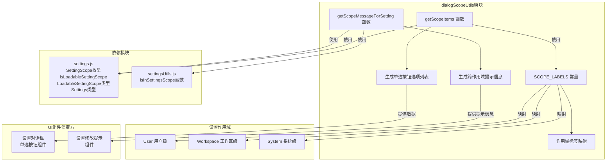

# dialogScopeUtils.ts

## 概述

`dialogScopeUtils.ts` 是 Gemini CLI 设置对话框的作用域（Scope）相关工具函数模块。它为 CLI 中涉及设置管理的对话框 UI 组件提供统一的作用域标签、选项列表生成以及跨作用域冲突提示信息生成功能。该模块是设置系统 UI 层的基础工具库，确保不同对话框组件在展示设置作用域时保持一致的标签和行为。

## 架构图（Mermaid）

## 核心组件

### 1. 常量 `SCOPE_LABELS`

**类型**: `Record<SettingScope, string>` (只读)

设置作用域的展示标签映射表，用于 UI 中统一显示作用域名称：

| 作用域 | 标签 |
|--------|------|
| `SettingScope.User` | `'User Settings'` |
| `SettingScope.Workspace` | `'Workspace Settings'` |
| `SettingScope.System` | `'System Settings'` |

使用 `as const` 断言确保类型安全，值不可修改。

### 2. 函数 `getScopeItems()`

**功能**: 生成用于单选按钮（radio button）组件的选项数据列表。

**返回值**: `Array<{ label: string; value: LoadableSettingScope }>`

返回包含三个元素的数组，每个元素包含：
- `label`: 展示给用户的标签文本（来自 `SCOPE_LABELS`）
- `value`: 对应的 `LoadableSettingScope` 枚举值

固定顺序为：User -> Workspace -> System。

### 3. 函数 `getScopeMessageForSetting(settingKey, selectedScope, settings)`

**功能**: 为指定设置项生成跨作用域修改提示信息。

**参数**:

| 参数 | 类型 | 说明 |
|------|------|------|
| `settingKey` | `string` | 设置项的键名 |
| `selectedScope` | `LoadableSettingScope` | 用户当前选择的作用域 |
| `settings` | `{ forScope: (scope) => { settings: Settings } }` | 提供按作用域获取设置的能力 |

**逻辑流程**:

1. 获取除当前选中作用域以外的所有可加载作用域
2. 遍历这些作用域，检查目标设置项是否在其中被修改过
3. 根据检查结果生成提示信息：
   - 没有在其他作用域修改 -- 返回空字符串
   - 在其他作用域修改过，且当前作用域也有修改 -- 返回 `"(Also modified in {scopes})"`
   - 在其他作用域修改过，但当前作用域没有 -- 返回 `"(Modified in {scopes})"`

**使用场景**: 当用户在某个作用域编辑设置时，提醒用户该设置在其他作用域也有值，帮助用户理解设置的优先级覆盖关系。

## 依赖关系

### 内部依赖

| 模块 | 导入内容 | 说明 |
|------|----------|------|
| `../config/settings.js` | `isLoadableSettingScope`, `SettingScope`, `LoadableSettingScope` (类型), `Settings` (类型) | 设置作用域枚举、类型守卫和类型定义 |
| `./settingsUtils.js` | `isInSettingsScope` | 判断某个设置键是否存在于指定作用域的设置集中 |

### 外部依赖

无外部第三方依赖。

## 关键实现细节

### 1. 作用域体系

Gemini CLI 采用三层作用域的设置体系：
- **User（用户级）**: 用户个人全局设置
- **Workspace（工作区级）**: 当前项目/工作区的设置
- **System（系统级）**: 系统范围的设置

不同作用域之间存在优先级覆盖关系，同一设置项可能在多个作用域中都有定义值。

### 2. `LoadableSettingScope` 类型限制

注意函数使用的是 `LoadableSettingScope` 而非 `SettingScope`。`isLoadableSettingScope` 类型守卫用于过滤掉不可加载的作用域（如可能存在的临时/运行时作用域），确保只处理可持久化加载的作用域。

### 3. 跨作用域冲突检测

`getScopeMessageForSetting` 提供了一种轻量级的跨作用域冲突检测机制。它通过 `isInSettingsScope` 工具函数检查设置是否存在于某个作用域，而不是检查值是否相同。这意味着即使不同作用域中设置了相同的值，也会显示提示信息 -- 设计意图是让用户知晓设置在多处被配置，从而做出明确决策。

### 4. 提示信息的"Also"区分

返回的提示信息通过 `"Also modified"` 和 `"Modified"` 两种措辞进行区分：
- `"Also modified"`: 暗示当前作用域已有该设置的值，其他作用域也有（多处覆盖）
- `"Modified"`: 暗示当前作用域没有该设置值，但其他作用域有（值来自其他作用域）

这种细微区分帮助用户理解当前操作是"新增"还是"覆盖"。
