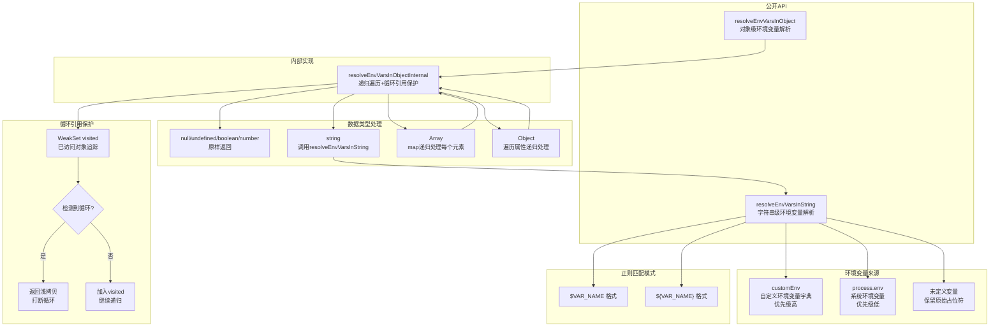

# envVarResolver.ts

## 概述

`envVarResolver.ts` 是 Gemini CLI 的环境变量解析模块。它提供将字符串和对象中的环境变量占位符（`$VAR_NAME` 和 `${VAR_NAME}` 格式）替换为实际环境变量值的功能。该模块支持字符串级别的简单替换和对象级别的深度递归替换，并内置了循环引用保护机制。主要用于配置文件解析场景，让用户可以在配置中引用环境变量。

## 架构图（Mermaid）



## 核心组件

### 1. 导出函数 `resolveEnvVarsInString(value, customEnv?)`

**功能**: 解析字符串中的环境变量占位符并替换为实际值。

**参数**:

| 参数 | 类型 | 必填 | 说明 |
|------|------|------|------|
| `value` | `string` | 是 | 可能包含环境变量占位符的字符串 |
| `customEnv` | `Record<string, string>` | 否 | 自定义环境变量字典，优先级高于 `process.env` |

**正则表达式**: `/\$(?:(\w+)|{([^}]+)})/g`

该正则匹配两种格式：
- `$VAR_NAME` -- 捕获组 1 (`\w+`) 匹配变量名（字母、数字、下划线）
- `${VAR_NAME}` -- 捕获组 2 (`[^}]+`) 匹配花括号内的变量名（可包含除 `}` 外的任意字符）

**解析优先级**:
1. 优先查找 `customEnv` 字典
2. 其次查找 `process.env` 系统环境变量
3. 都找不到则保留原始占位符文本

**示例**:
```typescript
resolveEnvVarsInString("Token: $API_KEY")       // "Token: secret-123"
resolveEnvVarsInString("URL: ${BASE_URL}/api")   // "URL: https://api.example.com/api"
resolveEnvVarsInString("Missing: $UNDEFINED_VAR") // "Missing: $UNDEFINED_VAR" (保留原样)
```

### 2. 导出函数 `resolveEnvVarsInObject<T>(obj, customEnv?)`

**功能**: 递归解析对象中所有字符串值的环境变量占位符。

**参数**:

| 参数 | 类型 | 必填 | 说明 |
|------|------|------|------|
| `obj` | `T` | 是 | 任意类型的输入值 |
| `customEnv` | `Record<string, string>` | 否 | 自定义环境变量字典 |

**返回值**: `T` -- 与输入相同类型，其中所有字符串值的环境变量已被解析。

该函数是 `resolveEnvVarsInObjectInternal` 的公开包装，自动创建 `WeakSet` 用于循环引用追踪。

### 3. 内部函数 `resolveEnvVarsInObjectInternal<T>(obj, visited, customEnv?)`

**功能**: 带循环引用保护的递归环境变量解析实现。

**类型处理策略**:

| 输入类型 | 处理方式 |
|----------|----------|
| `null` / `undefined` | 原样返回 |
| `boolean` | 原样返回 |
| `number` | 原样返回 |
| `string` | 调用 `resolveEnvVarsInString` 解析 |
| `Array` | `map` 递归处理每个元素 |
| `object` | 浅拷贝后遍历属性递归处理 |
| 其他类型 | 原样返回（兜底） |

## 依赖关系

### 内部依赖

无内部模块依赖。该模块是完全独立的纯工具函数。

### 外部依赖

| 依赖 | 说明 |
|------|------|
| `process.env` | Node.js 全局对象，用于读取系统环境变量 |

无第三方包依赖。

## 关键实现细节

### 1. 循环引用保护机制

递归遍历对象时使用 `WeakSet` 追踪已访问的对象引用：

- **进入对象前**: 检查 `visited.has(obj)`，如果已访问过，返回浅拷贝以打断循环
- **递归子对象前**: 将当前对象 `visited.add(obj)` 标记为已访问
- **递归完成后**: `visited.delete(obj)` 移除标记，允许同一对象在不同路径上被重复处理

使用 `WeakSet` 而非 `Set` 的原因是 `WeakSet` 不会阻止垃圾回收，避免处理大型对象树时的内存泄漏。

### 2. 不可变设计

对象和数组的处理都创建新的副本（`{ ...obj }` 和 `map` 返回新数组），不会修改原始输入对象。这是一个纯函数设计，符合函数式编程原则。

### 3. `customEnv` 优先级

`customEnv` 参数允许调用方传入自定义环境变量字典，其优先级高于 `process.env`。这在以下场景中非常有用：
- 测试时 mock 环境变量而不污染 `process.env`
- 提供默认值或覆盖值
- 沙箱化环境中运行

### 4. 未定义变量的保留策略

当环境变量未定义时，占位符文本保持原样（如 `$UNDEFINED_VAR` 不变），而不是替换为空字符串或抛出错误。这种设计选择确保了：
- 配置的可调试性 -- 用户可以在输出中看到哪些变量未被解析
- 安全性 -- 不会因为缺少变量而静默产生空值导致不易发现的错误
- 幂等性 -- 对同一字符串多次调用不会改变已经保留的占位符

### 5. 泛型保持

通过 TypeScript 泛型 `<T>` 保持输入输出类型一致，避免调用方在使用解析后的对象时丢失类型信息。虽然内部实现使用了 `as unknown as T` 等类型断言，但对外接口保持类型安全。

### 6. 正则表达式的 `g` 标志

正则使用全局标志 `g`，确保一个字符串中的多个环境变量占位符都能被解析，而不仅仅是第一个。例如 `"$HOST:$PORT"` 会同时解析两个变量。
