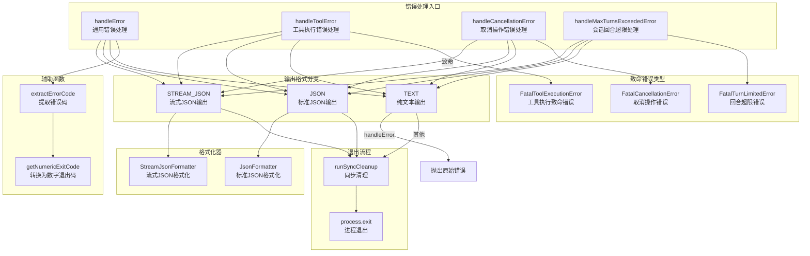

# errors.ts

## 概述

`errors.ts` 是 Gemini CLI 的统一错误处理模块。它为 CLI 提供了一套完整的错误处理策略，能够根据不同的输出格式（纯文本、JSON、流式 JSON）以及不同的错误类型（通用错误、工具执行错误、取消操作、会话回合超限）进行差异化处理。该模块确保在所有输出模式下，错误信息都以正确的格式传递给用户或下游消费者，并在致命错误时执行清理后优雅退出。

## 架构图（Mermaid）



## 核心组件

### 1. 接口 `ErrorWithCode`

扩展标准 `Error` 接口，添加错误码相关属性：

| 属性 | 类型 | 说明 |
|------|------|------|
| `exitCode` | `number` (可选) | 进程退出码，FatalError 类型专用 |
| `code` | `string \| number` (可选) | 通用错误码 |
| `status` | `string \| number` (可选) | HTTP 状态码或状态字符串 |

### 2. 内部函数 `extractErrorCode(error)`

**功能**: 从错误对象中按优先级提取错误码。

**优先级顺序**:
1. `error.exitCode` -- FatalError 类型的退出码（最高优先级）
2. `error.code` -- 通用错误码
3. `error.status` -- HTTP 状态码
4. `1` -- 默认退出码（兜底值）

### 3. 内部函数 `getNumericExitCode(errorCode)`

**功能**: 将错误码转换为数字类型的进程退出码。

- 输入为 `number` -- 直接返回
- 输入为 `string` -- 返回 `1`（默认退出码）

### 4. 导出函数 `handleError(error, config, customErrorCode?)`

**功能**: 通用错误处理函数，根据输出格式差异化处理。

**返回类型**: `never` -- 该函数永不正常返回（要么退出进程，要么抛出异常）。

**输出格式处理**:

| 输出格式 | 处理方式 |
|----------|----------|
| `STREAM_JSON` | 通过 `StreamJsonFormatter` 发出 `RESULT` 事件（status: 'error'），执行清理后 `process.exit` |
| `JSON` | 通过 `JsonFormatter.formatError` 格式化，通过 `coreEvents.emitFeedback` 发出，执行清理后 `process.exit` |
| 其他（TEXT） | 直接 `throw error` 重新抛出，交由上层处理 |

**关键行为**:
- 使用 `parseAndFormatApiError` 解析 API 错误，传入认证类型用于上下文化错误消息
- 支持 `customErrorCode` 参数覆盖自动提取的错误码
- 流式 JSON 和标准 JSON 模式都会收集遥测指标（`uiTelemetryService.getMetrics()`）

### 5. 导出函数 `handleToolError(toolName, toolError, config, errorType?, resultDisplay?)`

**功能**: 工具执行错误的专用处理函数。

**返回类型**: `void` -- 非致命错误仅记录日志并继续执行。

**参数**:

| 参数 | 类型 | 必填 | 说明 |
|------|------|------|------|
| `toolName` | `string` | 是 | 出错的工具名称 |
| `toolError` | `Error` | 是 | 工具抛出的错误对象 |
| `config` | `Config` | 是 | 配置对象 |
| `errorType` | `string` | 否 | 错误类型标识符 |
| `resultDisplay` | `string` | 否 | 用于展示的错误结果文本 |

**致命 vs 非致命**:

- **致命错误**（如 `NO_SPACE_LEFT`）: 通过 `isFatalToolError` 判断，创建 `FatalToolExecutionError`，按输出格式处理后 `process.exit`
- **非致命错误**（如 `INVALID_TOOL_PARAMS`、`FILE_NOT_FOUND`、`PATH_NOT_IN_WORKSPACE`）: 仅通过 `debugLogger.warn` 记录，错误信息会返回给模型允许其自我纠正

### 6. 导出函数 `handleCancellationError(config)`

**功能**: 处理用户取消操作（如 Ctrl+C）。

**返回类型**: `never` -- 总是退出进程。

**行为**: 创建 `FatalCancellationError`，按三种输出格式分别处理后 `process.exit`。纯文本模式下也会通过 `coreEvents.emitFeedback` 输出错误信息后退出。

### 7. 导出函数 `handleMaxTurnsExceededError(config)`

**功能**: 处理会话回合数超过最大限制。

**返回类型**: `never` -- 总是退出进程。

**行为**: 创建 `FatalTurnLimitedError`，提示用户可以通过 `settings.json` 中的 `maxSessionTurns` 增加限制。按三种输出格式分别处理后 `process.exit`。

## 依赖关系

### 内部依赖

| 模块 | 导入内容 | 说明 |
|------|----------|------|
| `@google/gemini-cli-core` | `Config` (类型) | 配置对象类型 |
| `@google/gemini-cli-core` | `OutputFormat` | 输出格式枚举 (TEXT, JSON, STREAM_JSON) |
| `@google/gemini-cli-core` | `JsonFormatter` | 标准 JSON 格式化器 |
| `@google/gemini-cli-core` | `StreamJsonFormatter` | 流式 JSON 格式化器 |
| `@google/gemini-cli-core` | `JsonStreamEventType` | 流式 JSON 事件类型枚举 |
| `@google/gemini-cli-core` | `uiTelemetryService` | UI 遥测服务，收集运行指标 |
| `@google/gemini-cli-core` | `parseAndFormatApiError` | API 错误解析与格式化 |
| `@google/gemini-cli-core` | `FatalTurnLimitedError` | 会话回合超限致命错误类 |
| `@google/gemini-cli-core` | `FatalCancellationError` | 取消操作致命错误类 |
| `@google/gemini-cli-core` | `FatalToolExecutionError` | 工具执行致命错误类 |
| `@google/gemini-cli-core` | `isFatalToolError` | 判断工具错误是否为致命错误 |
| `@google/gemini-cli-core` | `debugLogger` | 调试日志记录器 |
| `@google/gemini-cli-core` | `coreEvents` | 核心事件发射器 |
| `@google/gemini-cli-core` | `getErrorMessage` | 从未知类型提取错误信息 |
| `@google/gemini-cli-core` | `getErrorType` | 从错误对象提取错误类型标识 |
| `./cleanup.js` | `runSyncCleanup` | 同步清理函数，进程退出前执行 |

### 外部依赖

无第三方包依赖。使用 Node.js 内置的 `process.exit` 进行进程退出。

## 关键实现细节

### 1. 三种输出格式的统一处理模式

每个错误处理函数都遵循相同的三分支结构：

```
if (STREAM_JSON) → StreamJsonFormatter → emitEvent → cleanup → exit
else if (JSON)   → JsonFormatter → emitFeedback → cleanup → exit
else (TEXT)      → 特定于错误类型的处理
```

这种模式确保了 CLI 在作为管道工具（JSON 模式）或交互式终端工具（文本模式）时的错误处理一致性。

### 2. 流式 JSON 的 RESULT 事件

在流式 JSON 模式下，错误通过 `JsonStreamEventType.RESULT` 事件发出，包含：
- `type`: 事件类型（RESULT）
- `timestamp`: ISO 8601 时间戳
- `status`: 固定为 `'error'`
- `error`: 包含 `type` 和 `message` 的对象
- `stats`: 从遥测指标转换的统计信息

### 3. 工具错误的自我纠正设计

`handleToolError` 的非致命错误处理是一个关键设计决策：当工具执行失败（如文件未找到、参数无效）时，CLI 不会终止，而是将错误信息返回给 AI 模型。模型可以根据错误信息调整策略并重试，实现"自我纠正"循环。这对于 AI 驱动的 CLI 工具至关重要。

### 4. 清理先于退出

所有致命错误路径都在 `process.exit` 之前调用 `runSyncCleanup()`。这确保了：
- 临时文件被清理
- 日志被刷新
- 资源被释放
- 锁被解除

使用同步清理（而非异步）是因为 `process.exit` 不会等待异步操作完成。

### 5. `handleError` 的文本模式不退出

在文本模式下，`handleError` 不调用 `process.exit`，而是重新抛出原始错误。这允许上层调用者（如交互式 REPL 循环）捕获错误并继续运行，而不是终止整个进程。JSON 和流式 JSON 模式通常用于非交互式场景（如脚本/管道），因此直接退出是合理的。

### 6. 遥测数据收集

即使在错误退出路径上，模块也通过 `uiTelemetryService.getMetrics()` 收集遥测数据并包含在输出中。这对于诊断问题和改进产品质量非常重要，确保错误场景也有完整的度量数据。
