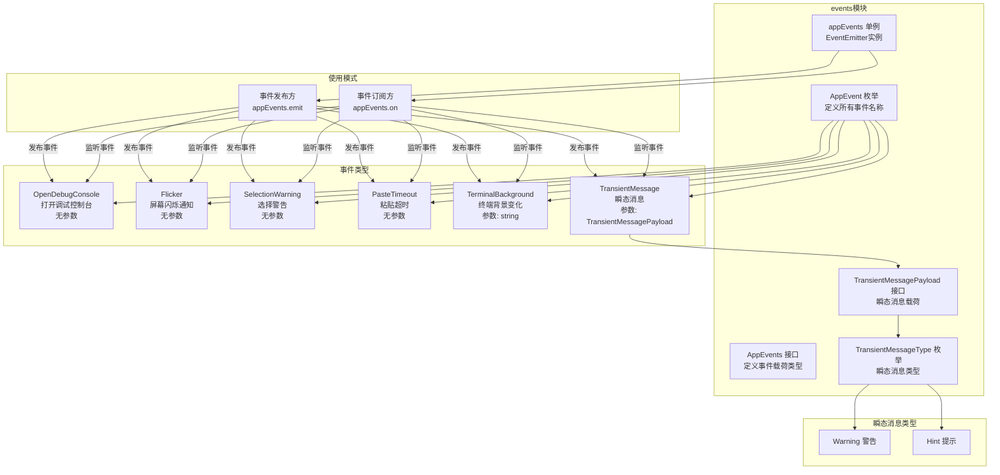

# events.ts

## 概述

`events.ts` 是 Gemini CLI 的应用级事件总线模块。它基于 Node.js 内置的 `EventEmitter` 定义了 CLI 应用层面的自定义事件系统，用于在不同 UI 组件和功能模块之间进行松耦合通信。该模块定义了所有应用事件的枚举、载荷（payload）类型以及全局事件发射器单例。事件涵盖调试控制台、终端交互、瞬态消息等多个方面。

## 架构图（Mermaid）



## 核心组件

### 1. 枚举 `TransientMessageType`

定义瞬态消息的类型分类：

| 枚举值 | 字符串值 | 说明 |
|--------|----------|------|
| `Warning` | `'warning'` | 警告类消息，提醒用户注意某些可能影响操作的状况 |
| `Hint` | `'hint'` | 提示类消息，为用户提供有用的操作建议或信息 |

### 2. 接口 `TransientMessagePayload`

瞬态消息事件的载荷结构：

| 属性 | 类型 | 说明 |
|------|------|------|
| `message` | `string` | 消息文本内容 |
| `type` | `TransientMessageType` | 消息类型（警告或提示） |

### 3. 枚举 `AppEvent`

定义所有应用级事件的名称，每个枚举值对应一个事件标识符：

| 枚举值 | 字符串值 | 说明 |
|--------|----------|------|
| `OpenDebugConsole` | `'open-debug-console'` | 请求打开调试控制台 |
| `Flicker` | `'flicker'` | 屏幕闪烁事件通知，可能用于视觉反馈 |
| `SelectionWarning` | `'selection-warning'` | 文本选择相关警告 |
| `PasteTimeout` | `'paste-timeout'` | 粘贴操作超时通知 |
| `TerminalBackground` | `'terminal-background'` | 终端背景颜色/主题变化事件 |
| `TransientMessage` | `'transient-message'` | 瞬态消息事件，用于显示临时通知 |

### 4. 接口 `AppEvents`

类型安全的事件映射接口，定义每个事件的参数列表类型：

| 事件 | 参数类型 | 说明 |
|------|----------|------|
| `OpenDebugConsole` | `never[]` | 无参数 |
| `Flicker` | `never[]` | 无参数 |
| `SelectionWarning` | `never[]` | 无参数 |
| `PasteTimeout` | `never[]` | 无参数 |
| `TerminalBackground` | `[string]` | 单个字符串参数（终端背景信息） |
| `TransientMessage` | `[TransientMessagePayload]` | 单个载荷对象参数 |

`never[]` 类型表示该事件不接受任何参数，提供编译时类型检查。

### 5. 常量 `appEvents`

**类型**: `EventEmitter<AppEvents>`

全局事件发射器单例，是整个 CLI 应用的事件通信中枢。所有需要跨组件通信的模块都通过此单例发布和订阅事件。

**使用方式**:
```typescript
// 发布事件（无参数）
appEvents.emit(AppEvent.OpenDebugConsole);

// 发布事件（带参数）
appEvents.emit(AppEvent.TransientMessage, {
  message: '操作即将超时',
  type: TransientMessageType.Warning,
});

// 订阅事件
appEvents.on(AppEvent.TerminalBackground, (background) => {
  // background 类型自动推断为 string
  console.log('终端背景变化:', background);
});
```

## 依赖关系

### 内部依赖

无内部模块依赖。

### 外部依赖

| 模块 | 导入内容 | 说明 |
|------|----------|------|
| `node:events` | `EventEmitter` | Node.js 内置事件发射器，支持泛型类型参数实现类型安全 |

无第三方包依赖。

## 关键实现细节

### 1. 类型安全的事件系统

该模块利用 Node.js `EventEmitter` 的泛型支持（`EventEmitter<AppEvents>`）实现了完全类型安全的事件系统。`AppEvents` 接口将每个事件名映射到其参数元组类型，使得：
- `emit` 调用时参数类型被检查
- `on`/`once` 回调函数的参数类型被自动推断
- 编译时即可发现事件名拼写错误或参数类型不匹配

### 2. `never[]` 的语义

使用 `never[]` 而非 `[]` 作为无参数事件的类型，其语义更加精确：`never[]` 明确表示"该元组中不应有任何元素"，在 TypeScript 类型系统中提供更严格的约束。

### 3. 全局单例模式

`appEvents` 作为模块级常量导出，利用 ES 模块的单例特性（模块只会被求值一次），确保所有导入者使用同一个 `EventEmitter` 实例。这避免了显式的单例工厂模式，代码更加简洁。

### 4. 瞬态消息的设计理念

`TransientMessage` 事件专为短暂显示的通知设计（类似 toast 通知），分为 `Warning` 和 `Hint` 两种级别。这种设计允许 CLI 的各个模块在不直接依赖 UI 渲染层的情况下发出通知，UI 层订阅此事件后决定如何展示（如在状态栏短暂显示后自动消失）。

### 5. 事件总线作为解耦手段

该模块体现了经典的观察者模式/事件总线架构。例如：
- `OpenDebugConsole` 事件允许快捷键处理模块通知 UI 层打开调试面板，而不需要直接引用 UI 组件
- `TerminalBackground` 事件允许终端检测模块通知主题系统调整配色，而不需要知道主题系统的实现细节
- `PasteTimeout` 事件允许输入处理模块通知 UI 层粘贴超时，而无需耦合到特定的 UI 组件

这种松耦合设计使得各模块可以独立开发和测试。

### 6. 轻量级实现

整个模块代码极为精简（约 37 行），仅包含类型定义和一个实例化语句，没有任何业务逻辑。这是一个纯粹的"契约模块"，定义了应用内部的通信协议，具体的事件处理逻辑分散在各个消费方模块中。
