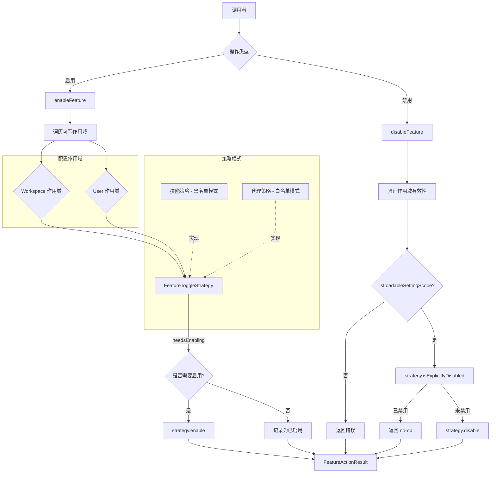

# featureToggleUtils.ts

## 概述

`featureToggleUtils.ts` 是一个功能开关（Feature Toggle）工具模块，提供了通用的功能启用/禁用机制。该模块采用**策略模式（Strategy Pattern）**设计，通过 `FeatureToggleStrategy` 接口抽象出不同功能类型（如技能 skills 和代理 agents）之间的差异，使得启用和禁用逻辑可以复用于不同的功能类型。

模块的核心能力是在多个配置作用域（Workspace 和 User）中管理功能的启用/禁用状态，并返回详细的操作结果，包括哪些作用域被修改、哪些已处于目标状态等。

## 架构图（Mermaid）



## 核心组件

### 1. 接口 `ModifiedScope`

```typescript
export interface ModifiedScope {
  scope: SettingScope;  // 配置作用域枚举值
  path: string;         // 对应配置文件的路径
}
```

描述一个被修改（或已处于目标状态）的配置作用域及其文件路径。用于在操作结果中精确报告哪些作用域受到了影响。

### 2. 类型 `FeatureActionStatus`

```typescript
export type FeatureActionStatus = 'success' | 'no-op' | 'error';
```

操作状态的三种可能值：
- **`success`**：操作成功执行，至少一个作用域被修改。
- **`no-op`**：无需操作，功能已处于目标状态。
- **`error`**：操作出错（如作用域无效）。

### 3. 接口 `FeatureActionResult`

```typescript
export interface FeatureActionResult {
  status: FeatureActionStatus;
  featureName: string;
  action: 'enable' | 'disable';
  modifiedScopes: ModifiedScope[];
  alreadyInStateScopes: ModifiedScope[];
  error?: string;
}
```

功能操作的完整结果对象，包含：
- `status`：操作状态
- `featureName`：功能名称
- `action`：执行的操作类型（启用或禁用）
- `modifiedScopes`：实际被修改的作用域列表
- `alreadyInStateScopes`：已处于目标状态的作用域列表
- `error`：当 status 为 `'error'` 时的错误消息

### 4. 接口 `FeatureToggleStrategy`（策略模式核心）

```typescript
export interface FeatureToggleStrategy {
  needsEnabling(settings, scope, featureName): boolean;
  enable(settings, scope, featureName): void;
  isExplicitlyDisabled(settings, scope, featureName): boolean;
  disable(settings, scope, featureName): void;
}
```

策略接口定义了四个方法，用于抽象不同功能类型的启用/禁用逻辑：

| 方法 | 说明 | 技能（黑名单模式） | 代理（白名单模式） |
|------|------|---------------------|---------------------|
| `needsEnabling` | 判断是否需要启用 | 在禁用列表中返回 true | 未明确启用（false 或 undefined）返回 true |
| `enable` | 执行启用操作 | 从禁用列表移除 | 设为 true |
| `isExplicitlyDisabled` | 判断是否被明确禁用 | 在禁用列表中返回 true | 明确设为 false 返回 true |
| `disable` | 执行禁用操作 | 加入禁用列表 | 设为 false |

### 5. 函数 `enableFeature`

```typescript
export function enableFeature(
  settings: LoadedSettings,
  featureName: string,
  strategy: FeatureToggleStrategy,
): FeatureActionResult
```

在所有可写作用域（Workspace 和 User）中启用指定功能。

**执行流程：**
1. 定义可写作用域列表：`[SettingScope.Workspace, SettingScope.User]`
2. 遍历每个作用域，通过 `isLoadableSettingScope` 验证有效性
3. 使用策略的 `needsEnabling` 方法判断该作用域是否需要启用
4. 如果所有作用域都已启用，返回 `no-op` 状态
5. 对需要启用的作用域，调用策略的 `enable` 方法执行启用
6. 返回包含修改详情的 `FeatureActionResult`

### 6. 函数 `disableFeature`

```typescript
export function disableFeature(
  settings: LoadedSettings,
  featureName: string,
  scope: SettingScope,
  strategy: FeatureToggleStrategy,
): FeatureActionResult
```

在指定的单个作用域中禁用功能（与 `enableFeature` 不同，禁用是针对单个作用域的）。

**执行流程：**
1. 验证传入的 scope 是否为可加载作用域，否则返回 `error`
2. 使用策略的 `isExplicitlyDisabled` 检查是否已禁用，是则返回 `no-op`
3. 检查另一个可写作用域是否已被禁用（提供信息参考）
4. 调用策略的 `disable` 方法执行禁用
5. 返回包含修改详情的 `FeatureActionResult`

**设计要点：** `enableFeature` 会同时在所有可写作用域启用功能，而 `disableFeature` 仅针对指定的单个作用域操作。这种不对称设计意味着启用是"全面启用"，而禁用是"精确禁用"。

## 依赖关系

### 内部依赖

| 依赖模块 | 导入项 | 用途 |
|----------|--------|------|
| `../config/settings.js` | `SettingScope` | 配置作用域枚举（Workspace、User 等） |
| `../config/settings.js` | `isLoadableSettingScope` | 判断作用域是否可加载的类型守卫函数 |
| `../config/settings.js` | `LoadableSettingScope` | 可加载作用域的类型定义 |
| `../config/settings.js` | `LoadedSettings` | 已加载配置的类型定义 |

### 外部依赖

无外部第三方依赖。本模块是纯逻辑模块，仅依赖项目内部的配置系统。

## 关键实现细节

1. **策略模式的应用**：模块通过 `FeatureToggleStrategy` 接口将"功能类型的差异"与"启用/禁用的通用流程"解耦。这意味着新增功能类型时，只需实现新的策略，而不需要修改 `enableFeature`/`disableFeature` 的逻辑。

2. **黑名单 vs 白名单**：注释中明确提到两种模式：
   - **技能（Skills）** 使用黑名单模式：默认启用，通过禁用列表来关闭。
   - **代理（Agents）** 使用白名单模式：默认禁用，需要明确启用。

3. **启用/禁用的不对称性**：
   - `enableFeature` 遍历所有可写作用域（Workspace + User），确保功能在所有层级都被启用。
   - `disableFeature` 仅操作指定的单个作用域，允许更精细的控制。
   - `disableFeature` 额外检查另一个作用域的状态，将其作为 `alreadyInStateScopes` 返回，为调用者提供完整的状态信息。

4. **作用域优先级**：可写作用域固定为 `[Workspace, User]`，暗示可能存在不可写的作用域（如系统级默认配置），通过 `isLoadableSettingScope` 进行过滤。

5. **幂等性设计**：两个操作函数都具有幂等性 —— 重复启用已启用的功能或禁用已禁用的功能不会报错，而是返回 `no-op` 状态，使调用方可以安全地重复调用。

6. **纯函数式设计**：除了通过策略对象修改 settings 对象外，函数本身不产生副作用（不进行 I/O、不写文件），实际的持久化由调用方负责。
