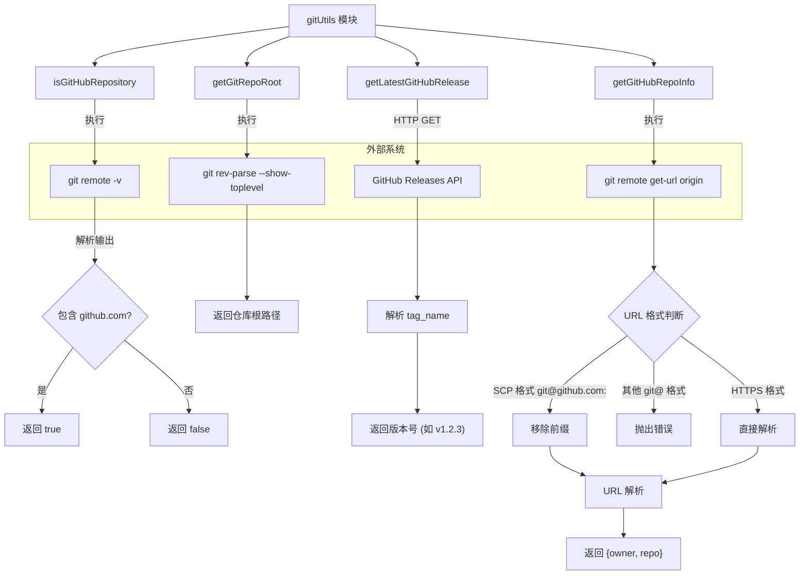

# gitUtils.ts

## 概述

`gitUtils.ts` 是一个 Git 相关的工具模块，提供了与 Git 仓库和 GitHub 交互的实用函数。主要功能包括：

1. **检测当前目录是否位于 GitHub 仓库中**
2. **获取 Git 仓库根目录路径**
3. **从 GitHub API 获取最新发布版本信息**
4. **解析 GitHub 仓库的 owner 和 repo 信息**

该模块主要服务于 CLI 工具的自动更新检测、仓库上下文感知等场景。所有的 Git 命令通过 `execSync` 同步执行，网络请求（GitHub API）通过 `fetch` 异步执行并支持代理配置。

## 架构图（Mermaid）



## 核心组件

### 1. 函数 `isGitHubRepository`

```typescript
export const isGitHubRepository = (): boolean
```

检查当前工作目录是否在一个托管于 GitHub 的 Git 仓库中。

**实现逻辑：**
1. 执行 `git remote -v` 获取所有远程仓库信息
2. 使用正则表达式 `/github\.com/` 检测输出中是否包含 `github.com`
3. 如果命令执行失败（如不在 Git 仓库中），捕获异常并返回 `false`
4. 通过 `debugLogger` 记录调试信息

**返回值：** `true` 表示在 GitHub 仓库中，`false` 表示不在。

**错误处理：** 所有异常都被静默捕获，确保该函数永远不会抛出异常。

### 2. 函数 `getGitRepoRoot`

```typescript
export const getGitRepoRoot = (): string
```

获取当前 Git 仓库的根目录绝对路径。

**实现逻辑：**
1. 执行 `git rev-parse --show-toplevel` 获取仓库根目录
2. 对输出进行 `trim()` 处理
3. 如果结果为空，抛出错误

**返回值：** 仓库根目录的绝对路径字符串。

**异常行为：** 当不在 Git 仓库中或命令执行失败时，会抛出异常（`execSync` 本身抛出或空值检查抛出）。

### 3. 函数 `getLatestGitHubRelease`

```typescript
export const getLatestGitHubRelease = async (proxy?: string): Promise<string>
```

异步获取 `google-github-actions/run-gemini-cli` 仓库在 GitHub 上的最新发布版本号。

**实现逻辑：**
1. 构造 GitHub API 端点 URL：`https://api.github.com/repos/google-github-actions/run-gemini-cli/releases/latest`
2. 发起 HTTP GET 请求，设置必要的请求头：
   - `Accept: application/vnd.github+json`
   - `X-GitHub-Api-Version: 2022-11-28`
3. 支持通过 `proxy` 参数配置代理，使用 `undici` 的 `ProxyAgent`
4. 设置 30 秒超时（通过 `AbortSignal.timeout(30_000)`）
5. 从响应 JSON 中提取 `tag_name` 字段

**参数：**
- `proxy`（可选）：代理服务器地址字符串

**返回值：** 版本标签字符串，如 `"v1.2.3"`。

**错误处理：** 网络错误、HTTP 错误、响应格式错误等都会被捕获，并抛出统一格式的错误消息。

### 4. 函数 `getGitHubRepoInfo`

```typescript
export function getGitHubRepoInfo(): { owner: string; repo: string }
```

解析当前 Git 仓库 `origin` 远程地址，提取 GitHub 的 owner 和 repo 名称。

**实现逻辑：**
1. 执行 `git remote get-url origin` 获取远程 URL
2. 根据 URL 格式进行分支处理：
   - **SCP 格式**（`git@github.com:owner/repo.git`）：移除 `git@github.com:` 前缀后解析
   - **其他 SSH 格式**（`git@`开头但不是 github.com）：直接抛出错误
   - **HTTPS 格式**（`https://github.com/owner/repo.git`）：直接进行 URL 解析
3. 使用 `new URL()` 解析 URL，验证 host 为 `github.com`
4. 从 pathname 中提取 owner 和 repo（去除 `.git` 后缀）

**返回值：** `{ owner: string; repo: string }` 对象。

**异常行为：** 在以下情况抛出错误：
- 远程 URL 不是 GitHub 地址
- URL 格式无法解析
- pathname 不符合 `owner/repo` 格式

## 依赖关系

### 内部依赖

| 依赖模块 | 导入项 | 用途 |
|----------|--------|------|
| `@google/gemini-cli-core` | `debugLogger` | 调试日志记录器，用于记录错误和调试信息 |

### 外部依赖

| 依赖包 | 导入项 | 用途 |
|--------|--------|------|
| `node:child_process` | `execSync` | 同步执行 Git 命令行命令 |
| `undici` | `ProxyAgent` | HTTP 代理代理，用于在需要时通过代理服务器请求 GitHub API |

此外，代码还使用了 Node.js 全局的 `fetch` API（Node 18+ 内置）和 `AbortSignal`、`URL` 等 Web 标准 API。

## 关键实现细节

1. **同步 vs 异步执行**：
   - `isGitHubRepository`、`getGitRepoRoot`、`getGitHubRepoInfo` 都使用 `execSync` 同步执行 Git 命令。这意味着它们会阻塞事件循环，适合在启动阶段或非性能关键路径使用。
   - `getLatestGitHubRelease` 是唯一的异步函数，使用 `fetch` 发起网络请求。

2. **代理支持**：`getLatestGitHubRelease` 通过 `undici` 的 `ProxyAgent` 支持 HTTP 代理。代理地址通过参数传入，使得调用方可以从配置中读取代理设置。使用 `dispatcher` 选项注入到 `fetch` 请求中（这是 Node.js undici 风格的 fetch 特性）。

3. **超时控制**：GitHub API 请求使用 `AbortSignal.any()` 组合了两个信号：
   - `AbortSignal.timeout(30_000)`：30 秒超时自动取消
   - `controller.signal`：手动取消信号（虽然当前代码中未使用手动取消，但保留了可扩展性）

4. **SCP 格式 SSH URL 处理**：`getGitHubRepoInfo` 特别处理了 Git 常见的 SCP 格式 URL（`git@github.com:owner/repo.git`），通过移除前缀并利用 `new URL()` 的 base URL 参数来正确解析。这是因为 SCP 格式不是标准 URL，无法直接被 `URL` 构造函数解析。

5. **安全性考虑**：
   - `isGitHubRepository` 采用了安全失败（fail-safe）模式 —— 任何异常都返回 `false`。
   - `getGitHubRepoInfo` 严格验证 host 必须是 `github.com`，拒绝其他 Git 托管平台的 URL。

6. **硬编码的仓库地址**：`getLatestGitHubRelease` 中的 GitHub API 端点硬编码为 `google-github-actions/run-gemini-cli` 仓库，说明该函数专用于检查此特定仓库的版本更新。
