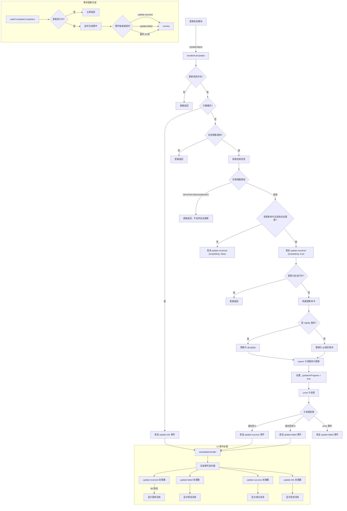

# handleAutoUpdate.ts

## 概述

`handleAutoUpdate.ts` 是 Gemini CLI 的**自动更新处理模块**，负责检测、执行和管理 CLI 工具的后台自动更新流程。该模块实现了完整的自动更新生命周期管理，包括：

1. **更新条件判断**：根据安装方式、沙箱模式、用户配置等条件决定是否执行自动更新。
2. **后台进程更新**：通过 `spawn` 创建分离的子进程在后台执行更新命令，不阻塞用户当前操作。
3. **事件驱动的状态通知**：通过 `updateEventEmitter` 发送更新状态事件（接收/成功/失败/信息），与 UI 层解耦。
4. **UI 事件处理注册**：提供 `setUpdateHandler` 函数注册 UI 更新处理器，将更新事件转化为用户可见的消息。
5. **等待更新完成**：在需要重启时，提供 `waitForUpdateCompletion` 函数等待后台更新完成。

## 架构图（Mermaid）



## 核心组件

### 1. 模块级状态变量 `_updateInProgress`

```typescript
let _updateInProgress = false;
```

布尔标志变量，用于跟踪当前是否有更新进程正在运行。该标志确保同一时刻只有一个更新进程在执行，防止并发更新冲突。

### 2. 函数 `_setUpdateStateForTesting`

```typescript
export function _setUpdateStateForTesting(value: boolean): void
```

**仅限测试使用**的辅助函数，用于在单元测试中手动设置 `_updateInProgress` 状态。以 `_` 前缀和 `@internal` JSDoc 标签表明其内部性质。

### 3. 函数 `isUpdateInProgress`

```typescript
export function isUpdateInProgress(): boolean
```

返回当前是否有更新进程正在执行。外部代码通过此函数查询更新状态。

### 4. 函数 `waitForUpdateCompletion`

```typescript
export async function waitForUpdateCompletion(timeoutMs = 30000): Promise<void>
```

返回一个 Promise，在更新进程完成或超时时 resolve。

**参数：**
- `timeoutMs`（默认 30000）：最大等待时间，单位毫秒

**实现逻辑：**
1. 如果当前没有更新在进行，立即返回
2. 在 Promise 内部再次检查状态（防止竞态条件）
3. 同时注册三个结束条件：
   - `update-success` 事件
   - `update-failed` 事件
   - 超时定时器
4. 任一条件触发后执行 `cleanup`：清除定时器、移除事件监听、resolve Promise

**竞态条件处理：** 在 Promise 执行器内部再次检查 `_updateInProgress`，避免在首次检查与创建 Promise 之间更新已完成的情况。

### 5. 函数 `handleAutoUpdate`（核心函数）

```typescript
export function handleAutoUpdate(
  info: UpdateObject | null,
  settings: LoadedSettings,
  projectRoot: string,
  spawnFn: typeof spawn = spawnWrapper,
): ChildProcess | undefined
```

自动更新的主入口函数，负责判断条件并执行更新。

**参数：**
- `info`：更新信息对象，为 `null` 表示没有可用更新
- `settings`：已加载的用户配置
- `projectRoot`：项目根目录路径
- `spawnFn`：进程生成函数，默认为 `spawnWrapper`，可注入用于测试

**决策链（短路返回条件）：**

| 序号 | 条件 | 行为 |
|------|------|------|
| 1 | `info` 为 null | 直接返回 |
| 2 | 沙箱模式（配置或环境变量 `GEMINI_SANDBOX`） | 发送 `update-info` 事件并返回 |
| 3 | 未启用更新通知 `enableAutoUpdateNotification` | 直接返回 |
| 4 | 包管理器为 NPX/PNPX/BUNX/BINARY | 直接返回（这些方式不支持自动更新） |
| 5 | 无更新命令或未启用自动更新 | 发送 `update-received`（`isUpdating: false`）并返回 |
| 6 | 已有更新在进行中 | 发送 `update-received`（`isUpdating: true`）后返回 |

**更新执行流程：**
1. 检测是否为 nightly 版本
2. 将更新命令中的 `@latest` 替换为目标版本号（`@nightly` 或 `@x.y.z`）
3. 通过 `spawnFn` 创建子进程，配置：
   - `stdio: 'ignore'`：忽略所有标准流
   - `shell: true`：在 shell 中执行
   - `detached: true`：创建独立进程组
4. 设置 `_updateInProgress = true`
5. 调用 `updateProcess.unref()` 允许父进程独立退出
6. 监听 `close` 事件：根据退出码发送成功或失败事件
7. 监听 `error` 事件：发送失败事件

### 6. 函数 `setUpdateHandler`

```typescript
export function setUpdateHandler(
  addItem: (item: Omit<HistoryItem, 'id'>, timestamp: number) => void,
  setUpdateInfo: (info: UpdateObject | null) => void,
): () => void
```

注册 UI 层的更新事件处理器，将更新事件转化为用户可见的历史消息。

**参数：**
- `addItem`：向 UI 历史记录添加消息的回调函数
- `setUpdateInfo`：设置更新信息状态的回调函数

**返回值：** 清理函数（取消注册所有事件监听器）

**事件处理器：**

| 事件 | 处理逻辑 |
|------|----------|
| `update-received` | 保存更新信息，60 秒后显示更新消息（若更新未在此期间完成） |
| `update-failed` | 清除更新信息，显示错误消息 |
| `update-success` | 设置成功标志，清除更新信息，显示成功消息 |
| `update-info` | 直接显示信息消息 |

**60 秒延迟逻辑：** `update-received` 事件处理中设置了 60 秒延迟。如果在 60 秒内更新成功完成（`successfullyInstalled` 被设为 `true`），则不再重复显示更新消息。这避免了"更新中"和"更新成功"消息同时出现。

## 依赖关系

### 内部依赖

| 依赖模块 | 导入项 | 用途 |
|----------|--------|------|
| `../ui/utils/updateCheck.js` | `UpdateObject`（类型） | 更新信息数据结构 |
| `../config/settings.js` | `LoadedSettings`（类型） | 已加载的用户配置 |
| `./installationInfo.js` | `getInstallationInfo`, `PackageManager` | 获取 CLI 的安装方式和更新命令 |
| `./updateEventEmitter.js` | `updateEventEmitter` | 更新事件的发射器（EventEmitter） |
| `../ui/types.js` | `MessageType`, `HistoryItem`（类型） | UI 消息类型和历史记录项 |
| `./spawnWrapper.js` | `spawnWrapper` | 子进程生成的包装函数 |
| `@google/gemini-cli-core` | `debugLogger` | 调试日志记录 |

### 外部依赖

| 依赖包 | 导入项 | 用途 |
|--------|--------|------|
| `node:child_process` | `spawn`（类型） | 子进程生成函数的类型定义 |

## 关键实现细节

1. **后台进程分离**：通过 `detached: true` 和 `unref()` 实现真正的后台更新。`detached` 让子进程在新的进程组中运行，`unref` 让 Node.js 事件循环不再等待子进程结束，允许 CLI 主进程独立退出。

2. **事件驱动架构**：整个更新流程通过 `updateEventEmitter` 发布-订阅模式与 UI 解耦。核心逻辑只发出事件（`update-received`、`update-success`、`update-failed`、`update-info`），UI 层通过 `setUpdateHandler` 注册处理器来响应。

3. **单例更新保护**：模块级 `_updateInProgress` 标志确保同一时刻只有一个更新进程。多次调用 `handleAutoUpdate` 时，如果已有更新在进行，后续调用会直接返回。

4. **沙箱模式检测**：同时检查配置 `settings.merged.tools.sandbox` 和环境变量 `GEMINI_SANDBOX`，任一为真即视为沙箱模式，此时禁止自动更新但会通知用户。

5. **Nightly 版本支持**：通过检查版本字符串是否包含 `'nightly'` 来判断是否为 nightly 版本，并相应调整更新命令中的版本标签。

6. **包管理器兼容性**：NPX、PNPX、BUNX 和 BINARY 安装方式不支持自动更新（因为它们每次运行时自动获取最新版本或是二进制分发），对这些方式直接跳过更新流程。

7. **依赖注入**：`spawnFn` 参数支持注入自定义的进程生成函数，主要用于测试场景，实现了良好的可测试性。

8. **竞态条件防护**：`waitForUpdateCompletion` 在 Promise 构造函数内部二次检查 `_updateInProgress` 状态，防止首次检查和 Promise 创建之间的竞态。

9. **60 秒消息延迟策略**：`setUpdateHandler` 中的 `update-received` 处理器使用 60 秒延迟显示消息。如果更新在 60 秒内成功完成，`successfullyInstalled` 标志会阻止重复的"正在更新"消息显示，提供更好的用户体验。
