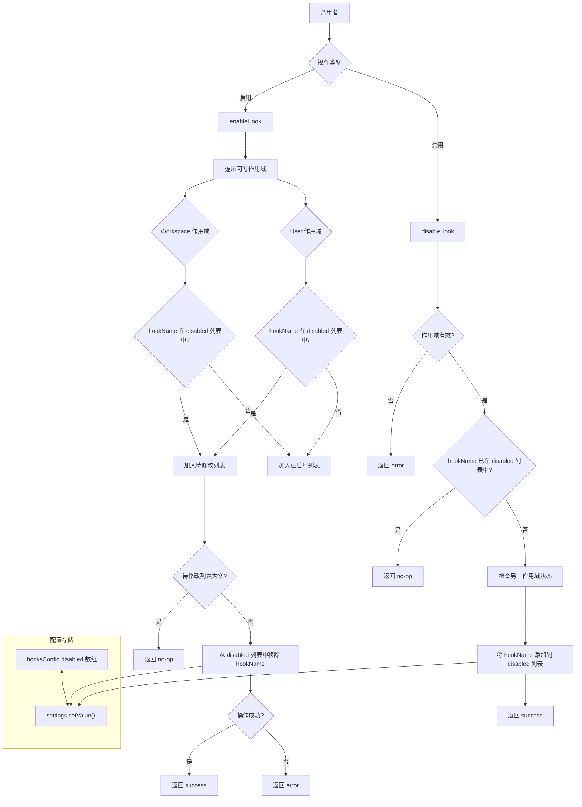

# hookSettings.ts

## 概述

`hookSettings.ts` 是 Gemini CLI 的**钩子（Hook）配置管理模块**，负责在用户配置中启用和禁用特定的钩子。钩子采用**黑名单模式**管理 —— 即钩子默认处于启用状态，通过将钩子名称添加到 `hooksConfig.disabled` 列表中来禁用它们。

该模块提供两个核心函数：
- `enableHook`：通过从所有可写作用域的禁用列表中移除钩子名称来启用钩子。
- `disableHook`：通过将钩子名称添加到指定作用域的禁用列表中来禁用钩子。

其设计与 `featureToggleUtils.ts` 的策略模式不同，本模块直接实现了钩子特有的黑名单逻辑，而非通过策略接口抽象。

## 架构图（Mermaid）



## 核心组件

### 1. 类型 `HookActionStatus`

```typescript
export type HookActionStatus = 'success' | 'no-op' | 'error';
```

钩子操作的三种状态：
- **`success`**：操作成功执行，配置已被修改
- **`no-op`**：无需操作，钩子已处于目标状态
- **`error`**：操作执行出错

### 2. 接口 `HookActionResult`

```typescript
export interface HookActionResult {
  status: HookActionStatus;
  hookName: string;
  action: 'enable' | 'disable';
  modifiedScopes: ModifiedScope[];
  alreadyInStateScopes: ModifiedScope[];
  error?: string;
}
```

钩子操作的完整结果对象：
- `status`：操作状态
- `hookName`：钩子名称
- `action`：执行的操作类型
- `modifiedScopes`：实际被修改的作用域列表
- `alreadyInStateScopes`：已处于目标状态的作用域列表
- `error`：错误时的详细错误消息

该接口与 `featureToggleUtils.ts` 中的 `FeatureActionResult` 结构几乎一致，但 `featureName` 被替换为 `hookName`。

### 3. 函数 `enableHook`

```typescript
export function enableHook(
  settings: LoadedSettings,
  hookName: string,
): HookActionResult
```

在所有可写作用域（Workspace 和 User）中启用指定钩子。

**实现逻辑：**

1. **扫描阶段**：遍历 `[Workspace, User]` 两个可写作用域
   - 检查每个作用域的 `hooksConfig.disabled` 数组是否包含目标钩子名称
   - 包含则加入 `foundInDisabledScopes`，不包含则加入 `alreadyEnabledScopes`

2. **短路检查**：如果所有作用域都未禁用该钩子，返回 `no-op`

3. **修改阶段**：对每个需要修改的作用域
   - 获取当前 `disabled` 数组
   - 使用 `filter` 移除目标钩子名称
   - 通过 `settings.setValue(scope, 'hooksConfig.disabled', newDisabled)` 持久化修改

4. **错误处理**：整个修改过程包裹在 `try-catch` 中，捕获异常后返回 `error` 状态及已修改的作用域列表（部分成功场景）

### 4. 函数 `disableHook`

```typescript
export function disableHook(
  settings: LoadedSettings,
  hookName: string,
  scope: SettingScope,
): HookActionResult
```

在指定作用域中禁用钩子。

**实现逻辑：**

1. **作用域验证**：检查 scope 是否为可加载作用域，否则返回 `error`
2. **重复检查**：如果目标钩子已在当前作用域的 `disabled` 列表中，返回 `no-op`
3. **交叉检查**：检查另一个可写作用域是否已禁用该钩子，作为 `alreadyInStateScopes` 返回
4. **执行禁用**：将钩子名称追加到 `disabled` 数组中，通过 `settings.setValue` 持久化

**与 `enableHook` 的不对称性：**
- `enableHook` 遍历所有可写作用域，从所有禁用列表中移除（全面启用）
- `disableHook` 仅操作指定的单个作用域（精确禁用）

## 依赖关系

### 内部依赖

| 依赖模块 | 导入项 | 用途 |
|----------|--------|------|
| `../config/settings.js` | `SettingScope` | 配置作用域枚举 |
| `../config/settings.js` | `isLoadableSettingScope` | 判断作用域是否可加载的类型守卫 |
| `../config/settings.js` | `LoadedSettings`（类型） | 已加载的配置对象 |
| `@google/gemini-cli-core` | `getErrorMessage` | 从错误对象中安全提取错误消息 |
| `./skillSettings.js` | `ModifiedScope`（类型） | 已修改作用域的类型定义（复用自 skillSettings） |

### 外部依赖

无外部第三方依赖。

## 关键实现细节

1. **黑名单管理模式**：钩子默认是启用的。禁用通过将钩子名称加入 `hooksConfig.disabled` 数组实现，启用则是从该数组中移除。这与技能（skills）的管理模式一致，但不同于代理（agents）的白名单模式。

2. **配置路径 `hooksConfig.disabled`**：钩子的禁用列表存储在配置对象的 `hooksConfig.disabled` 路径下，是一个字符串数组。通过 `settings.setValue(scope, 'hooksConfig.disabled', newDisabled)` 进行更新。

3. **不可变数据操作**：
   - 启用时使用 `filter` 创建新数组（不修改原数组）
   - 禁用时使用展开运算符 `[...currentScopeDisabled, hookName]` 创建新数组
   - 这保证了操作不会意外修改原始配置数据

4. **部分成功处理**：`enableHook` 的 `try-catch` 设计允许处理部分成功的情况。如果在修改第一个作用域成功但第二个失败时，返回的结果中 `modifiedScopes` 会包含已成功修改的作用域，`error` 字段包含失败信息。这比全有或全无（all-or-nothing）策略提供了更多信息。

5. **类型复用**：`ModifiedScope` 类型从 `./skillSettings.js` 导入而非自行定义，表明钩子和技能共享相同的作用域描述结构。这是代码复用的良好实践，但也意味着对 `skillSettings` 有耦合关系。

6. **可选链安全访问**：使用 `settings.forScope(scope).settings.hooksConfig?.disabled` 进行安全访问，当 `hooksConfig` 或 `disabled` 不存在时不会抛出异常。结合空值合并运算符 `?? []` 提供默认值。

7. **与 `featureToggleUtils` 的关系对比**：`hookSettings` 直接硬编码了黑名单逻辑，而 `featureToggleUtils` 通过策略模式抽象。如果未来需要将钩子管理纳入通用的功能开关框架，可以为钩子实现 `FeatureToggleStrategy` 接口，将本模块的逻辑迁移到策略实现中。
