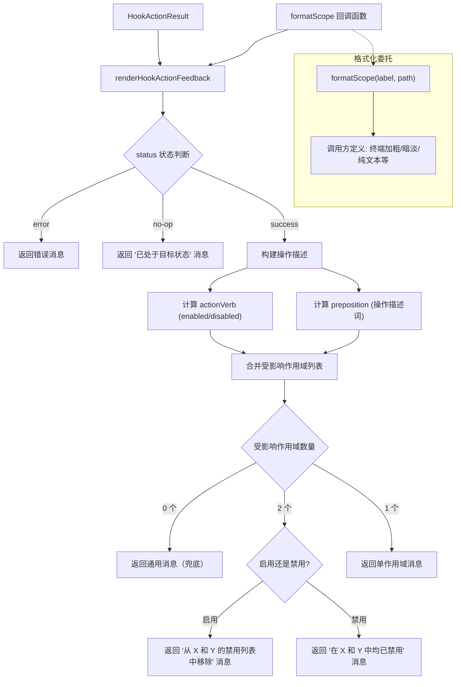

# hookUtils.ts

## 概述

`hookUtils.ts` 是 Gemini CLI 的**钩子操作反馈消息渲染模块**，专门负责将钩子启用/禁用操作的结果（`HookActionResult`）转化为人类可读的反馈消息字符串。

该模块的核心设计理念是**关注点分离**：将消息内容的生成逻辑与消息的格式化样式（如终端加粗、暗淡等）分离。通过 `formatScope` 回调函数，调用方可以自定义作用域信息的呈现方式，而消息内容的拼接逻辑则由本模块统一管理。

模块仅导出一个函数 `renderHookActionFeedback`，它是一个纯函数，不产生任何副作用。

## 架构图（Mermaid）



## 核心组件

### 函数 `renderHookActionFeedback`

```typescript
export function renderHookActionFeedback(
  result: HookActionResult,
  formatScope: (label: string, path: string) => string,
): string
```

将钩子操作结果渲染为用户可读的反馈消息。

**参数：**
- `result`：`HookActionResult` 对象，包含操作状态、钩子名称、受影响的作用域等信息
- `formatScope`：格式化回调函数，接收作用域标签（如 `"workspace"`、`"user"`）和配置文件路径，返回格式化后的字符串。调用方可通过此函数控制渲染样式（如终端颜色、加粗、暗淡等）

**返回值：** 格式化后的反馈消息字符串

**消息生成逻辑（按优先级）：**

| 条件 | 消息模板 | 示例 |
|------|----------|------|
| `status === 'error'` | 返回 `error` 字段或通用错误消息 | `"An error occurred while attempting to enable hook \"pre-commit\"."` |
| `status === 'no-op'` | `Hook "{name}" is already {enabled/disabled}.` | `"Hook \"pre-commit\" is already enabled."` |
| `success` + 0 个受影响作用域 | `Hook "{name}" {enabled/disabled}.`（兜底） | `"Hook \"pre-commit\" enabled."` |
| `success` + 2 个受影响作用域 + 启用 | `Hook "{name}" enabled by removing it from the disabled list in {scope1} and {scope2} settings.` | 完整描述启用操作的影响范围 |
| `success` + 2 个受影响作用域 + 禁用 | `Hook "{name}" is now disabled in both {scope1} and {scope2} settings.` | 明确说明两个作用域都已禁用 |
| `success` + 1 个受影响作用域 | `Hook "{name}" {enabled/disabled} by {preposition} {scope} settings.` | 单作用域操作描述 |

**作用域标签映射：**
- `SettingScope.Workspace` 映射为 `"workspace"`
- 其他作用域使用 `scope.toLowerCase()`（如 `"user"`）

**受影响作用域合并：** 将 `modifiedScopes` 和 `alreadyInStateScopes` 合并为 `totalAffectedScopes`，统一计算影响范围。这意味着消息不仅报告本次修改的作用域，还包含已处于目标状态的作用域，给用户一个完整的状态视图。

**启用/禁用的措辞差异：**
- **启用（enable）**：强调"从禁用列表中移除"（`by removing it from the disabled list in`）
- **禁用（disable）**：强调"现在在两个作用域中都已禁用"（`is now disabled in both`）

## 依赖关系

### 内部依赖

| 依赖模块 | 导入项 | 用途 |
|----------|--------|------|
| `../config/settings.js` | `SettingScope` | 配置作用域枚举，用于判断 Workspace 作用域 |
| `./hookSettings.js` | `HookActionResult`（类型） | 钩子操作结果的类型定义 |

### 外部依赖

无外部第三方依赖。本模块是纯粹的消息格式化逻辑。

## 关键实现细节

1. **高阶函数设计**：`formatScope` 是一个高阶回调函数参数，实现了样式与内容的分离。这使得同一段消息逻辑可以在不同的 UI 环境中复用：
   - 终端 UI 可以传入添加 ANSI 颜色/加粗/暗淡的格式化函数
   - 测试代码可以传入简单的字符串拼接函数
   - Web UI 可以传入生成 HTML 标签的函数

2. **纯函数特性**：`renderHookActionFeedback` 不依赖任何外部状态，不修改传入参数，不产生副作用。给定相同的输入，始终返回相同的输出。这使得该函数非常容易测试和推理。

3. **防御性编程**：当 `totalAffectedScopes.length === 0` 时（理论上不应发生），函数返回一个通用的兜底消息，而非抛出异常。注释也明确标注了这是一个保护性措施。

4. **消息的语义精确性**：
   - 启用操作明确说明"从禁用列表中移除"，让用户理解底层操作
   - 禁用操作在涉及两个作用域时使用"in both"强调全面性
   - `no-op` 状态使用"already"暗示用户之前已执行过相同操作

5. **Workspace 作用域的特殊处理**：代码中 `SettingScope.Workspace` 被映射为固定的 `"workspace"` 字符串，而非直接调用 `toLowerCase()`。这说明 `SettingScope.Workspace` 的枚举值可能不是 `"Workspace"`（可能是 `"project"` 或其他值），需要显式映射以保证用户看到的标签一致。

6. **模块的单一职责**：整个模块只做一件事 —— 渲染钩子操作反馈消息。它不参与钩子的启用/禁用逻辑（那是 `hookSettings.ts` 的职责），也不负责实际输出到终端（那是调用方的职责）。这种单一职责设计使代码更易维护和测试。
