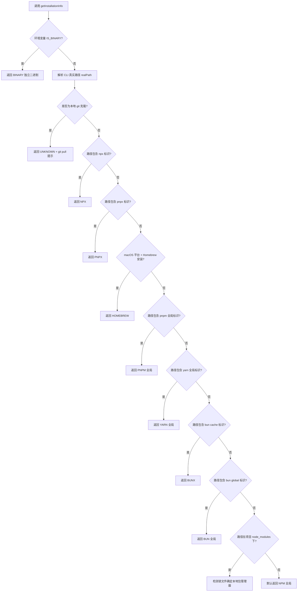

# installationInfo.ts

## 概述

`installationInfo.ts` 是 Gemini CLI 的安装信息检测工具模块。其核心职责是**识别当前 CLI 的安装方式和包管理器类型**，并据此生成对应的更新命令和更新提示信息。该模块支持检测多种安装途径，包括 npm、yarn、pnpm、bun、Homebrew、npx 临时执行、独立二进制文件以及本地 git 克隆等方式。

文件路径：`packages/cli/src/utils/installationInfo.ts`

## 架构图（Mermaid）



## 核心组件

### 1. `isDevelopment` 常量

```typescript
export const isDevelopment = process.env['NODE_ENV'] === 'development';
```

通过读取环境变量 `NODE_ENV` 判断当前是否处于开发模式。该常量被导出供其他模块使用。

### 2. `PackageManager` 枚举

```typescript
export enum PackageManager {
  NPM = 'npm',
  YARN = 'yarn',
  PNPM = 'pnpm',
  PNPX = 'pnpx',
  BUN = 'bun',
  BUNX = 'bunx',
  HOMEBREW = 'homebrew',
  NPX = 'npx',
  BINARY = 'binary',
  UNKNOWN = 'unknown',
}
```

定义了所有支持的包管理器/安装方式类型：

| 枚举值 | 含义 |
|--------|------|
| `NPM` | npm 全局或本地安装 |
| `YARN` | yarn 全局或本地安装 |
| `PNPM` | pnpm 全局或本地安装 |
| `PNPX` | 通过 pnpx 临时执行 |
| `BUN` | bun 全局安装 |
| `BUNX` | 通过 bunx 临时执行 |
| `HOMEBREW` | macOS Homebrew 安装 |
| `NPX` | 通过 npx 临时执行 |
| `BINARY` | 独立二进制文件 |
| `UNKNOWN` | 无法识别的安装方式 |

### 3. `InstallationInfo` 接口

```typescript
export interface InstallationInfo {
  packageManager: PackageManager;
  isGlobal: boolean;
  updateCommand?: string;
  updateMessage?: string;
}
```

| 字段 | 类型 | 必填 | 说明 |
|------|------|------|------|
| `packageManager` | `PackageManager` | 是 | 检测到的包管理器类型 |
| `isGlobal` | `boolean` | 是 | 是否为全局安装 |
| `updateCommand` | `string` | 否 | 可自动执行的更新命令（仅部分安装方式提供） |
| `updateMessage` | `string` | 否 | 面向用户的更新提示消息 |

### 4. `getInstallationInfo()` 函数

这是本模块的核心函数，接收两个参数：

- `projectRoot: string` — 项目根目录路径
- `isAutoUpdateEnabled: boolean` — 是否启用了自动更新

函数返回 `InstallationInfo` 对象。

#### 检测优先级（从高到低）

1. **独立二进制文件**：检查环境变量 `IS_BINARY === 'true'`
2. **本地 git 克隆**：CLI 路径在项目根目录下且不在 `node_modules` 中，同时当前目录是 git 仓库
3. **npx 临时执行**：路径包含 `/.npm/_npx` 或 `/npm/_npx`
4. **pnpx 临时执行**：路径包含 `/.pnpm/_pnpx` 或 `/.cache/pnpm/dlx`
5. **Homebrew（仅 macOS）**：通过 `brew --prefix gemini-cli` 命令验证
6. **pnpm 全局安装**：路径包含 `/.pnpm/global` 或 `/.local/share/pnpm`
7. **yarn 全局安装**：路径包含 `/.yarn/global`
8. **bunx 临时执行**：路径包含 `/.bun/install/cache`
9. **bun 全局安装**：路径包含 `/.bun/install/global`
10. **本地项目安装**：路径在 `${projectRoot}/node_modules` 下，通过锁文件（`yarn.lock`、`pnpm-lock.yaml`、`bun.lockb`）识别包管理器
11. **默认**：假定为 npm 全局安装

#### 自动更新行为

当 `isAutoUpdateEnabled` 为 `true` 时，对于支持自动更新的安装方式（npm、yarn、pnpm、bun 全局安装），`updateMessage` 会显示"正在尝试自动更新..."；否则显示手动更新命令。

不支持自动更新的安装方式（npx、pnpx、bunx、binary、本地 git 克隆、本地项目安装）只提供静态提示信息。

## 依赖关系

### 内部依赖

| 模块 | 导入项 | 用途 |
|------|--------|------|
| `@google/gemini-cli-core` | `debugLogger` | 在异常捕获时记录调试日志 |
| `@google/gemini-cli-core` | `isGitRepository` | 判断当前工作目录是否为 git 仓库 |

### 外部依赖

| 模块 | 用途 |
|------|------|
| `node:fs` | 文件系统操作：`realpathSync` 解析符号链接获取真实路径，`existsSync` 检测锁文件是否存在 |
| `node:path` | 路径拼接：`path.join` 构建锁文件的完整路径 |
| `node:child_process` | 子进程执行：`execSync` 调用 `brew --prefix` 命令检测 Homebrew 安装 |
| `node:process` | 读取 `process.argv[1]`（CLI 入口路径）、`process.env`（环境变量）、`process.cwd()`（当前工作目录）、`process.platform`（操作系统平台） |

## 关键实现细节

### 路径标准化

函数内部将所有路径的反斜杠 `\` 替换为正斜杠 `/`，以保证在 Windows 环境下也能正确进行路径匹配：

```typescript
const realPath = fs.realpathSync(cliPath).replace(/\\/g, '/');
const normalizedProjectRoot = projectRoot?.replace(/\\/g, '/');
```

### 符号链接解析

使用 `fs.realpathSync()` 解析 `process.argv[1]`，确保获取的是 CLI 可执行文件的真实物理路径而非符号链接路径。这对于正确识别 npm/yarn 等工具创建的全局命令链接至关重要。

### Homebrew 检测策略

Homebrew 检测仅在 macOS（`process.platform === 'darwin'`）上执行。通过执行 `brew --prefix gemini-cli` 获取 Homebrew 安装前缀，再将其解析为真实路径与 CLI 路径对比。如果 `brew` 命令不存在或 `gemini-cli` 未通过 brew 安装，异常会被静默捕获并继续后续检测。

### 本地安装的包管理器识别

当确定为本地项目安装（路径在 `node_modules` 下）时，通过检测项目根目录中的锁文件来推断使用的包管理器：

| 锁文件 | 对应包管理器 |
|--------|-------------|
| `yarn.lock` | YARN |
| `pnpm-lock.yaml` | PNPM |
| `bun.lockb` | BUN |
| （无匹配锁文件） | NPM（默认） |

### 错误处理

整个检测逻辑被包裹在 `try-catch` 中。任何异常（如文件系统权限问题、子进程执行失败等）都会通过 `debugLogger` 记录，并返回一个安全的默认值 `{ packageManager: UNKNOWN, isGlobal: false }`，确保不会因为安装信息检测失败而中断 CLI 正常运行。
