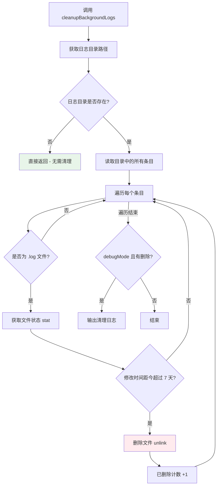

# logCleanup.ts

## 概述

`logCleanup.ts` 是 Gemini CLI 的后台进程日志清理工具模块。它的核心职责是扫描后台进程日志目录（`~/.gemini/tmp/background-processes/`），删除超过 **7 天**保留期的 `.log` 文件。该模块采用"尽力而为"的策略，清理失败不会中断 CLI 的正常运行。

文件路径：`packages/cli/src/utils/logCleanup.ts`

## 架构图（Mermaid）



## 核心组件

### 1. `RETENTION_PERIOD_MS` 常量

```typescript
const RETENTION_PERIOD_MS = 7 * 24 * 60 * 60 * 1000; // 7 days
```

日志保留期常量，值为 7 天对应的毫秒数（604,800,000 毫秒）。超过此时间的日志文件将被删除。该常量为模块私有，不对外导出。

### 2. `cleanupBackgroundLogs()` 函数

```typescript
export async function cleanupBackgroundLogs(
  debugMode: boolean = false,
): Promise<void>
```

**功能**：异步清理过期的后台进程日志文件。

**参数**：

| 参数 | 类型 | 默认值 | 说明 |
|------|------|--------|------|
| `debugMode` | `boolean` | `false` | 是否输出详细的调试日志信息 |

**返回值**：`Promise<void>` — 无返回值的 Promise

**执行流程**：

1. **获取日志目录**：通过 `ShellExecutionService.getLogDir()` 获取后台进程日志存放目录的路径
2. **检查目录存在性**：使用 `fs.access()` 异步检查目录是否存在。若不存在则直接返回，不执行任何操作
3. **读取目录内容**：使用 `fs.readdir()` 读取目录中的所有条目，启用 `withFileTypes: true` 以获取文件类型信息
4. **遍历过滤**：对每个条目进行过滤，仅处理满足以下条件的文件：
   - 是文件（`entry.isFile()` 为 `true`）
   - 文件名以 `.log` 结尾
5. **检查过期**：获取文件的 `stat` 信息，比较当前时间与文件的修改时间（`mtime`），若差值超过 `RETENTION_PERIOD_MS` 则判定为过期
6. **删除文件**：使用 `fs.unlink()` 删除过期文件，并累加 `deletedCount` 计数器
7. **输出结果**：如果处于调试模式且有文件被删除，输出清理数量日志

## 依赖关系

### 内部依赖

| 模块 | 导入项 | 用途 |
|------|--------|------|
| `@google/gemini-cli-core` | `ShellExecutionService` | 调用其静态方法 `getLogDir()` 获取后台进程日志存放目录路径 |
| `@google/gemini-cli-core` | `debugLogger` | 在调试模式下记录清理过程信息和错误 |

### 外部依赖

| 模块 | 用途 |
|------|------|
| `node:fs`（promises API） | 异步文件系统操作：`access`（检查目录存在性）、`readdir`（读取目录）、`stat`（获取文件状态）、`unlink`（删除文件） |
| `node:path` | 路径拼接：`path.join` 构建日志文件的完整路径 |

## 关键实现细节

### "尽力而为"的清理策略

该模块采用了多层错误处理的"尽力而为"（best-effort）策略：

1. **外层 try-catch**：包裹整个清理逻辑，捕获任何未预期的异常（如目录读取权限问题），确保不会因清理失败而崩溃 CLI
2. **目录存在检查**：使用单独的 try-catch 处理 `fs.access`，目录不存在时优雅退出
3. **单文件级 try-catch**：每个文件的处理（stat + unlink）都有独立的 try-catch，单个文件处理失败不会影响其他文件的清理

这种设计确保了日志清理作为一个辅助功能，永远不会干扰 CLI 的主流程。

### 调试模式的分级日志

- `debugLogger.debug()`：用于记录单个文件处理失败和清理成功的详细信息
- `debugLogger.warn()`：用于记录整体清理流程失败的警告信息

只有当 `debugMode` 为 `true` 时才会输出这些日志，避免在正常使用中产生不必要的输出。

### 基于修改时间的过期判断

使用文件的 `mtime`（最后修改时间）而非 `birthtime`（创建时间）来判断文件是否过期。这意味着如果一个日志文件在创建后又被追加写入，其保留期会从最后写入时间重新计算。

### 异步操作设计

整个模块使用 `async/await` 和 `fs.promises` API，所有文件系统操作都是异步非阻塞的。这对于在 CLI 启动时作为后台任务运行非常重要，不会阻塞主线程的响应。
