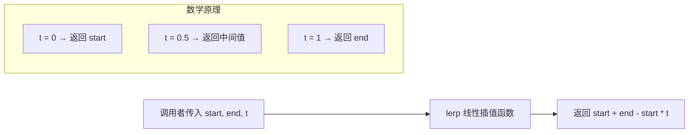

# math.ts

## 概述

`math.ts` 是 Gemini CLI 中的数学工具模块，目前仅包含一个线性插值（Linear Interpolation，简称 lerp）函数。该函数在两个数值之间进行线性插值计算，常用于 UI 动画、渐变效果、进度计算等场景。

文件路径：`packages/cli/src/utils/math.ts`

## 架构图（Mermaid）



## 核心组件

### `lerp()` 函数

```typescript
export const lerp = (start: number, end: number, t: number): number =>
  start + (end - start) * t;
```

**功能**：在两个数值之间进行线性插值，根据参数 `t` 的值返回 `start` 和 `end` 之间的某个中间值。

**参数**：

| 参数 | 类型 | 说明 |
|------|------|------|
| `start` | `number` | 起始值，当 `t = 0` 时返回此值 |
| `end` | `number` | 终止值，当 `t = 1` 时返回此值 |
| `t` | `number` | 插值因子，通常在 `[0, 1]` 范围内 |

**返回值**：`number` — 插值结果

**数学公式**：

```
result = start + (end - start) * t
```

等价于：

```
result = (1 - t) * start + t * end
```

**使用示例**：

| `start` | `end` | `t` | 结果 | 说明 |
|---------|-------|-----|------|------|
| 0 | 100 | 0 | 0 | 返回起始值 |
| 0 | 100 | 0.5 | 50 | 返回中间值 |
| 0 | 100 | 1 | 100 | 返回终止值 |
| 0 | 100 | 0.25 | 25 | 返回 25% 位置的值 |
| 10 | 20 | 0.3 | 13 | 从 10 到 20 的 30% 位置 |
| 100 | 0 | 0.5 | 50 | 反向插值也适用 |
| 0 | 100 | 1.5 | 150 | t 超出 [0,1] 范围时产生外推 |
| 0 | 100 | -0.5 | -50 | t 为负值时产生反向外推 |

## 依赖关系

### 内部依赖

无。本模块不依赖任何项目内部模块。

### 外部依赖

无。本模块不依赖任何外部库或 Node.js 内置模块。

## 关键实现细节

### 简洁的箭头函数导出

该函数使用 `export const` + 箭头函数的形式定义，而非传统的 `export function` 声明。这种风格在该项目的工具函数中较为常见，适合于单行表达式的简短函数。

### 无边界限制

该实现不对参数 `t` 进行范围限制（clamping）。当 `t < 0` 或 `t > 1` 时，函数会执行线性外推（extrapolation），返回超出 `[start, end]` 范围的值。这是有意的设计选择——如果调用方需要限制结果在 `[start, end]` 范围内，需要自行对 `t` 或结果进行 clamp 处理。

### 典型使用场景

在 CLI 上下文中，`lerp` 函数可能用于以下场景：

- **终端 UI 动画**：在加载动画或进度指示器中计算中间帧的位置/大小/颜色值
- **渐进式输出**：控制文本渐显效果的透明度或位置
- **滚动/缓动计算**：在终端交互界面中实现平滑过渡效果

### 数值精度

由于使用 JavaScript 的浮点数运算（IEEE 754 双精度），对于极端值可能存在浮点精度问题。例如 `lerp(0, 1, 0.3)` 的结果可能是 `0.30000000000000004` 而非精确的 `0.3`。在大多数实际使用中，这个精度差异可以忽略不计。
