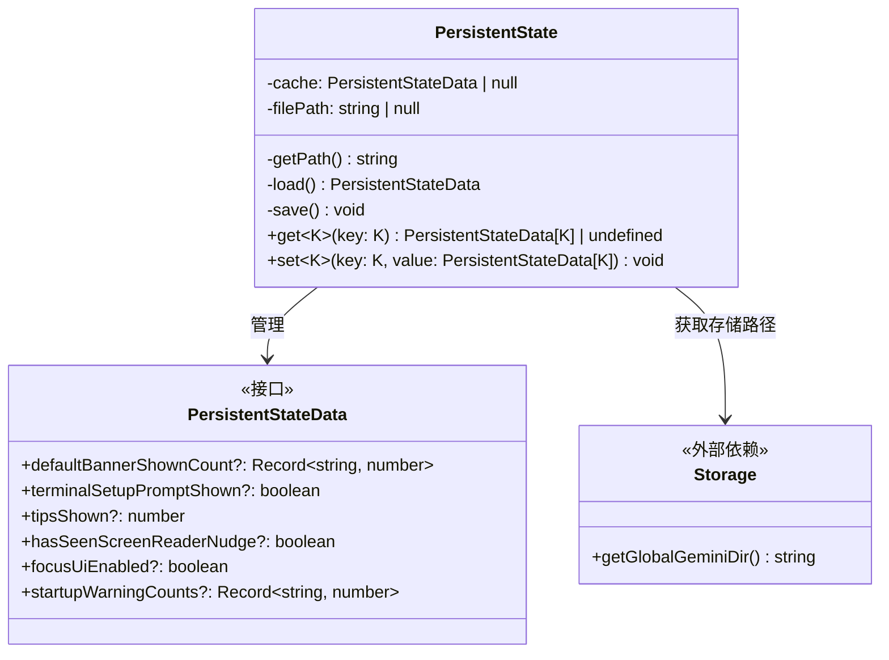
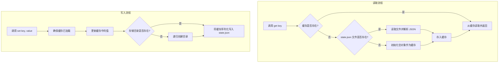

# persistentState.ts

## 概述

`persistentState.ts` 是 Gemini CLI 的持久化状态管理模块。它提供了一个基于 JSON 文件的键值存储机制，用于在 CLI 多次运行之间保留用户偏好和应用状态（如横幅展示次数、终端设置提示是否已显示、提示计数等）。状态数据存储在 `~/.gemini/state.json` 文件中。该模块采用单例模式，同时具备内存缓存机制以避免重复的文件系统读写。

文件路径：`packages/cli/src/utils/persistentState.ts`

## 架构图（Mermaid）





## 核心组件

### 1. `STATE_FILENAME` 常量

```typescript
const STATE_FILENAME = 'state.json';
```

状态文件名常量，模块私有。最终文件路径为 `~/.gemini/state.json`（由 `Storage.getGlobalGeminiDir()` + `state.json` 拼接）。

### 2. `PersistentStateData` 接口

```typescript
interface PersistentStateData {
  defaultBannerShownCount?: Record<string, number>;
  terminalSetupPromptShown?: boolean;
  tipsShown?: number;
  hasSeenScreenReaderNudge?: boolean;
  focusUiEnabled?: boolean;
  startupWarningCounts?: Record<string, number>;
}
```

定义了所有可持久化存储的状态字段，所有字段都是可选的：

| 字段 | 类型 | 用途说明 |
|------|------|---------|
| `defaultBannerShownCount` | `Record<string, number>` | 各默认横幅已展示的次数。键为横幅标识，值为展示次数 |
| `terminalSetupPromptShown` | `boolean` | 终端设置引导提示是否已向用户展示过 |
| `tipsShown` | `number` | 已展示的提示/技巧数量 |
| `hasSeenScreenReaderNudge` | `boolean` | 用户是否已看过屏幕阅读器适配提示 |
| `focusUiEnabled` | `boolean` | 聚焦 UI 模式是否已启用（无障碍相关） |
| `startupWarningCounts` | `Record<string, number>` | 各启动警告已展示的次数。键为警告标识，值为展示次数 |

该接口的注释中标注了 `// Add other persistent state keys here as needed`，说明它是一个可扩展的设计，开发者可以按需添加新的状态字段。

### 3. `PersistentState` 类

#### 私有属性

| 属性 | 类型 | 说明 |
|------|------|------|
| `cache` | `PersistentStateData \| null` | 内存缓存，首次加载后保存状态数据，避免重复读取文件 |
| `filePath` | `string \| null` | 状态文件的完整路径，惰性计算后缓存 |

#### 私有方法

##### `getPath(): string`

获取状态文件的完整路径。采用惰性初始化模式：首次调用时通过 `Storage.getGlobalGeminiDir()` 获取全局 Gemini 配置目录并与 `STATE_FILENAME` 拼接，结果缓存在 `this.filePath` 中供后续调用直接使用。

##### `load(): PersistentStateData`

从磁盘加载状态数据到内存缓存。

- 如果缓存已存在，直接返回缓存（避免重复读取文件）
- 如果文件存在，读取并解析 JSON
- 如果文件不存在，初始化为空对象 `{}`
- 如果读取或解析失败（如 JSON 格式损坏），记录警告日志并初始化为空对象 `{}`

##### `save(): void`

将内存缓存中的状态数据写回磁盘。

- 如果缓存为 `null` 则不执行任何操作
- 写入前检查目录是否存在，不存在则递归创建
- 使用 `JSON.stringify(this.cache, null, 2)` 格式化输出为可读的缩进 JSON
- 写入失败记录警告日志但不抛出异常

#### 公开方法

##### `get<K>(key: K): PersistentStateData[K] | undefined`

```typescript
get<K extends keyof PersistentStateData>(
  key: K,
): PersistentStateData[K] | undefined
```

类型安全的状态读取方法。使用 TypeScript 泛型约束，确保 `key` 必须是 `PersistentStateData` 的有效字段名，返回值类型自动推导为对应字段的类型。内部先调用 `load()` 确保数据已加载，然后返回对应键的值。

##### `set<K>(key: K, value: PersistentStateData[K]): void`

```typescript
set<K extends keyof PersistentStateData>(
  key: K,
  value: PersistentStateData[K],
): void
```

类型安全的状态写入方法。同样使用泛型约束确保类型安全。执行流程：先调用 `load()` 确保缓存已初始化，然后更新缓存中的值，最后调用 `save()` 立即持久化到磁盘。

### 4. `persistentState` 单例实例

```typescript
export const persistentState = new PersistentState();
```

导出一个预创建的 `PersistentState` 实例。整个应用通过引入此单例来访问持久化状态，确保所有模块共享同一份内存缓存，避免状态不一致。

## 依赖关系

### 内部依赖

| 模块 | 导入项 | 用途 |
|------|--------|------|
| `@google/gemini-cli-core` | `Storage` | 调用 `Storage.getGlobalGeminiDir()` 获取全局 Gemini 配置目录路径（通常为 `~/.gemini/`） |
| `@google/gemini-cli-core` | `debugLogger` | 在状态加载失败或保存失败时记录警告日志 |

### 外部依赖

| 模块 | 用途 |
|------|------|
| `node:fs` | 同步文件系统操作：`existsSync`（检查文件/目录是否存在）、`readFileSync`（读取状态文件）、`writeFileSync`（写入状态文件）、`mkdirSync`（创建目录） |
| `node:path` | 路径操作：`path.join`（拼接文件路径）、`path.dirname`（提取目录路径） |

## 关键实现细节

### 内存缓存策略

该模块采用"首次读取，后续复用"的缓存策略：

1. 首次调用 `get()` 或 `set()` 时触发 `load()`，从磁盘读取 `state.json` 文件并缓存到 `this.cache`
2. 后续所有读操作直接从 `this.cache` 返回，无需重复读取磁盘
3. 写操作在更新 `this.cache` 后立即调用 `save()` 将整个缓存写回磁盘

这种设计的优点是读取性能高（内存操作），写入操作虽然每次都写磁盘但保证了数据一致性。

### 即时持久化（Write-Through）

`set()` 方法每次调用都会将完整的缓存数据写入磁盘。这是一种 Write-Through 缓存策略，确保数据不会因 CLI 意外退出而丢失。缺点是频繁的 `set()` 调用会产生多次磁盘写入。

### 路径的惰性初始化

`filePath` 和 `cache` 都采用惰性初始化模式。`getPath()` 只在首次调用时计算路径，`load()` 只在 `cache` 为 `null` 时从磁盘读取。这避免了在模块加载时就产生文件系统操作，将开销推迟到真正需要时。

### 类型安全设计

通过 TypeScript 泛型 `<K extends keyof PersistentStateData>`，`get()` 和 `set()` 方法在编译时保证：

- 键名必须是 `PersistentStateData` 中已声明的字段
- 值的类型必须与对应字段声明的类型匹配

这使得对持久化状态的访问在编译期就能捕获类型错误，避免运行时出现意外的数据格式问题。

### 容错处理

- **JSON 损坏恢复**：如果 `state.json` 文件内容损坏（如不合法的 JSON），`load()` 会捕获解析异常，将缓存重置为空对象 `{}`，后续写入时会覆盖损坏的文件
- **目录不存在处理**：`save()` 在写入前会检查并创建缺失的目录（使用 `{ recursive: true }`）
- **静默失败**：加载和保存的异常都通过 `debugLogger.warn()` 记录但不向上抛出，确保状态管理的故障不会影响 CLI 主功能

### 同步 I/O 的选择

该模块使用同步文件操作（`readFileSync`、`writeFileSync`），而非异步版本。这简化了 `get()`/`set()` 的调用方式（调用方无需 `await`），但代价是在文件 I/O 期间会阻塞事件循环。对于读写一个小型 JSON 文件的场景，这种阻塞时间极短，是合理的设计权衡。

### 单例模式

通过在模块级别导出一个 `PersistentState` 实例，实现了事实上的单例模式。由于 Node.js 的模块缓存机制，所有 `import { persistentState } from '...'` 的代码都会获得同一个实例引用，共享同一份内存缓存。
