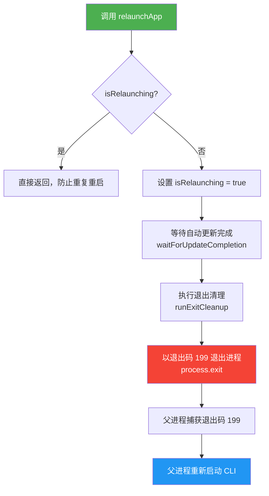

# processUtils.ts

## 概述

`processUtils.ts` 是 Gemini CLI 的进程控制工具模块，主要负责 **应用重启（relaunch）** 逻辑。它定义了一个特殊的退出码 `199`，当 CLI 进程以该退出码退出时，父进程（通常是启动脚本或 relaunch 包装器）会捕获这一信号并重新启动 CLI 进程。这在自动更新完成后需要重启应用时非常有用。

该模块通过防重入标志 `isRelaunching` 确保重启流程不会被重复触发，并在退出前依次执行更新等待和清理操作，保证进程安全退出。

## 架构图（Mermaid）



## 核心组件

### 1. `RELAUNCH_EXIT_CODE` 常量

```typescript
export const RELAUNCH_EXIT_CODE = 199;
```

- **类型**: `number`（常量）
- **值**: `199`
- **用途**: 定义重启信号退出码。当 CLI 进程以此退出码退出时，外部的 relaunch 包装器会识别并重新启动进程。选择 `199` 是因为它不与任何标准退出码冲突（标准退出码通常在 0-128 范围内，128+ 通常用于信号终止）。

### 2. `isRelaunching` 内部状态标志

```typescript
let isRelaunching = false;
```

- **类型**: `boolean`
- **可见性**: 模块私有（非导出）
- **用途**: 防重入标志，确保 `relaunchApp()` 不会被多次并发调用。一旦触发重启流程，后续对 `relaunchApp()` 的调用将被直接忽略。

### 3. `_resetRelaunchStateForTesting()` 函数

```typescript
export function _resetRelaunchStateForTesting(): void {
  isRelaunching = false;
}
```

- **可见性**: 导出（但以 `_` 前缀标记为内部使用）
- **用途**: 仅用于单元测试，在测试之间重置 `isRelaunching` 状态，避免测试间状态污染。
- **注意**: 生产代码不应调用此函数。

### 4. `relaunchApp()` 异步函数

```typescript
export async function relaunchApp(): Promise<void> {
  if (isRelaunching) return;
  isRelaunching = true;
  await waitForUpdateCompletion();
  await runExitCleanup();
  process.exit(RELAUNCH_EXIT_CODE);
}
```

- **返回值**: `Promise<void>`（实际上不会正常返回，因为 `process.exit()` 会终止进程）
- **执行流程**:
  1. **防重入检查**: 如果已在重启过程中，直接返回
  2. **锁定状态**: 设置 `isRelaunching = true`
  3. **等待更新**: 调用 `waitForUpdateCompletion()` 等待任何正在进行的自动更新操作完成
  4. **清理资源**: 调用 `runExitCleanup()` 执行退出前的清理工作（如临时文件删除、连接关闭等）
  5. **退出进程**: 以特殊退出码 `199` 退出，通知父进程需要重新启动

## 依赖关系

### 内部依赖

| 依赖模块 | 导入内容 | 用途 |
|---|---|---|
| `./cleanup.js` | `runExitCleanup` | 在退出进程前执行清理操作（释放资源、删除临时文件等） |
| `./handleAutoUpdate.js` | `waitForUpdateCompletion` | 等待自动更新流程完成，确保更新数据写入磁盘后再退出 |

### 外部依赖

| 依赖 | 用途 |
|---|---|
| Node.js `process` 全局对象 | 调用 `process.exit()` 终止当前进程 |

## 关键实现细节

1. **防重入机制**: `isRelaunching` 标志确保了即使在短时间内多次调用 `relaunchApp()`（例如用户快速连续触发更新操作），重启流程也只会执行一次。这避免了竞态条件下的重复退出和资源清理问题。

2. **有序退出流程**: 退出前先 `await waitForUpdateCompletion()` 再 `await runExitCleanup()`，这保证了：
   - 自动更新的二进制文件已完整写入磁盘
   - 所有注册的清理回调都被执行
   - 进程以一致、可预测的状态退出

3. **与 relaunch 模块的协作**: 本模块定义了退出码常量 `RELAUNCH_EXIT_CODE`，而 `relaunch.ts` 模块（作为外部包装器）负责监听子进程退出事件，当检测到退出码为 `199` 时，会自动重新 spawn 一个新的 CLI 进程。这构成了一个完整的"退出-重启"循环。

4. **测试友好设计**: `_resetRelaunchStateForTesting()` 函数使得单元测试可以在每个测试用例之间重置模块内部状态，而不需要重新加载整个模块。这是一种常见的测试辅助模式。

5. **退出码选择**: 使用 `199` 作为重启信号码是经过深思熟虑的选择——它既大于常用的程序退出码范围（0-2），也大于 shell 信号导致的退出码范围（128-159），不会与系统标准退出码产生冲突。
