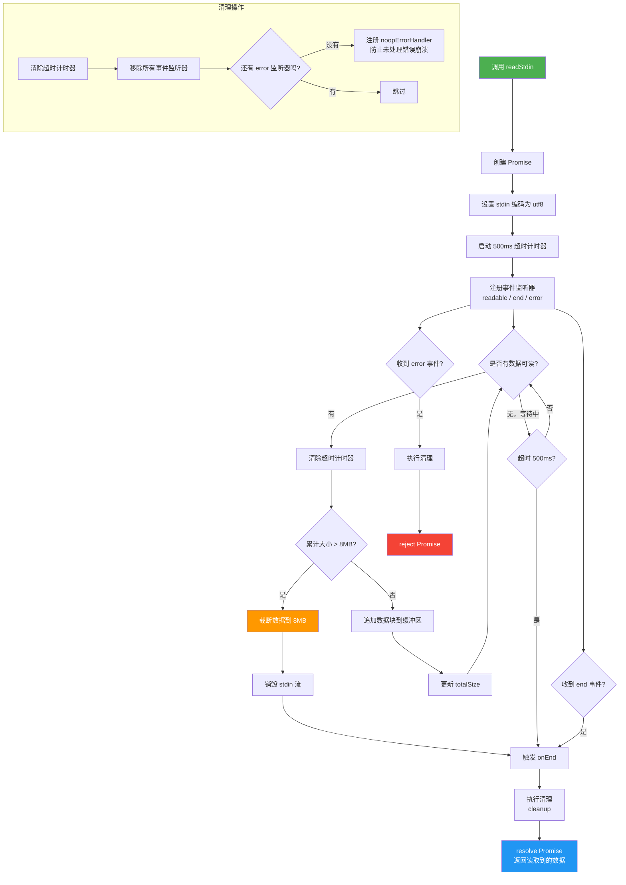

# readStdin.ts

## 概述

`readStdin.ts` 是 Gemini CLI 的标准输入（stdin）读取工具模块。它提供了一个异步函数 `readStdin()`，用于从管道或重定向中读取用户输入数据。该模块实现了以下关键特性：

- **大小限制**: 最大读取 8MB 数据，超出部分自动截断，防止内存溢出
- **超时保护**: 当 500ms 内没有管道数据可用时自动结束读取，避免程序在非 TTY 终端中挂起
- **错误安全**: 清理完事件监听器后注册空操作错误处理器，防止后续 `EIO` 等错误导致进程崩溃
- **流式读取**: 基于 Node.js `readable` 事件的非阻塞流式数据读取

此模块通常用于支持管道输入场景，例如 `cat file.txt | gemini "summarize this"`.

## 架构图（Mermaid）



## 核心组件

### 1. `readStdin()` 异步函数

```typescript
export async function readStdin(): Promise<string>
```

- **返回值**: `Promise<string>` - 从 stdin 读取的文本数据
- **功能**: 异步读取标准输入中的全部管道数据

#### 内部常量与变量

| 名称 | 类型 | 值/说明 |
|---|---|---|
| `MAX_STDIN_SIZE` | `number` | `8 * 1024 * 1024`（8MB），stdin 读取上限 |
| `data` | `string` | 数据累积缓冲区 |
| `totalSize` | `number` | 已读取字节数计数器 |
| `pipedInputShouldBeAvailableInMs` | `number` | `500`，管道输入等待超时时间（毫秒） |
| `pipedInputTimerId` | `NodeJS.Timeout \| null` | 超时计时器 ID |

#### 内部回调函数

##### `onReadable()`
- **触发条件**: 当 `process.stdin` 有数据可读时
- **行为**:
  1. 首次读到数据时清除超时计时器（说明确实有管道数据）
  2. 循环调用 `process.stdin.read()` 读取所有可用块
  3. 检查累计大小是否超过 8MB 限制
  4. 超限时截断数据并销毁 stdin 流
  5. 未超限则将数据块追加到缓冲区

##### `onEnd()`
- **触发条件**: stdin 流结束或超时
- **行为**: 执行清理操作后以累积数据 resolve Promise

##### `onError(err)`
- **触发条件**: stdin 流发生错误
- **行为**: 执行清理操作后以错误 reject Promise

##### `cleanup()`
- **功能**: 资源清理函数
- **行为**:
  1. 清除超时计时器
  2. 移除 `readable`、`end`、`error` 三个事件监听器
  3. 如果 stdin 上没有其他 `error` 监听器，注册一个空操作 `noopErrorHandler` 防止未处理错误

### 2. `noopErrorHandler()` 函数

```typescript
function noopErrorHandler() {}
```

- **可见性**: 模块私有
- **用途**: 空操作错误处理器，注册到 `process.stdin` 上作为兜底，防止在 `readStdin` 完成读取并移除自己的错误监听器后，后续发生的 `EIO` 等错误事件因无处理器而导致进程崩溃。这在后台执行场景（TTY 断开连接）中尤为重要。

## 依赖关系

### 内部依赖

| 依赖模块 | 导入内容 | 用途 |
|---|---|---|
| `@google/gemini-cli-core` | `debugLogger` | 当 stdin 数据超过 8MB 上限被截断时输出警告日志 |

### 外部依赖

| 依赖 | 用途 |
|---|---|
| Node.js `process.stdin` | 作为可读流读取标准输入数据 |
| Node.js `setTimeout` / `clearTimeout` | 实现管道输入超时检测机制 |

## 关键实现细节

1. **500ms 超时机制**: 这是解决一个棘手问题的关键设计。在某些终端环境中（如 CI/CD 管道、某些 Docker 容器），stdin 永远不是 TTY 模式，但也没有管道数据。如果不设超时，程序会永远卡在等待 stdin 数据的状态。500ms 是一个经验值——足够快以不影响用户体验，又足够长以让管道数据有时间到达。

2. **超时计时器与数据读取的协作**: 当 `onReadable` 回调首次被触发并读到数据时，会立即清除超时计时器。这意味着一旦确认有管道数据流入，就不再受 500ms 超时的限制，转而由正常的流 `end` 事件来结束读取。

3. **8MB 大小限制与截断策略**: 采用"截断而非拒绝"的策略——当输入超过 8MB 时，保留前 8MB 数据，截断剩余部分，并通过 `debugLogger.warn` 输出警告。同时调用 `process.stdin.destroy()` 停止进一步读取，释放资源。

4. **防止进程崩溃的 noopErrorHandler**: 这是一个防御性编程的典范。Node.js 的 EventEmitter 在触发 `error` 事件时，如果没有注册任何 `error` 监听器，会抛出未捕获异常导致进程崩溃。当 `readStdin` 完成后移除了自己的错误监听器，此时如果 stdin 底层出现 `EIO` 错误（如 TTY 断开），就会导致崩溃。`noopErrorHandler` 吞掉这些错误，因为此时读取已完成，这些错误不再有意义。

5. **编码设置**: 通过 `process.stdin.setEncoding('utf8')` 确保读取的数据为字符串类型而非 Buffer，简化了后续的字符串拼接操作。

6. **清理函数的幂等性**: `cleanup()` 函数通过检查 `pipedInputTimerId` 是否为 null 来避免重复清除计时器，且 `removeListener` 在监听器不存在时是安全的无操作调用，确保 cleanup 可以安全地被多次调用。
