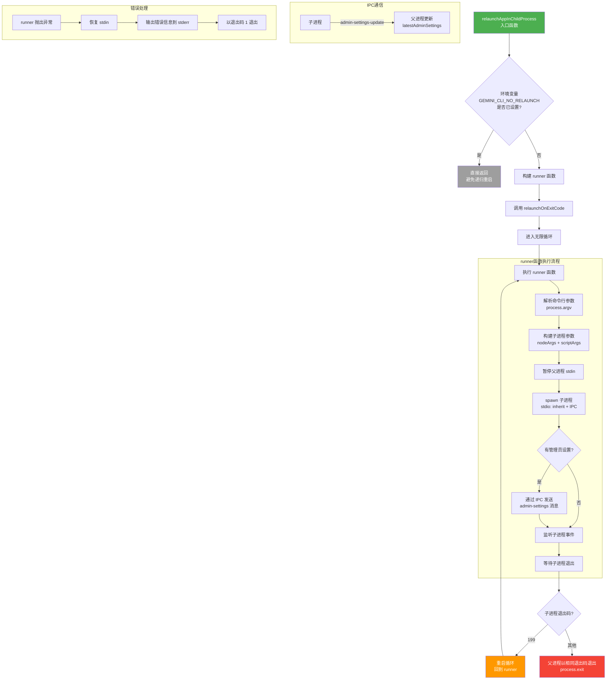

# relaunch.ts

## 概述

`relaunch.ts` 是 Gemini CLI 的进程重启（relaunch）管理模块，实现了 CLI 的"热重启"机制。当 CLI 自动更新完成后，需要用新版本代码重新启动。本模块通过 **父子进程架构** 实现这一能力：

- **父进程** 是一个轻量的"包装器"，负责反复 spawn 子进程并监控其退出码
- **子进程** 是实际运行 CLI 逻辑的进程
- 当子进程以特殊退出码 `199`（`RELAUNCH_EXIT_CODE`）退出时，父进程会自动重新 spawn 一个新的子进程
- 通过 IPC 通道在父子进程间传递管理员控制设置（`AdminControlsSettings`）

这种设计使得 CLI 可以在不中断用户工作流的情况下完成自动更新和重启。

## 架构图（Mermaid）



## 核心组件

### 1. `relaunchOnExitCode(runner)` 异步函数

```typescript
export async function relaunchOnExitCode(runner: () => Promise<number>)
```

- **参数**: `runner` - 返回退出码的 Promise 函数，每次调用代表执行一次 CLI 生命周期
- **返回值**: `Promise<void>`（实际上永远不会正常返回，要么无限循环要么 `process.exit`）
- **功能**: 核心的重启循环控制器

#### 执行逻辑

1. 进入 `while(true)` 无限循环
2. 调用 `runner()` 获取退出码
3. 如果退出码 **不是** `199`（`RELAUNCH_EXIT_CODE`），以该退出码退出父进程
4. 如果退出码 **是** `199`，继续下一轮循环（即重新启动）
5. 如果 `runner()` 抛出异常：
   - 恢复 `process.stdin`
   - 将错误信息写入 stderr
   - 以退出码 `1` 退出

### 2. `relaunchAppInChildProcess()` 异步函数

```typescript
export async function relaunchAppInChildProcess(
  additionalNodeArgs: string[],
  additionalScriptArgs: string[],
  remoteAdminSettings?: AdminControlsSettings,
)
```

- **参数**:
  - `additionalNodeArgs`: 额外的 Node.js 运行时参数（如 `--experimental-vm-modules`）
  - `additionalScriptArgs`: 额外的脚本参数
  - `remoteAdminSettings`: 可选的远程管理员控制设置
- **返回值**: `Promise<void>`
- **功能**: 构建子进程并管理重启循环

#### 执行逻辑

1. **防递归检查**: 检查环境变量 `GEMINI_CLI_NO_RELAUNCH`，如果已设置则直接返回（说明当前进程已经是子进程）
2. **构建 runner**: 定义一个闭包函数，负责：
   - 从 `process.argv` 解析当前脚本路径和参数
   - 将额外的 Node 参数、脚本参数与原始参数合并
   - 设置子进程环境变量，加入 `GEMINI_CLI_NO_RELAUNCH=true` 防止子进程再次 spawn 孙进程
   - 暂停父进程的 stdin（让子进程独占 stdin）
   - 使用 `spawn` 创建子进程，配置 `stdio: ['inherit', 'inherit', 'inherit', 'ipc']`
   - 如果有管理员设置，通过 IPC 发送给子进程
   - 监听子进程的 IPC 消息，接收 `admin-settings-update` 类型的设置更新
   - 返回子进程的退出码
3. **启动循环**: 调用 `relaunchOnExitCode(runner)`

#### 子进程参数构建

```typescript
// process.argv = [node, script, ...userArgs]
const nodeArgs = [
  ...process.execArgv,        // 原始 Node.js 参数
  ...additionalNodeArgs,      // 额外 Node.js 参数
  script,                     // 脚本路径
  ...additionalScriptArgs,    // 额外脚本参数
  ...scriptArgs,              // 用户传入的原始参数
];
```

#### IPC 消息协议

| 方向 | 消息类型 | 数据结构 | 用途 |
|---|---|---|---|
| 父 -> 子 | `admin-settings` | `{ type: 'admin-settings', settings: AdminControlsSettings }` | 启动时传递管理员控制设置 |
| 子 -> 父 | `admin-settings-update` | `{ type: 'admin-settings-update', settings: AdminControlsSettings }` | 运行时更新管理员控制设置 |

## 依赖关系

### 内部依赖

| 依赖模块 | 导入内容 | 用途 |
|---|---|---|
| `./processUtils.js` | `RELAUNCH_EXIT_CODE` | 重启信号退出码（值为 199），用于判断子进程是否请求重启 |
| `@google/gemini-cli-core` | `writeToStderr` | 将致命错误信息写入标准错误输出 |
| `@google/gemini-cli-core` | `AdminControlsSettings`（类型） | 管理员控制设置的类型定义 |

### 外部依赖

| 依赖 | 用途 |
|---|---|
| `node:child_process` 的 `spawn` | 创建子进程 |
| Node.js `process.argv` | 获取当前进程的命令行参数，用于构建子进程参数 |
| Node.js `process.execPath` | 获取 Node.js 可执行文件路径，作为子进程的命令 |
| Node.js `process.execArgv` | 获取当前 Node.js 运行时的额外参数 |
| Node.js `process.env` | 读取/设置环境变量 |
| Node.js `process.stdin` | 管理标准输入的暂停/恢复 |

## 关键实现细节

1. **防递归 spawn 机制**: 环境变量 `GEMINI_CLI_NO_RELAUNCH=true` 是防止无限嵌套 spawn 的关键。父进程在创建子进程时设置此环境变量，子进程启动时检测到该变量就不会再次进入 relaunch 逻辑。这确保了只有两层进程结构：一个包装器父进程 + 一个实际工作的子进程。

2. **stdin 管理策略**: 父进程在 spawn 子进程前调用 `process.stdin.pause()`，在子进程退出后调用 `process.stdin.resume()`。这确保了在子进程运行期间，父进程不会与子进程竞争 stdin 输入。由于 stdio 配置为 `inherit`，子进程直接继承父进程的标准输入/输出/错误。

3. **IPC 通道**: stdio 配置中的第四个元素 `'ipc'` 建立了父子进程间的 IPC 通信通道。这使得管理员控制设置可以在重启周期间持久化传递——子进程在运行期间更新设置后，通过 IPC 发送给父进程；父进程在 spawn 新的子进程时，将最新设置传递给新子进程。

4. **管理员设置的跨重启持久化**: `latestAdminSettings` 变量在 `relaunchAppInChildProcess` 的闭包中维护，不会随子进程退出而丢失。每次子进程发送 `admin-settings-update` 消息时，父进程更新该变量；下次 spawn 新子进程时，将最新设置通过 IPC 发送。这实现了设置在多次重启间的持久化。

5. **错误恢复**: 当 `runner` 函数抛出异常时（如 spawn 失败），错误处理逻辑会先恢复 `process.stdin`（因为之前被 pause 了），然后输出详细的错误信息（包括 stack trace），最后以退出码 1 退出。

6. **参数透传**: 子进程完整继承了父进程的所有参数——包括 Node.js 运行时参数（`process.execArgv`）、脚本路径和用户参数。额外参数被插入到正确的位置，确保子进程的行为与直接运行时一致。
