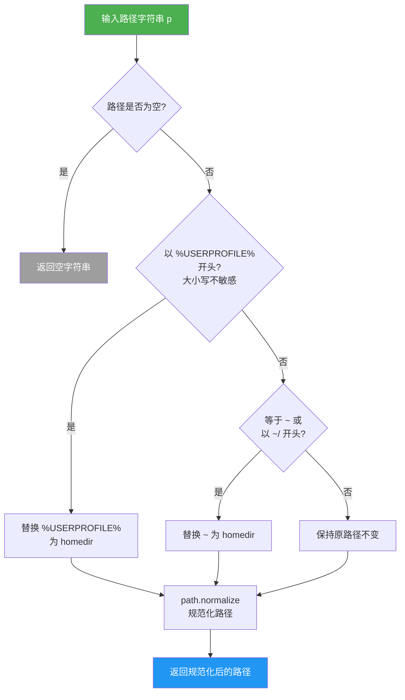

# resolvePath.ts

## 概述

`resolvePath.ts` 是 Gemini CLI 的路径解析工具模块，提供了一个跨平台的路径解析函数 `resolvePath()`。该函数的核心职责是将用户输入的路径字符串中包含的 **家目录缩写** 展开为绝对路径，并进行路径规范化处理。

支持的家目录缩写包括：
- **Unix/macOS 风格**: `~` 和 `~/...`（如 `~/Documents/file.txt`）
- **Windows 风格**: `%USERPROFILE%`（如 `%USERPROFILE%\Documents\file.txt`），且大小写不敏感

这使得 CLI 可以在配置文件或命令行参数中统一使用这些缩写，而不必硬编码具体的用户家目录路径。

## 架构图（Mermaid）



## 核心组件

### `resolvePath(p)` 函数

```typescript
export function resolvePath(p: string): string
```

- **参数**: `p` - 待解析的路径字符串
- **返回值**: `string` - 展开并规范化后的路径字符串
- **功能**: 将包含家目录缩写的路径展开为完整路径并规范化

#### 处理逻辑

| 输入示例 | 匹配规则 | 输出示例（假设 homedir 为 `/home/user`） |
|---|---|---|
| `""` 或 `undefined`（falsy） | 空值检查 | `""` |
| `%USERPROFILE%\Documents` | Windows 风格（大小写不敏感） | `/home/user/Documents`（经 normalize） |
| `%userprofile%/test` | Windows 风格（小写也匹配） | `/home/user/test` |
| `~` | Unix 家目录 | `/home/user` |
| `~/Documents/file.txt` | Unix 家目录前缀 | `/home/user/Documents/file.txt` |
| `/absolute/path` | 无匹配，直接 normalize | `/absolute/path` |
| `relative/path` | 无匹配，直接 normalize | `relative/path` |

#### 详细步骤

1. **空值检查**: 如果输入为空字符串或 falsy 值，直接返回空字符串
2. **Windows 家目录展开**: 使用 `toLowerCase()` 进行大小写不敏感匹配 `%userprofile%`，如果匹配则用 `homedir()` 替换该前缀
3. **Unix 家目录展开**: 检查是否等于 `~` 或以 `~/` 开头，如果匹配则用 `homedir()` 替换 `~`
4. **路径规范化**: 无论是否进行了展开，最终都通过 `path.normalize()` 处理路径，消除多余的分隔符和 `.`/`..` 引用

## 依赖关系

### 内部依赖

| 依赖模块 | 导入内容 | 用途 |
|---|---|---|
| `@google/gemini-cli-core` | `homedir` | 获取当前用户的家目录路径。这是对 `os.homedir()` 的封装，可能包含额外的平台适配逻辑 |

### 外部依赖

| 依赖 | 用途 |
|---|---|
| `node:path` | 使用 `path.normalize()` 规范化路径字符串 |

## 关键实现细节

1. **跨平台兼容性**: 同时支持 Unix 的 `~` 和 Windows 的 `%USERPROFILE%` 两种家目录表示法。这使得 CLI 的配置文件可以在不同操作系统间共享，或者用户可以按照自己熟悉的方式输入路径。

2. **大小写不敏感的 Windows 路径处理**: 使用 `p.toLowerCase().startsWith('%userprofile%')` 进行匹配，但在截取后缀时使用原始字符串 `p.substring('%userprofile%'.length)`。这确保了 `%USERPROFILE%`、`%UserProfile%`、`%userprofile%` 等各种大小写变体都能被正确识别，同时保留路径其余部分的原始大小写。

3. **`~` 的精确匹配**: 代码区分了两种情况——`p === '~'`（仅波浪号）和 `p.startsWith('~/')`（波浪号加斜杠前缀）。这是为了避免误匹配以 `~` 开头但不代表家目录的路径（如 `~username` 在某些 shell 中表示其他用户的家目录）。不过需要注意，本函数**不**支持 `~username` 语法。

4. **`path.normalize()` 的作用**: 该函数会处理路径中的 `//`、`/./`、`/../` 等冗余部分。例如 `~/Documents/../file.txt` 会被规范化为 `/home/user/file.txt`。在 Windows 上，它还会将正斜杠 `/` 转换为反斜杠 `\`。

5. **非绝对路径的处理**: 如果输入既不是家目录缩写也不是绝对路径（如 `relative/path`），函数只做 normalize 处理而不做路径解析。调用者如需绝对路径，需自行结合当前工作目录进行解析。

6. **简洁高效的实现**: 整个函数仅有 10 行有效代码，没有文件系统 I/O 操作，是纯字符串处理函数，性能开销极小，适合在路径配置解析等高频场景中使用。
