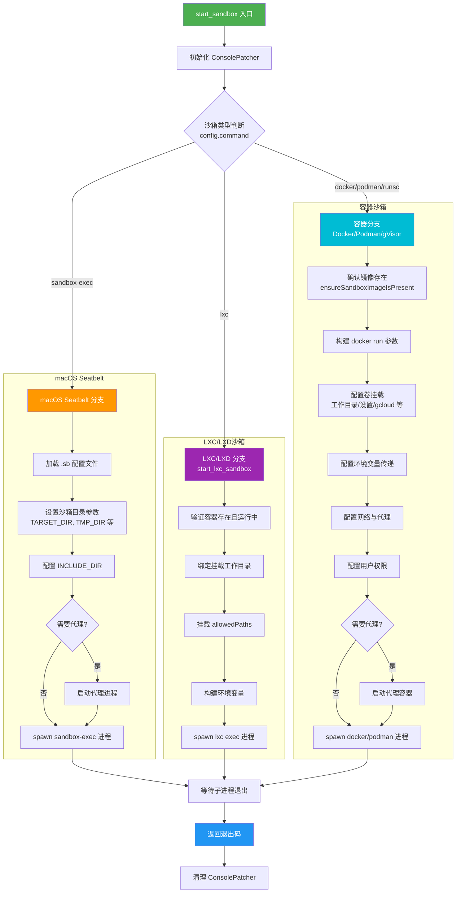
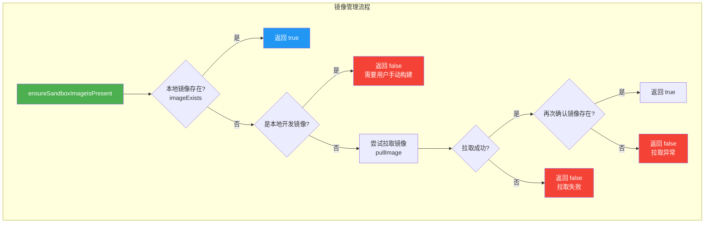

# sandbox.ts

## 概述

`sandbox.ts` 是 Gemini CLI 的 **沙箱执行环境管理模块**，是整个 CLI 安全隔离机制的核心。它负责在受限的沙箱环境中启动 CLI 进程，防止 AI 工具调用（如文件操作、命令执行）对宿主系统造成意外损害。

该模块支持 **四种沙箱后端**：

| 后端 | 命令 | 平台 | 说明 |
|---|---|---|---|
| **macOS Seatbelt** | `sandbox-exec` | macOS | 使用 macOS 内置的 Seatbelt 沙箱机制，基于 `.sb` 配置文件限制进程权限 |
| **Docker** | `docker` | 跨平台 | 在 Docker 容器中运行 CLI |
| **Podman** | `podman` | 跨平台 | Docker 的无守护进程替代方案（rootless） |
| **gVisor (runsc)** | `runsc`（通过 Docker） | Linux | 使用 gVisor 运行时提供内核级隔离 |
| **LXC/LXD** | `lxc` | Linux | 在 LXC 容器中运行，用户需预先创建容器 |

模块的主要职责包括：容器/沙箱创建与启动、文件系统挂载映射、环境变量传递、网络隔离与代理配置、用户权限管理、镜像拉取与验证。

## 架构图（Mermaid）





## 核心组件

### 1. `start_sandbox()` 主入口函数

```typescript
export async function start_sandbox(
  config: SandboxConfig,
  nodeArgs: string[] = [],
  cliConfig?: Config,
  cliArgs: string[] = [],
): Promise<number>
```

- **参数**:
  - `config`: 沙箱配置对象，包含 `command`（沙箱类型）、`image`（容器镜像）、`networkAccess`（网络访问）、`allowedPaths`（允许的宿主路径）等
  - `nodeArgs`: 额外的 Node.js 运行时参数
  - `cliConfig`: CLI 配置对象，提供调试模式、工作区上下文等信息
  - `cliArgs`: CLI 命令行参数，传递给沙箱内的 CLI 进程
- **返回值**: `Promise<number>` - 沙箱进程的退出码
- **功能**: 根据 `config.command` 的值分派到不同的沙箱后端

#### macOS Seatbelt 分支（`sandbox-exec`）

当 `config.command === 'sandbox-exec'` 时进入此分支：

1. **加载 Seatbelt 配置文件**: 从内置配置或项目设置目录加载 `.sb` 文件
2. **设置沙箱参数**: 通过 `-D` 标志传入目录路径变量（`TARGET_DIR`、`TMP_DIR`、`HOME_DIR`、`CACHE_DIR`）
3. **配置包含目录**: 最多支持 5 个 `INCLUDE_DIR`，从工作区上下文和 `config.allowedPaths` 获取
4. **代理支持**: 如果设置了 `GEMINI_SANDBOX_PROXY_COMMAND`，先启动代理进程
5. **启动沙箱进程**: 通过 `spawn('sandbox-exec', args)` 启动

#### 容器分支（Docker/Podman/gVisor）

当 `config.command` 为 `docker`、`podman` 或 `runsc` 时进入此分支：

1. **镜像检查与拉取**: 调用 `ensureSandboxImageIsPresent()` 确保镜像可用
2. **构建 `docker run` 参数**: 包括 `--rm`、`--init`、`--workdir` 等
3. **配置卷挂载**: 工作目录、用户设置目录、临时目录、gcloud 配置、ADC 凭证等
4. **配置环境变量**: API 密钥、模型配置、终端设置、IDE 集成变量等
5. **配置网络**: 创建隔离网络，可选代理容器
6. **用户权限**: 支持 UID/GID 映射，在容器内创建用户
7. **启动容器**: 通过 `spawn(command, args)` 启动

#### LXC/LXD 分支

当 `config.command === 'lxc'` 时委托给 `start_lxc_sandbox()`。

### 2. `start_lxc_sandbox()` LXC 沙箱函数

```typescript
async function start_lxc_sandbox(
  config: SandboxConfig,
  nodeArgs: string[],
  cliArgs: string[],
): Promise<number>
```

- **功能**: 在预先创建的 LXC 容器中执行 CLI
- **核心逻辑**:
  1. 验证容器存在且正在运行（通过 `lxc list --format=json`）
  2. 使用 `lxc config device add` 绑定挂载工作目录和允许路径
  3. 构建环境变量参数
  4. 通过 `lxc exec` 在容器内执行 CLI
  5. 退出时通过 `lxc config device remove` 清理挂载设备

### 3. `imageExists()` 镜像检查函数

```typescript
async function imageExists(sandbox: string, image: string): Promise<boolean>
```

- **功能**: 检查本地是否存在指定的容器镜像
- **实现**: 执行 `docker/podman images -q <image>`，如果标准输出非空则镜像存在

### 4. `pullImage()` 镜像拉取函数

```typescript
async function pullImage(
  sandbox: string, image: string, cliConfig?: Config
): Promise<boolean>
```

- **功能**: 从远程仓库拉取容器镜像
- **特点**: 调试模式下会显示拉取进度，始终显示 stderr 中的错误信息

### 5. `ensureSandboxImageIsPresent()` 镜像确保函数

```typescript
async function ensureSandboxImageIsPresent(
  sandbox: string, image: string, cliConfig?: Config
): Promise<boolean>
```

- **功能**: 确保沙箱镜像可用的完整流程
- **逻辑**: 先检查本地 -> 本地开发镜像不自动拉取 -> 尝试拉取 -> 拉取后再次验证

## 依赖关系

### 内部依赖

| 依赖模块 | 导入内容 | 用途 |
|---|---|---|
| `@google/gemini-cli-core` | `coreEvents` | 发射反馈事件（如错误通知） |
| `@google/gemini-cli-core` | `debugLogger` | 调试日志输出 |
| `@google/gemini-cli-core` | `FatalSandboxError` | 沙箱致命错误类 |
| `@google/gemini-cli-core` | `GEMINI_DIR` | Gemini 项目设置目录名（如 `.gemini`） |
| `@google/gemini-cli-core` | `homedir` | 获取用户家目录 |
| `@google/gemini-cli-core` | `Config`, `SandboxConfig`（类型） | 配置类型定义 |
| `./sandboxUtils.js` | `getContainerPath` | 将宿主路径转换为容器内路径 |
| `./sandboxUtils.js` | `shouldUseCurrentUserInSandbox` | 判断是否需要在沙箱中使用当前用户的 UID/GID |
| `./sandboxUtils.js` | `parseImageName` | 解析镜像名称用于容器命名 |
| `./sandboxUtils.js` | `ports` | 获取需要暴露的端口列表 |
| `./sandboxUtils.js` | `entrypoint` | 构建容器入口点命令 |
| `./sandboxUtils.js` | `LOCAL_DEV_SANDBOX_IMAGE_NAME` | 本地开发沙箱镜像名称常量 |
| `./sandboxUtils.js` | `SANDBOX_NETWORK_NAME` | 沙箱 Docker 网络名称 |
| `./sandboxUtils.js` | `SANDBOX_PROXY_NAME` | 沙箱代理容器名称 |
| `./sandboxUtils.js` | `BUILTIN_SEATBELT_PROFILES` | 内置 Seatbelt 配置文件名列表 |
| `../ui/utils/ConsolePatcher.js` | `ConsolePatcher` | 控制台输出补丁器，用于调试模式 |

### 外部依赖

| 依赖 | 用途 |
|---|---|
| `node:child_process` | `exec`、`execFile`、`execSync`、`spawn`、`spawnSync` - 进程管理 |
| `node:path` | 路径处理 |
| `node:fs` | 文件系统操作（检查文件/目录存在、创建目录、写文件） |
| `node:os` | 获取临时目录、操作系统信息 |
| `node:url` | `fileURLToPath` - 将 `import.meta.url` 转换为文件路径 |
| `node:util` | `promisify` - 将回调函数 Promise 化 |
| `node:crypto` | `randomBytes` - 生成随机容器名称后缀 |
| `shell-quote` | `quote`、`parse` - 安全的 shell 命令引用和解析 |

## 关键实现细节

### 1. 多后端沙箱架构

模块采用策略模式，通过 `config.command` 字段分派到不同的沙箱后端。每种后端有不同的隔离粒度：
- **Seatbelt**: 进程级隔离，通过系统调用过滤限制文件访问
- **Docker/Podman**: 容器级隔离，完整的文件系统和网络隔离
- **gVisor**: 内核级隔离，通过用户空间内核拦截系统调用
- **LXC**: 系统容器级隔离，更接近虚拟机的隔离效果

### 2. 文件系统挂载策略

容器分支精心设计了多层卷挂载，以确保沙箱内的 CLI 能正常工作：

| 挂载项 | 宿主路径 | 容器路径 | 模式 | 用途 |
|---|---|---|---|---|
| 工作目录 | `process.cwd()` | `getContainerPath(cwd)` | 读写 | CLI 的工作目录 |
| 用户设置 | `~/.gemini` | `/home/node/.gemini` | 读写 | Gemini 配置和缓存 |
| 临时目录 | `os.tmpdir()` | `getContainerPath(tmpdir)` | 读写 | 临时文件 |
| gcloud 配置 | `~/.config/gcloud` | 对应容器路径 | 只读 | Google Cloud 认证 |
| ADC 凭证 | `$GOOGLE_APPLICATION_CREDENTIALS` | 对应容器路径 | 只读 | 应用默认凭证 |
| SANDBOX_MOUNTS | 用户自定义 | 用户自定义 | 默认只读 | 自定义挂载 |
| allowedPaths | 配置指定路径 | 对应容器路径 | 只读 | 配置允许的额外路径 |
| VIRTUAL_ENV | Python 虚拟环境 | 容器内替代路径 | 读写 | 避免宿主二进制文件泄入 |

### 3. 网络隔离与代理机制

当 `config.networkAccess` 为 `false` 或设置了 `GEMINI_SANDBOX_PROXY_COMMAND` 时，创建一个 **内部 Docker 网络**（`--internal`）。沙箱容器连接到此网络，无法直接访问外部网络。

如果需要代理：
- 创建一个额外的非内部网络（`SANDBOX_PROXY_NAME`）
- 代理容器同时连接两个网络
- 沙箱容器通过代理容器间接访问外部网络
- 代理环境变量（`HTTPS_PROXY`、`HTTP_PROXY` 等）中的 `localhost` 被替换为代理容器名称

### 4. 用户权限管理（UID/GID 映射）

在 Linux 上，容器内的用户 UID/GID 需要与宿主一致，否则会出现文件权限问题。模块通过以下步骤处理：
1. 容器以 `root` 用户启动
2. 在入口点脚本中使用 `groupadd` 和 `useradd` 创建一个与宿主 UID/GID 匹配的用户
3. 使用 `su -p` 切换到该用户执行 CLI
4. 设置 `HOME` 环境变量确保家目录正确

### 5. 容器命名与冲突避免

- **集成测试模式**: 使用 `gemini-cli-integration-test-<随机hex>` 格式，避免并行测试冲突
- **正常模式**: 使用 `<镜像名>-<递增序号>` 格式，通过 `docker ps -a` 查询现有容器名来确定下一个可用序号

### 6. 环境变量透传

模块精心选择需要传入沙箱的环境变量，主要包括：
- **认证相关**: `GEMINI_API_KEY`、`GOOGLE_API_KEY`、`GOOGLE_APPLICATION_CREDENTIALS`
- **服务配置**: `GOOGLE_GEMINI_BASE_URL`、`GOOGLE_VERTEX_BASE_URL`、`GOOGLE_GENAI_USE_VERTEXAI`
- **模型配置**: `GEMINI_MODEL`
- **终端配置**: `TERM`、`COLORTERM`
- **IDE 集成**: `GEMINI_CLI_IDE_SERVER_PORT`、`GEMINI_CLI_IDE_WORKSPACE_PATH`
- **自定义**: 通过 `SANDBOX_ENV` 传递任意 `key=value` 对

### 7. BUILD_SANDBOX 开发模式

设置 `BUILD_SANDBOX` 环境变量时，模块会在启动沙箱前调用 `scripts/build_sandbox.js` 构建沙箱镜像。此功能仅在 CLI 是从 gemini-cli 仓库 `npm link` 安装时可用（通过检查 `process.argv[1]` 中是否包含 `gemini-cli/packages/`），防止已安装版本误用。

### 8. Podman 特殊处理

当使用 Podman 时，创建一个空的 `authfile`（`/tmp/empty_auth.json`），通过 `--authfile` 传递给 Podman，跳过不必要的认证刷新开销。

### 9. macOS Seatbelt 配置文件查找

Seatbelt 配置文件的查找顺序：
1. 检查是否为内置配置名（如 `permissive-open`），从模块所在目录加载 `sandbox-macos-<profile>.sb`
2. 如果不是内置配置，从项目设置目录 `GEMINI_DIR` 查找 `sandbox-macos-<profile>.sb`
3. 文件不存在则抛出 `FatalSandboxError`

### 10. LXC 设备清理机制

LXC 分支使用 `lxc config device add` 动态挂载目录，并通过 `process.on('exit', removeDevices)` 在进程退出时清理。`removeDevices` 使用 `spawnSync` 而非异步方法，因为在 `exit` 事件中无法执行异步操作。清理采用尽力而为（best-effort）策略，忽略清理过程中的错误。

### 11. ConsolePatcher 的使用

函数开头创建 `ConsolePatcher` 并在 `finally` 块中清理，确保沙箱启动过程中的日志输出格式正确，并在函数结束后恢复控制台原始行为。

### 12. 防命令注入安全措施

- 镜像名称通过正则 `/^[a-zA-Z0-9_.:/-]+$/` 验证，防止注入
- `SANDBOX_FLAGS` 和 `GEMINI_SANDBOX_PROXY_COMMAND` 使用 `shell-quote` 的 `parse` 方法安全解析
- 代理容器使用 `shell: false` 直接传递参数数组，避免 shell 注入
- `SANDBOX_MOUNTS` 中的路径必须为绝对路径且必须存在
