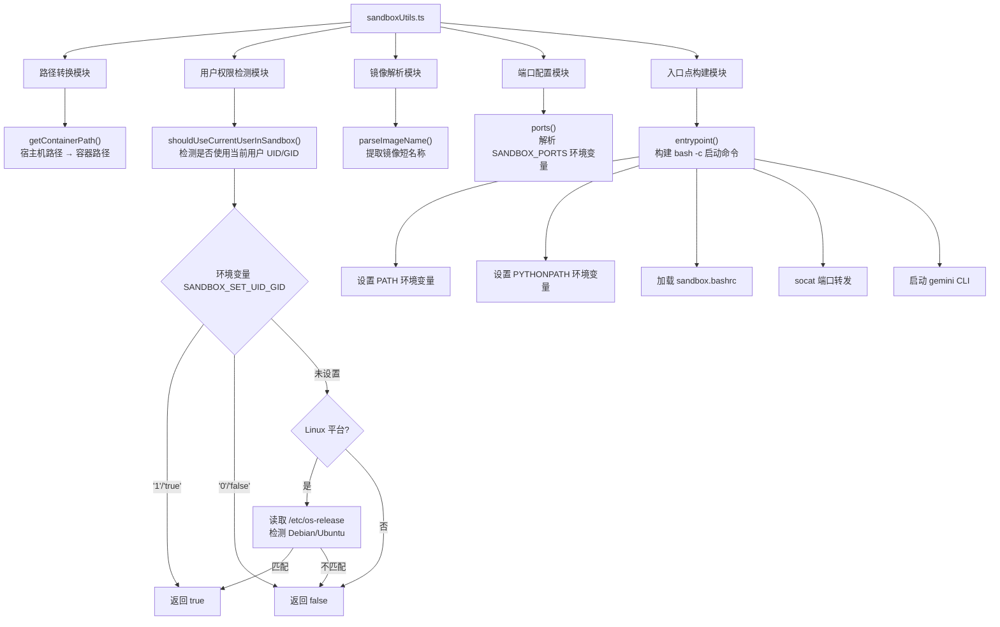

# sandboxUtils.ts

## 概述

`sandboxUtils.ts` 是 Gemini CLI 项目中用于管理 **Docker 沙箱环境** 的工具模块。它提供了一系列函数和常量，用于配置和启动容器化的沙箱执行环境。主要功能包括：

- 将宿主机路径转换为容器内路径（特别处理 Windows 环境）
- 判断是否需要在沙箱中使用当前用户的 UID/GID
- 解析 Docker 镜像名称
- 配置沙箱端口映射
- 构建容器入口点（entrypoint）命令

该模块是 Gemini CLI 安全沙箱机制的核心底层组件，确保命令在隔离的 Docker 容器中安全执行。

## 架构图（Mermaid）

## 核心组件

### 1. 导出常量

| 常量名 | 值 | 用途 |
|---|---|---|
| `LOCAL_DEV_SANDBOX_IMAGE_NAME` | `'gemini-cli-sandbox'` | 本地开发沙箱 Docker 镜像名称 |
| `SANDBOX_NETWORK_NAME` | `'gemini-cli-sandbox'` | 沙箱 Docker 网络名称 |
| `SANDBOX_PROXY_NAME` | `'gemini-cli-sandbox-proxy'` | 沙箱代理容器名称 |
| `BUILTIN_SEATBELT_PROFILES` | 6 个预设配置文件名数组 | macOS Seatbelt 安全配置档列表 |

**Seatbelt 配置档说明：**

Seatbelt 是 macOS 的应用沙箱安全机制。6 个内置配置档按 **权限级别** 和 **网络模式** 两个维度组合：

| 权限级别 | 含义 |
|---|---|
| `permissive` | 宽松模式 - 允许大部分操作 |
| `restrictive` | 限制模式 - 限制部分敏感操作 |
| `strict` | 严格模式 - 仅允许最小必要操作 |

| 网络模式 | 含义 |
|---|---|
| `open` | 直接网络访问 |
| `proxied` | 通过代理访问网络 |

### 2. `getContainerPath(hostPath: string): string`

将宿主机文件路径转换为 Docker 容器内可识别的路径格式。

- **非 Windows 平台**：直接返回原路径
- **Windows 平台**：将 `C:\Users\foo` 转换为 `/c/Users/foo` 格式
  - 反斜杠 `\` 替换为正斜杠 `/`
  - 驱动器号 `C:` 转换为 `/c` 前缀（小写）

### 3. `shouldUseCurrentUserInSandbox(): Promise<boolean>`

异步函数，判断是否应在 Docker 沙箱中使用当前用户的 UID/GID。这对于避免容器内文件权限问题至关重要。

**判断逻辑（优先级从高到低）：**

1. 环境变量 `SANDBOX_SET_UID_GID` 设为 `'1'` 或 `'true'` → 返回 `true`
2. 环境变量 `SANDBOX_SET_UID_GID` 设为 `'0'` 或 `'false'` → 返回 `false`
3. 若在 Linux 平台且未显式设置环境变量：
   - 读取 `/etc/os-release` 文件
   - 检测是否为 Debian/Ubuntu 或其衍生发行版（通过 `ID=debian`、`ID=ubuntu`、`ID_LIKE=.*debian.*`、`ID_LIKE=.*ubuntu.*`）
   - 匹配则默认返回 `true`
4. 其他情况默认返回 `false`

### 4. `parseImageName(image: string): string`

从完整的 Docker 镜像引用中提取简短的镜像名称。

- 输入: `'registry.example.com/my-org/my-image:v1.0'`
- 输出: `'my-image-v1.0'`
- 仅保留最后一段名称部分，若有 tag 则以 `-` 连接

### 5. `ports(): string[]`

从环境变量 `SANDBOX_PORTS` 解析需要映射的端口列表。

- 环境变量格式: 逗号分隔的端口号，如 `'3000,8080,9229'`
- 返回去除空白后的端口字符串数组
- 若未设置则返回空数组

### 6. `entrypoint(workdir: string, cliArgs: string[]): string[]`

构建 Docker 容器的入口点命令。这是最核心的函数，负责生成完整的容器启动脚本。

**执行流程：**

1. **PATH 环境变量注入**：遍历宿主机 `PATH`，筛选出以工作目录开头的路径，追加到容器 PATH 中
2. **PYTHONPATH 环境变量注入**：同理筛选并追加 Python 路径
3. **加载 sandbox.bashrc**：若项目目录下存在 `.gemini/sandbox.bashrc`，则 `source` 加载
4. **端口转发**：使用 `socat` 为每个配置端口建立 TCP 转发（从容器 IP 转发到 localhost）
5. **CLI 命令构建**：
   - 开发模式（`NODE_ENV=development`）：
     - Debug 模式：`npm run debug --`
     - 普通模式：`npm rebuild && npm run start --`
   - 生产模式：
     - Debug 模式：`node --inspect-brk=0.0.0.0:{DEBUG_PORT} $(which gemini)`
     - 普通模式：`gemini`
6. 使用 `shell-quote` 的 `quote()` 函数安全转义 CLI 参数

**返回值**：`['bash', '-c', '<完整的 shell 命令字符串>']`

## 依赖关系

### 内部依赖

| 模块 | 导入内容 | 用途 |
|---|---|---|
| `@google/gemini-cli-core` | `debugLogger` | 调试日志记录器，用于输出调试和警告信息 |
| `@google/gemini-cli-core` | `GEMINI_DIR` | Gemini 配置目录路径（通常为 `.gemini`） |

### 外部依赖

| 模块 | 导入内容 | 用途 |
|---|---|---|
| `node:os` | 默认导入 `os` | 获取操作系统平台信息（`os.platform()`） |
| `node:fs` | 默认导入 `fs` | 同步文件系统操作（`fs.existsSync()`） |
| `node:fs/promises` | `readFile` | 异步读取文件（读取 `/etc/os-release`） |
| `shell-quote` | `quote` | Shell 命令参数安全引用/转义 |

## 关键实现细节

1. **跨平台路径兼容性**：`getContainerPath()` 专门处理 Windows 驱动器路径到 Linux 容器路径的映射，使用正则 `/^([A-Z]):\/(.*)/i` 匹配驱动器号格式。

2. **Debian/Ubuntu 自动检测**：`shouldUseCurrentUserInSandbox()` 不仅检测 `ID=debian` 和 `ID=ubuntu`，还通过 `ID_LIKE` 字段检测衍生发行版（如 Linux Mint、Pop!_OS 等），确保更广泛的兼容性。

3. **socat 端口转发机制**：在容器内使用 `socat` 实现端口转发，将容器 IP 上的端口流量转发到 `127.0.0.1`，解决容器网络隔离下的端口访问问题。每个端口转发以后台进程运行（`&`），stderr 输出重定向到 `/dev/null`。

4. **安全参数转义**：使用 `shell-quote` 库的 `quote()` 函数对 CLI 参数进行转义，防止命令注入攻击。注意 `cliArgs.slice(2)` 跳过了前两个参数（通常是 `node` 和脚本路径）。

5. **开发/生产模式自适应**：`entrypoint()` 根据 `NODE_ENV` 和 `DEBUG` 环境变量自动选择合适的启动命令，支持四种组合：开发+调试、开发+普通、生产+调试、生产+普通。

6. **Debug 端口可配置**：生产环境的调试模式支持通过 `DEBUG_PORT` 环境变量自定义调试端口，默认为 `9229`（Node.js 标准调试端口），且绑定到 `0.0.0.0` 以允许容器外部连接。
