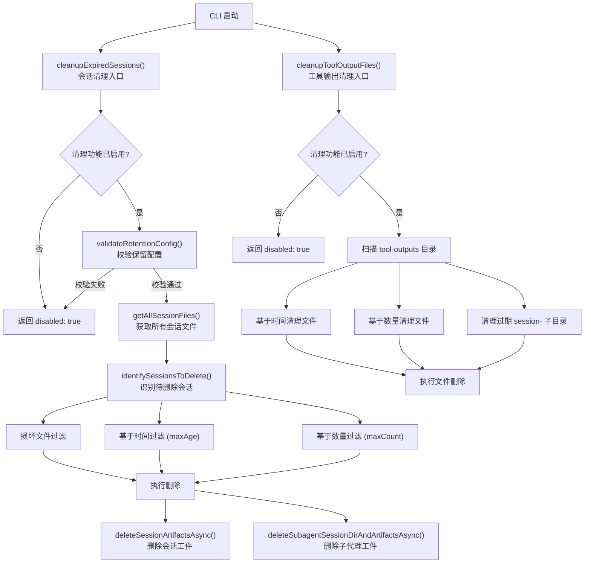

# sessionCleanup.ts

## 概述

`sessionCleanup.ts` 是 Gemini CLI 的 **会话清理模块**，负责在 CLI 启动时自动清理过期、损坏的会话文件及其关联的工具输出文件。该模块实现了基于 **时间（maxAge）** 和 **数量（maxCount）** 两种维度的保留策略，确保磁盘空间不会被无限增长的历史会话数据占满。

核心功能包括：

- 根据用户配置的保留策略，识别并删除过期/超额会话文件
- 清理会话关联的子代理（subagent）目录和工件
- 清理工具输出文件（tool-outputs）目录中的过期文件和子目录
- 完善的配置校验和错误容错机制，确保清理失败不影响 CLI 正常启动

## 架构图（Mermaid）



## 核心组件

### 1. 常量与配置

| 常量/配置 | 值 | 说明 |
|---|---|---|
| `DEFAULT_MIN_RETENTION` | `'1d'` | 默认最小保留时间（1 天），防止误配置导致立即清除所有会话 |
| `MIN_MAX_COUNT` | `1` | `maxCount` 最小值为 1，确保至少保留一个会话 |
| `MULTIPLIERS` | `{ h, d, w, m }` | 时间单位到毫秒的换算系数 |
| `SHORT_ID_REGEX` | `/-([a-zA-Z0-9]{8})\.json$/` | 从文件名中提取 8 字符短 ID 的正则表达式 |

**时间单位换算表：**

| 单位 | 含义 | 毫秒值 |
|---|---|---|
| `h` | 小时 | 3,600,000 |
| `d` | 天 | 86,400,000 |
| `w` | 周 | 604,800,000 |
| `m` | 月（30 天） | 2,592,000,000 |

### 2. `CleanupResult` 接口

会话清理操作的结果统计：

```typescript
interface CleanupResult {
  disabled: boolean;  // 清理是否被禁用
  scanned: number;    // 扫描的文件总数
  deleted: number;    // 成功删除的文件数
  skipped: number;    // 跳过的文件数（如当前活跃会话）
  failed: number;     // 删除失败的文件数
}
```

### 3. `ToolOutputCleanupResult` 接口

工具输出清理操作的结果统计：

```typescript
interface ToolOutputCleanupResult {
  disabled: boolean;  // 清理是否被禁用
  scanned: number;    // 扫描的条目总数
  deleted: number;    // 成功删除的条目数
  failed: number;     // 删除失败的条目数
}
```

### 4. `cleanupExpiredSessions(config, settings): Promise<CleanupResult>`

**会话清理的主入口函数**，在 CLI 启动时调用。

**执行流程：**

1. **前置检查**：若 `settings.general.sessionRetention.enabled` 为 false，直接返回 disabled
2. **配置校验**：调用 `validateRetentionConfig()` 验证保留配置的合法性
3. **获取文件列表**：调用 `getAllSessionFiles()` 获取聊天目录下所有会话文件（排除当前会话）
4. **识别待删除会话**：调用 `identifySessionsToDelete()` 确定需要删除的会话
5. **执行删除**：
   - 通过 `deriveShortIdFromFileName()` 提取文件的短 ID
   - 使用 `processedShortIds` Set 避免重复处理同一短 ID 的多个文件
   - 找到所有匹配短 ID 的文件，逐个读取获取完整 sessionId
   - 删除文件后，调用 `cleanupSessionAndSubagentsAsync()` 清理关联工件
   - 当前会话（`fullSessionId === config.getSessionId()`）不会被删除
6. **异常处理**：ENOENT 错误（文件已被删除）被静默忽略，其他错误记录日志但不中断流程

### 5. `identifySessionsToDelete(allFiles, retentionConfig): Promise<SessionFileEntry[]>`

**识别需要删除的会话文件**，这是清理策略的核心算法。

**删除标准：**

1. **损坏文件**：`sessionInfo === null` 的文件一律删除
2. **基于时间（maxAge）**：将 `maxAge` 解析为毫秒，计算截止日期（`now - maxAgeMs`），`lastUpdated` 在截止日期之前的会话标记为删除
3. **基于数量（maxCount）**：
   - 将有效会话按 `lastUpdated` 降序排列（最新在前）
   - 从可删除会话中分离出当前活跃会话（不可删除）
   - 若存在活跃会话，`maxDeletableSessions = maxCount - 1`
   - 索引超出 `maxDeletableSessions` 的旧会话标记为删除

**关键细节**：两种策略是 **OR** 关系，即只要满足任一条件即删除。

### 6. `cleanupToolOutputFiles(settings, debugMode?, projectTempDir?): Promise<ToolOutputCleanupResult>`

**工具输出文件清理入口**，使用与会话清理相同的保留策略。

**执行流程：**

1. 检查清理是否启用
2. 确定 `tool-outputs` 目录路径（可通过参数传入或自动从 Storage 获取）
3. 获取目录中所有条目，分为文件和子目录
4. **文件清理**：
   - 并行获取所有文件的 `stat` 信息
   - 按修改时间排序（最旧在前）
   - 按 maxAge 删除过期文件
   - 按 maxCount 删除超额文件（优先删除最旧的）
5. **子目录清理**：
   - 扫描以 `session-` 开头的子目录
   - 安全校验：使用 `sanitizeFilenamePart()` 验证目录名防止路径遍历攻击
   - 按 maxAge 删除过期子目录（递归删除 `rm -rf`）
6. 执行文件删除

### 7. 辅助函数

#### `deriveShortIdFromFileName(fileName): string | null`

从会话文件名中提取 8 字符的短 ID。例如：
- 输入: `'session-20250110-abcdef12.json'`
- 输出: `'abcdef12'`

仅处理以 `SESSION_FILE_PREFIX` 开头且以 `.json` 结尾的文件名。

#### `cleanupSessionAndSubagentsAsync(sessionId, config): Promise<void>`

清理指定会话的所有关联资源：
1. 调用 `deleteSessionArtifactsAsync()` 删除会话工件（日志等）
2. 调用 `deleteSubagentSessionDirAndArtifactsAsync()` 删除子代理的会话目录和工件

#### `parseRetentionPeriod(period): number`

解析保留时间字符串为毫秒数。支持格式：`<数字><单位>`，如 `30d`、`7d`、`24h`、`4w`、`2m`。

- 零值（如 `0d`）会抛出错误
- 不支持的格式会抛出错误

#### `validateRetentionConfig(config, retentionConfig): string | null`

验证保留配置的合法性，返回错误信息字符串或 null（表示通过）。

**校验规则：**
1. `enabled` 必须为 true
2. `maxAge` 格式合法且不小于 `minRetention`（默认 1 天）
3. `maxCount` 不小于 `MIN_MAX_COUNT`（1）
4. `maxAge` 和 `maxCount` 至少指定一个

## 依赖关系

### 内部依赖

| 模块 | 导入内容 | 用途 |
|---|---|---|
| `@google/gemini-cli-core` | `debugLogger` | 调试和警告日志记录 |
| `@google/gemini-cli-core` | `sanitizeFilenamePart` | 安全地校验文件名，防止路径遍历 |
| `@google/gemini-cli-core` | `SESSION_FILE_PREFIX` | 会话文件名前缀常量 |
| `@google/gemini-cli-core` | `Storage` | 存储管理类，获取项目临时目录 |
| `@google/gemini-cli-core` | `TOOL_OUTPUTS_DIR` | 工具输出目录名常量 |
| `@google/gemini-cli-core` | `Config` (type) | 配置对象类型 |
| `@google/gemini-cli-core` | `deleteSessionArtifactsAsync` | 删除会话工件的异步函数 |
| `@google/gemini-cli-core` | `deleteSubagentSessionDirAndArtifactsAsync` | 删除子代理会话目录和工件的异步函数 |
| `../config/settings.js` | `Settings`, `SessionRetentionSettings` (types) | 设置和会话保留配置类型定义 |
| `./sessionUtils.js` | `getAllSessionFiles`, `SessionFileEntry` (type) | 获取所有会话文件列表的函数及其条目类型 |

### 外部依赖

| 模块 | 导入内容 | 用途 |
|---|---|---|
| `node:fs/promises` | `* as fs` | 异步文件系统操作（读取、删除、stat 等） |
| `node:path` | `* as path` | 路径拼接与解析 |

## 关键实现细节

1. **短 ID 去重机制**：同一会话可能有多个文件（如不同时间的快照），通过提取 8 字符短 ID 并使用 `processedShortIds` Set 来避免重复处理。当一个短 ID 被处理时，所有匹配该短 ID 的文件都会被一并处理。

2. **活跃会话保护**：清理过程中，当前活跃会话（`config.getSessionId()` 匹配的会话）始终被保护不会被删除。在数量计算时也会将活跃会话计入 maxCount 配额。

3. **容错设计**：整个清理过程被全局 try-catch 包裹，确保清理失败不会阻断 CLI 启动。ENOENT 错误（文件已不存在）被静默处理，因为并发环境下文件可能已被其他进程删除。

4. **安全性考虑**：在清理工具输出子目录时，使用 `sanitizeFilenamePart()` 校验目录名，防止恶意构造的目录名导致路径遍历（path traversal）攻击。

5. **并行性能优化**：工具输出文件的 `stat` 操作使用 `Promise.all()` 并行执行，减少 I/O 等待时间。

6. **最小保留时间保护**：`minRetention` 参数（默认 1 天）防止用户将 `maxAge` 设置为极小值（如 `1h`），避免意外清除仍有价值的会话数据。

7. **降级逻辑**：当文件名无法解析出短 ID 时，会回退到旧的逻辑直接删除单个文件，保证向后兼容。
