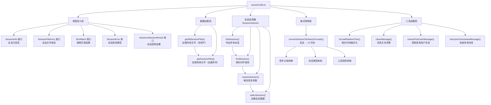

# sessionUtils.ts

## 概述

`sessionUtils.ts` 是 Gemini CLI 的 **会话工具核心模块**，为整个会话管理子系统提供基础设施。它定义了会话相关的数据类型（`SessionInfo`、`SessionFileEntry`、`TextMatch` 等）、错误类型（`SessionError`），以及会话文件的加载、解析、排序、去重、搜索和选择等核心功能。

该模块是会话管理的"枢纽"，被 `sessions.ts`（用户交互层）和 `sessionCleanup.ts`（清理层）等多个模块依赖。主要职责包括：

- 定义会话信息的完整数据结构
- 从磁盘加载和解析会话 JSON 文件
- 会话发现与选择（通过 `SessionSelector` 类）
- 支持按 UUID、索引号、"latest" 三种方式定位会话
- 将会话数据转换为 UI 历史记录格式
- 提供时间格式化、消息清理等通用工具函数

## 架构图（Mermaid）



## 核心组件

### 1. 常量

| 常量名 | 值 | 用途 |
|---|---|---|
| `RESUME_LATEST` | `'latest'` | `--resume` 参数的特殊值，表示恢复最近的会话 |

### 2. 类型定义

#### `SessionErrorCode`

会话错误代码联合类型：
- `'NO_SESSIONS_FOUND'` — 当前项目无会话
- `'INVALID_SESSION_IDENTIFIER'` — 无效的会话标识符

#### `SessionError` 类

继承自 `Error` 的自定义错误类，附带 `code` 字段区分错误类型。

**静态工厂方法：**
- `SessionError.noSessionsFound()` — 创建"无会话"错误
- `SessionError.invalidSessionIdentifier(identifier, chatsDir?)` — 创建"无效标识符"错误，包含搜索目录信息和使用提示

#### `TextMatch` 接口

搜索匹配结果，包含匹配文本及其上下文：

```typescript
interface TextMatch {
  before: string;     // 匹配前文本（可能带省略号）
  match: string;      // 精确匹配文本
  after: string;      // 匹配后文本（可能带省略号）
  role: 'user' | 'assistant';  // 消息作者角色
}
```

#### `SessionInfo` 接口

会话的完整元信息，是整个会话管理系统的核心数据结构：

| 字段 | 类型 | 说明 |
|---|---|---|
| `id` | `string` | 唯一会话标识符 |
| `file` | `string` | 文件名（不含 .json 扩展名） |
| `fileName` | `string` | 完整文件名（含 .json） |
| `startTime` | `string` | ISO 时间戳，会话开始时间 |
| `messageCount` | `number` | 消息总数 |
| `lastUpdated` | `string` | ISO 时间戳，最后更新时间 |
| `displayName` | `string` | 显示名称（优先使用 AI 摘要，否则用首条消息） |
| `firstUserMessage` | `string` | 清理后的首条用户消息 |
| `isCurrentSession` | `boolean` | 是否为当前活跃会话 |
| `index` | `number` | 列表中的显示序号（1-based） |
| `summary?` | `string` | AI 生成的会话摘要（可选） |
| `fullContent?` | `string` | 所有消息拼接的完整内容（搜索时加载） |
| `messages?` | `Array<{role, content}>` | 标准化角色的消息数组（搜索时加载） |
| `matchSnippets?` | `TextMatch[]` | 搜索匹配片段 |
| `matchCount?` | `number` | 匹配总数 |

#### `SessionFileEntry` 接口

会话文件条目，用于区分有效和损坏的文件：

```typescript
interface SessionFileEntry {
  fileName: string;              // 完整文件名
  sessionInfo: SessionInfo | null;  // null 表示文件损坏
}
```

#### `SessionSelectionResult` 接口

会话选择/恢复的结果：

```typescript
interface SessionSelectionResult {
  sessionPath: string;          // 会话文件完整路径
  sessionData: ConversationRecord;  // 解析后的会话数据
  displayInfo: string;          // 用于显示的摘要信息
}
```

### 3. 工具函数

#### `hasUserOrAssistantMessage(messages): boolean`

检查消息数组中是否包含至少一条用户或助手（gemini）消息。仅含系统消息（info、error、warning）的会话视为空会话。

#### `cleanMessage(message): string`

清理消息文本用于显示：
1. 换行符替换为空格
2. 多个连续空白合并为单个空格
3. 移除非可打印字符（仅保留 ASCII 32-126）
4. 去除首尾空白

#### `extractFirstUserMessage(messages): string`

从会话消息中提取第一条有意义的用户消息：
1. 优先查找不以 `/` 或 `?` 开头且非空的用户消息（排除斜杠命令）
2. 若无匹配，回退到第一条用户消息（即使是斜杠命令）
3. 若完全无用户消息，返回 `'Empty conversation'`

#### `formatRelativeTime(timestamp, style?): string`

将 ISO 时间戳格式化为人类可读的相对时间。

**长格式（默认 `style='long'`）：**
- `"3 days ago"`、`"1 hour ago"`、`"5 minutes ago"`、`"Just now"`

**短格式（`style='short'`）：**
- `"now"`、`"30s"`、`"5m"`、`"2h"`、`"7d"`、`"3mo"`、`"1y"`

### 4. 数据加载函数

#### `getAllSessionFiles(chatsDir, currentSessionId?, options?): Promise<SessionFileEntry[]>`

从聊天目录加载所有会话文件（包括损坏的）。

**处理逻辑：**
1. 读取 `chatsDir` 目录下所有以 `SESSION_FILE_PREFIX` 开头、`.json` 结尾的文件
2. 并行解析每个文件（`Promise.all`），对每个文件：
   - 读取并解析 JSON
   - 验证必要字段（`sessionId`、`messages`、`startTime`、`lastUpdated`）
   - 过滤仅含系统消息的空会话
   - 过滤子代理（`kind === 'subagent'`）会话
   - 提取首条用户消息和显示名称
   - 判断是否为当前会话（通过短 ID 前 8 字符匹配）
   - 可选加载完整内容（`includeFullContent`）
3. 解析失败或字段缺失的文件返回 `sessionInfo: null`
4. 目录不存在（ENOENT）返回空数组

#### `getSessionFiles(chatsDir, currentSessionId?, options?): Promise<SessionInfo[]>`

加载所有有效会话文件，自动过滤损坏文件、去重、排序和编号。

**处理逻辑：**
1. 调用 `getAllSessionFiles()` 获取全部条目
2. 过滤掉 `sessionInfo === null` 的条目
3. **按 ID 去重**：若同一 ID 有多个文件，保留 `lastUpdated` 最新的
4. 按 `startTime` 升序排列
5. 设置 1-based 的 `index` 编号

### 5. `SessionSelector` 类

会话发现和选择的工具类，封装了完整的会话查找流程。

#### 构造函数

```typescript
constructor(private config: Config)
```

接收 `Config` 对象以获取存储路径和当前会话 ID。

#### `listSessions(): Promise<SessionInfo[]>`

列出当前项目的所有可用会话。内部调用 `getSessionFiles()`。

#### `findSession(identifier: string): Promise<SessionInfo>`

按标识符查找会话，支持两种标识符：
1. **UUID**：精确匹配 `session.id`
2. **索引号**：1-based 整数索引，需严格为纯数字（`index.toString() === trimmedIdentifier`）

找不到时抛出 `SessionError`。

#### `resolveSession(resumeArg: string): Promise<SessionSelectionResult>`

解析 `--resume` 参数并加载对应会话数据。

- `'latest'`：选择按 `startTime` 排序后的最新会话
- 其他值：委托给 `findSession()`
- 最终调用私有方法 `selectSession()` 读取文件并构建 `SessionSelectionResult`

#### `selectSession(sessionInfo): Promise<SessionSelectionResult>`（私有）

加载指定会话的完整数据，返回包含文件路径、解析后数据和显示信息的结果对象。

### 6. `convertSessionToHistoryFormats(messages): { uiHistory }`

将会话的 `ConversationRecord.messages` 转换为 UI 历史记录格式（`HistoryItemWithoutId[]`）。

**转换规则：**

1. **思考记录**：`gemini` 类型消息若包含 `thoughts`，每个思考转换为 `type: 'thinking'` 条目
2. **消息内容**：
   - 优先使用 `displayContent`（显示用内容），否则使用 `content`
   - 空白内容的消息跳过
   - 消息类型映射：
     - `'user'` → `MessageType.USER`
     - `'gemini'` → `MessageType.GEMINI`
     - `'info'` → `MessageType.INFO`
     - `'error'` → `MessageType.ERROR`
     - `'warning'` → `MessageType.WARNING`
   - 使用 `checkExhaustive()` 确保穷尽所有类型（编译时安全检查）
3. **工具调用**：非 user 类型消息若包含 `toolCalls`，转换为 `type: 'tool_group'` 条目，包含：
   - 调用 ID、名称、描述
   - 状态映射（`'success'` → `CoreToolCallStatus.Success`，否则 → `CoreToolCallStatus.Error`）
   - 结果显示内容
   - Markdown 渲染标志（默认 true）

## 依赖关系

### 内部依赖

| 模块 | 导入内容 | 用途 |
|---|---|---|
| `@google/gemini-cli-core` | `checkExhaustive` | TypeScript 穷举类型检查辅助函数 |
| `@google/gemini-cli-core` | `partListUnionToString` | 将消息内容（可能是 Part 列表或字符串联合类型）转换为字符串 |
| `@google/gemini-cli-core` | `SESSION_FILE_PREFIX` | 会话文件名前缀常量 |
| `@google/gemini-cli-core` | `CoreToolCallStatus` | 工具调用状态枚举（Success、Error） |
| `@google/gemini-cli-core` | `Config` (type) | 配置对象类型 |
| `@google/gemini-cli-core` | `ConversationRecord` (type) | 会话记录数据结构类型 |
| `@google/gemini-cli-core` | `MessageRecord` (type) | 单条消息记录类型 |
| `../ui/utils/textUtils.js` | `stripUnsafeCharacters` | 移除不安全字符（用于清理 AI 摘要） |
| `../ui/types.js` | `MessageType` | UI 消息类型枚举 |
| `../ui/types.js` | `HistoryItemWithoutId` (type) | UI 历史记录条目类型（不含 ID） |

### 外部依赖

| 模块 | 导入内容 | 用途 |
|---|---|---|
| `node:fs/promises` | `* as fs` | 异步文件系统操作（读取目录、读取文件） |
| `node:path` | 默认导入 `path` | 路径拼接与处理 |

## 关键实现细节

1. **会话去重策略**：`getSessionFiles()` 使用 `Map<string, SessionInfo>` 按会话 ID 去重，当同一 ID 存在多个文件时，保留 `lastUpdated` 最新的版本。这处理了文件系统中可能出现的重复会话文件。

2. **子代理会话过滤**：`kind === 'subagent'` 的会话是工具调用的内部实现细节，不应出现在用户可见的会话列表中，因此在加载阶段就被过滤掉。

3. **当前会话检测**：通过比较文件名是否包含 `currentSessionId.slice(0, 8)`（前 8 字符）来判断是否为当前会话。这是一种基于短 ID 的快速匹配策略。

4. **懒加载设计**：`fullContent` 和 `messages` 字段仅在 `options.includeFullContent` 为 true 时才加载，避免列表展示时的不必要内存开销。

5. **严格索引验证**：`findSession()` 在验证数字索引时，不仅检查 `isNaN` 和范围，还要求 `index.toString() === trimmedIdentifier`，防止 `"1.5"` 或 `"1abc"` 等非纯整数被错误接受。

6. **穷举类型检查**：`convertSessionToHistoryFormats()` 中使用 `checkExhaustive(msg)` 确保所有消息类型都被处理。如果未来新增消息类型但未更新此处的 switch 语句，TypeScript 编译器会报错。

7. **显示名称优先级**：会话的 `displayName` 优先使用 AI 生成的 `summary`（经过 `stripUnsafeCharacters` 清理），若无摘要则使用首条用户消息。

8. **并行文件加载**：`getAllSessionFiles()` 使用 `Promise.all()` 并行读取和解析所有会话文件，大幅提升多文件场景下的加载性能。
