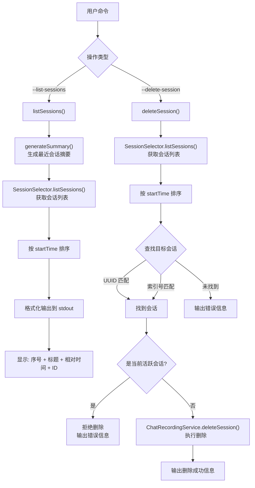

# sessions.ts

## 概述

`sessions.ts` 是 Gemini CLI 的 **会话管理用户交互模块**，提供面向用户的会话列表展示和会话删除功能。它是 CLI 命令行参数 `--list-sessions` 和 `--delete-session` 的直接处理逻辑实现。

该模块是一个较薄的业务层，核心逻辑委托给 `SessionSelector`（来自 `sessionUtils.js`）和 `ChatRecordingService`（来自核心库），自身主要负责：

- 格式化并输出会话列表到标准输出
- 解析用户指定的会话标识符（支持索引号和 UUID）
- 执行会话删除并输出结果

## 架构图（Mermaid）



## 核心组件

### 1. `listSessions(config: Config): Promise<void>`

列出当前项目的所有可用会话。

**执行流程：**

1. 调用 `generateSummary(config)` 为最近的会话生成摘要（如果尚未生成）
2. 通过 `SessionSelector` 获取所有会话列表
3. 若无会话，输出提示信息并返回
4. 按 `startTime` 升序排列（最早的在前，最新的在后）
5. 逐个格式化输出，每行包含：
   - 序号（从 1 开始）
   - 标题（`displayName`，超过 100 字符截断为 97 字符 + `...`）
   - 相对时间（如 "2 hours ago"）
   - 当前会话标记（`, current`）
   - 会话 ID（方括号内）

**输出示例：**
```
Available sessions for this project (3):
  1. Fix the login bug (2 hours ago) [abc12345]
  2. Implement dark mode (1 day ago) [def67890]
  3. Refactor utils module (just now, current) [ghi24680]
```

### 2. `deleteSession(config: Config, sessionIndex: string): Promise<void>`

删除指定的会话。

**执行流程：**

1. 获取所有会话并按 `startTime` 升序排列（与 `listSessions` 排序一致，确保索引号对应正确）
2. **查找目标会话**（两种方式）：
   - 优先按 UUID（`session.id`）匹配
   - UUID 未匹配时，尝试将输入解析为整数索引（1-based）
3. **安全检查**：
   - 索引范围校验（1 到 sessions.length）
   - 禁止删除当前活跃会话（`isCurrentSession === true`）
4. 通过 `ChatRecordingService.deleteSession()` 执行实际删除
5. 输出删除结果（成功或失败）

**错误处理：**
- 无效标识符：输出提示信息，引导用户使用 `--list-sessions`
- 当前活跃会话：输出 "Cannot delete the current active session."
- 删除异常：捕获并输出错误信息

## 依赖关系

### 内部依赖

| 模块 | 导入内容 | 用途 |
|---|---|---|
| `@google/gemini-cli-core` | `ChatRecordingService` | 会话录制服务类，提供 `deleteSession()` 方法执行实际文件删除 |
| `@google/gemini-cli-core` | `generateSummary` | 为最近的会话生成摘要/标题 |
| `@google/gemini-cli-core` | `writeToStderr` | 向标准错误流写入信息（用于错误提示） |
| `@google/gemini-cli-core` | `writeToStdout` | 向标准输出流写入信息（用于正常输出） |
| `@google/gemini-cli-core` | `Config` (type) | 配置对象类型 |
| `./sessionUtils.js` | `formatRelativeTime` | 将时间戳格式化为相对时间字符串 |
| `./sessionUtils.js` | `SessionSelector` | 会话选择器类，封装了会话文件的列表和恢复逻辑 |
| `./sessionUtils.js` | `SessionInfo` (type) | 会话信息类型定义 |

### 外部依赖

无直接的外部（npm）依赖。所有功能通过内部模块实现。

## 关键实现细节

1. **排序一致性**：`listSessions()` 和 `deleteSession()` 使用完全相同的排序逻辑（按 `startTime` 升序），确保用户通过 `--list-sessions` 看到的序号与 `--delete-session <index>` 使用的序号一一对应。

2. **双重标识符支持**：`deleteSession()` 先尝试 UUID 精确匹配，再回退到索引号匹配，提供灵活的用户体验。用户可以使用完整的会话 ID 或简单的数字序号来指定会话。

3. **当前会话保护**：活跃会话不可删除，这是一个硬性约束。因为删除当前会话会导致后续操作（如消息记录、会话恢复）出现异常。

4. **摘要预生成**：`listSessions()` 在获取列表之前先调用 `generateSummary()`，确保最近的会话有可展示的标题/摘要。这是因为会话标题通常是从对话内容中异步提取的，可能在列出时尚未生成。

5. **标题截断**：`displayName` 超过 100 字符时截断为 97 字符加省略号，避免终端输出换行导致列表格式混乱。

6. **错误输出分离**：正常信息（列表内容、删除成功提示）输出到 `stdout`，错误信息（无效参数、删除失败）输出到 `stderr`，符合 Unix 标准输出规范，便于脚本管道处理。
