# settingsUtils.ts

## 概述

`settingsUtils.ts` 是 Gemini CLI 的 **设置工具模块**，为整个设置管理子系统提供核心的查询、解析和格式化功能。该模块的主要职责是将嵌套的设置 Schema 扁平化为点号分隔的键路径格式（如 `model.compressionThreshold`），并提供丰富的查询和操作 API。

核心功能包括：

- **Schema 扁平化**：将树形的嵌套设置 Schema 转换为 `key.path` → `SettingDefinition` 的扁平映射，便于 UI 和逻辑层使用
- **设置查询**：按类型、分类、键名等多种维度查询设置项
- **值解析**：将用户在 UI 中编辑的字符串值解析为对应的类型化值（数字、数组、对象等）
- **值显示**：将设置值格式化为用户友好的显示字符串（含单位、百分比、作用域标记等）
- **有效值计算**：支持设置值的分层覆盖和实验性标志回退

## 架构图（Mermaid）

```mermaid
graph TD
    A["settingsUtils.ts"] --> B["Schema 扁平化层"]
    A --> C["设置查询层"]
    A --> D["值处理层"]
    A --> E["对话框支持层"]

    B --> B1["flattenSchema()
    递归扁平化嵌套 Schema"]
    B --> B2["getFlattenedSchema()
    获取扁平化 Schema（带缓存）"]

    C --> C1["getSettingDefinition()
    按键获取定义"]
    C --> C2["getSettingsByCategory()
    按分类分组"]
    C --> C3["getSettingsByType()
    按类型过滤"]
    C --> C4["getAllSettingKeys()
    获取所有键名"]
    C --> C5["isValidSettingKey()
    验证键名合法性"]
    C --> C6["getSettingCategory()
    获取设置分类"]
    C --> C7["getRestartRequiredSettings()
    获取需重启的设置"]
    C --> C8["getSettingsRequiringRestart()
    获取需重启的设置定义"]

    D --> D1["getEffectiveValue()
    获取有效值（含回退）"]
    D --> D2["getEffectiveDefaultValue()
    获取有效默认值（含实验值）"]
    D --> D3["getDefaultValue()
    获取 Schema 默认值"]
    D --> D4["getNestedValue()
    嵌套对象路径取值"]
    D --> D5["parseEditedValue()
    解析用户编辑值"]
    D --> D6["getEditValue()
    获取可编辑字符串"]
    D --> D7["getDisplayValue()
    获取显示字符串"]

    E --> E1["shouldShowInDialog()
    是否在对话框中显示"]
    E --> E2["getDialogSettingKeys()
    对话框设置键列表"]
    E --> E3["getDialogSettingsByCategory()
    对话框设置分类分组"]
    E --> E4["getDialogSettingsByType()
    对话框设置按类型过滤"]
    E --> E5["getDialogRestartRequiredSettings()
    对话框中需重启的设置"]
```



## 核心组件

### 1. Schema 扁平化

#### `FlattenedSchema` 类型

```typescript
type FlattenedSchema = Record<string, SettingDefinition & { key: string }>;
```

将嵌套的 Schema 结构映射为以点号分隔的键路径为 key、设置定义为 value 的扁平字典。

#### `flattenSchema(schema, prefix?): FlattenedSchema`

递归扁平化嵌套的 Settings Schema。

**示例**：
```
输入 Schema:
{
  model: {
    properties: {
      compressionThreshold: { type: 'number', ... }
    }
  }
}

输出:
{
  'model': { key: 'model', ... },
  'model.compressionThreshold': { key: 'model.compressionThreshold', type: 'number', ... }
}
```

递归处理 `properties` 字段，每层添加 `.` 分隔的前缀。

#### `getFlattenedSchema(): FlattenedSchema`

获取扁平化 Schema 的**单例缓存版本**。首次调用时执行扁平化并缓存，后续调用直接返回缓存。使用 `??` 空值合并运算符实现惰性初始化。

#### `clearFlattenedSchema()`

清除缓存的扁平化 Schema。仅通过 `TEST_ONLY` 导出，供测试使用。

### 2. 设置查询函数

#### `getSettingDefinition(key): SettingDefinition | undefined`

按点号路径键名查询单个设置项的完整定义。

#### `getSettingsByCategory(): Record<string, Array<...>>`

将所有设置按 `category` 字段分组返回。分类如 "General"、"Advanced" 等。

#### `getSettingsByType(type): Array<...>`

按设置类型（`string`、`number`、`boolean`、`enum`、`array`、`object`）过滤设置。

#### `getAllSettingKeys(): string[]`

返回 Schema 中所有设置的键名列表。

#### `isValidSettingKey(key): boolean`

验证给定键名是否存在于 Schema 中。

#### `getSettingCategory(key): string | undefined`

返回指定设置所属的分类名称。

#### `requiresRestart(key): boolean`

判断修改指定设置后是否需要重启 CLI。

#### `getRestartRequiredSettings(): string[]`

返回所有需要重启的设置的键名列表。

#### `getSettingsRequiringRestart(): Array<...>`

返回所有需要重启的设置的完整定义列表。

### 3. 值处理函数

#### `getNestedValue(obj, path): unknown`

迭代式地从嵌套对象中按路径数组获取值。

```typescript
getNestedValue({ model: { theme: 'dark' } }, ['model', 'theme'])
// 返回: 'dark'
```

逐层检查对象是否为 Record 类型且包含目标键，任一层不满足则返回 `undefined`。

#### `getEffectiveValue(key, settings): SettingsValue`

获取设置的**有效值**，优先使用当前作用域的用户设置，若未设置则回退到 Schema 默认值。

**查找优先级：**
1. 当前作用域的 settings 中按路径查找
2. Schema 中的 default 值

#### `getEffectiveDefaultValue(key, config?): SettingsValue`

获取设置的**有效默认值**，支持实验性标志覆盖。

**特殊处理**：当 `key === 'model.compressionThreshold'` 且 Config 可用时：
- 检查实验性标志 `ExperimentFlags.CONTEXT_COMPRESSION_THRESHOLD` 的 `floatValue`
- 若实验值存在且非 0，使用实验值作为默认值
- 否则回退到 Schema 默认值

#### `getDefaultValue(key): SettingsValue`

直接返回 Schema 中定义的默认值。

#### `parseEditedValue(type, newValue): SettingsValue | null`

解析用户在 UI 内联编辑框中输入的字符串值为对应类型。

| 类型 | 解析逻辑 | 返回 null 的情况 |
|---|---|---|
| `number` | `Number()` 转换 | 空字符串或 NaN |
| `array` | 优先 JSON 数组解析，回退到逗号分隔 | - |
| `object` | JSON 对象解析 | 空字符串或解析失败 |
| 其他 | 直接返回原字符串 | - |

**数组解析的双重策略：**
1. 尝试 `JSON.parse()` 解析为 `string[]`（如 `["a", "b"]`）
2. 若失败，按逗号分隔并去除空白（如 `a, b, c`）

#### `getEditValue(type, rawValue): string | undefined`

将类型化的设置值转换为可编辑的字符串形式。

| 类型 | 转换逻辑 |
|---|---|
| `array` | `Array.join(', ')` |
| `object` | `JSON.stringify()` |
| 其他 | 返回 `undefined`（UI 使用默认展示） |

#### `getDisplayValue(key, scopeSettings, mergedSettings): string`

将设置值格式化为用户友好的显示字符串。

**格式化规则：**
1. 若设置存在于当前作用域中，使用作用域值；否则使用默认值
2. `object` 类型序列化为 JSON 字符串
3. `enum` 类型显示选项的 `label`（而非 `value`）
4. 百分比单位（`unit === '%'`）的数字显示为 `0.75 (75%)` 格式
5. 有单位的值在后面追加单位（如 `100ms`）
6. 存在于当前作用域的值追加 `*` 标记

### 4. 对话框支持函数

这组函数专门为设置对话框（Settings Dialog）UI 提供数据支持，过滤掉 `showInDialog === false` 的设置项。

#### `shouldShowInDialog(key): boolean`

判断指定设置是否应在对话框中显示。默认为 `true`（向后兼容）。

#### `getDialogSettingKeys(): string[]`

返回所有应在对话框中显示的设置键名。

#### `getDialogSettingsByCategory(): Record<string, Array<...>>`

将对话框可见的设置按分类分组。

#### `getDialogSettingsByType(type): Array<...>`

返回对话框可见的指定类型设置。

#### `getDialogRestartRequiredSettings(): string[]`

返回对话框中可见且需要重启的设置键名。排除了 `showInDialog === false` 的设置（如 `mcpServers`、`tools` 等容器对象），因为用户无法通过对话框直接修改这些设置。

### 5. 辅助函数

#### `isRecord(value): value is Record<string, unknown>`

TypeScript 类型守卫，判断值是否为非 null 的对象类型。

#### `isSettingsValue(value): value is SettingsValue`

判断值是否为合法的设置值类型（`undefined`、`string`、`number`、`boolean`、`object`），`null` 被排除。

#### `isInSettingsScope(key, scopeSettings): boolean`

检查指定键是否在给定的作用域设置中有值（不为 `undefined`）。

### 6. 测试专用导出

```typescript
export const TEST_ONLY = { clearFlattenedSchema };
```

仅供测试使用的工具，允许在测试间清除 Schema 缓存以确保测试隔离。

## 依赖关系

### 内部依赖

| 模块 | 导入内容 | 用途 |
|---|---|---|
| `../config/settings.js` | `Settings` (type) | 设置数据结构类型 |
| `../config/settingsSchema.js` | `getSettingsSchema` | 获取嵌套的原始设置 Schema |
| `../config/settingsSchema.js` | `SettingDefinition` (type) | 单个设置项的定义类型 |
| `../config/settingsSchema.js` | `SettingsSchema` (type) | 完整设置 Schema 类型 |
| `../config/settingsSchema.js` | `SettingsType` (type) | 设置值类型枚举（string、number 等） |
| `../config/settingsSchema.js` | `SettingsValue` (type) | 设置值联合类型 |
| `@google/gemini-cli-core` | `ExperimentFlags` | 实验性标志枚举 |
| `@google/gemini-cli-core` | `Config` (type) | 配置对象类型 |

### 外部依赖

无直接的外部（npm）依赖。所有功能通过内部模块和 Node.js 标准库实现。

## 关键实现细节

1. **惰性缓存策略**：扁平化 Schema 使用模块级变量 `_FLATTENED_SCHEMA` 缓存，通过 `??` 运算符实现惰性初始化。首次调用 `getFlattenedSchema()` 时执行计算并缓存，后续调用直接返回。这避免了应用启动时不必要的计算开销。

2. **递归扁平化算法**：`flattenSchema()` 递归遍历 Schema 树的 `properties` 字段，用 `.` 连接父子键名。每一层（包括中间节点）都会被加入扁平结果，这意味着 `model` 和 `model.compressionThreshold` 都会作为独立条目存在。

3. **实验性标志集成**：`getEffectiveDefaultValue()` 特殊处理了 `model.compressionThreshold` 设置，当远程实验平台下发了 `CONTEXT_COMPRESSION_THRESHOLD` 标志值时，将其作为默认值使用。这是 A/B 测试的典型模式。

4. **双重数组解析**：`parseStringArrayValue()` 先尝试 JSON 格式（`["a","b"]`），失败后回退到逗号分隔格式（`a, b, c`），同时兼顾了编程格式和用户友好格式。

5. **作用域标记机制**：`getDisplayValue()` 在值后追加 `*` 标记来表示该值是在当前作用域中显式设置的（而非来自默认值）。这帮助用户区分哪些设置已被自定义修改。

6. **百分比展示优化**：当设置的 `unit` 为 `%` 且值为数字时，同时显示原始值和百分比形式（如 `0.75 (75%)`），因为内部存储的可能是 0-1 范围的小数而非百分比。

7. **对话框可见性过滤**：`showInDialog` 字段控制设置是否在 UI 对话框中可见。默认为 `true`，确保向后兼容。容器对象类型的设置（如 `mcpServers`）通常设为 `false`，因为它们的修改需要通过专门的 UI 而非通用设置对话框。

8. **类型安全保障**：`isRecord()` 和 `isSettingsValue()` 作为 TypeScript 类型守卫，在运行时验证值的类型并收窄 TypeScript 类型推断，确保后续操作的类型安全。
