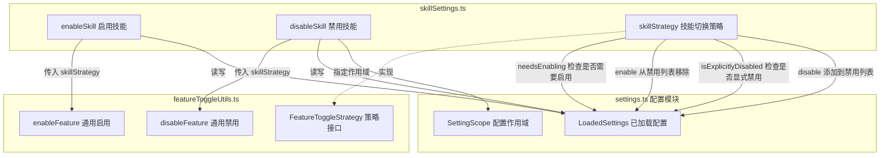

# skillSettings.ts

## 概述

`skillSettings.ts` 是 Gemini CLI 中用于管理 **技能（Skill）启用/禁用设置** 的工具模块。它基于通用的「特性开关」（Feature Toggle）工具层 `featureToggleUtils.ts` 进行封装，提供了针对技能的专用启用与禁用操作接口。核心思想是将"已禁用的技能名称列表"存储在配置的 `skills.disabled` 字段中，通过对该列表的增删来控制技能的启用与禁用状态。

该模块支持多作用域（User / Workspace）的设置管理，在启用技能时会遍历所有可写作用域移除禁用记录，在禁用技能时则在指定作用域中添加禁用记录。

## 架构图（Mermaid）



## 核心组件

### 1. 类型定义

#### `SkillActionStatus`

```typescript
export type SkillActionStatus = 'success' | 'no-op' | 'error';
```

技能操作状态的联合类型：
- **`success`**：操作成功完成（技能状态发生了实际变更）
- **`no-op`**：无需操作（技能已经处于目标状态）
- **`error`**：操作出错

#### `SkillActionResult`

```typescript
export interface SkillActionResult
  extends Omit<FeatureActionResult, 'featureName'> {
  skillName: string;
}
```

技能操作结果接口，继承自 `FeatureActionResult`（去除 `featureName` 字段），并用 `skillName` 替代。这样对外暴露更具语义化的字段名称，让调用方明确知道操作的是"技能"而非泛化的"特性"。

### 2. `skillStrategy` — 技能切换策略对象

```typescript
const skillStrategy: FeatureToggleStrategy = { ... };
```

实现了 `FeatureToggleStrategy` 接口的策略对象，包含四个方法：

| 方法 | 作用 | 实现细节 |
|------|------|----------|
| `needsEnabling(settings, scope, skillName)` | 判断指定作用域下技能是否需要被启用 | 检查 `settings.forScope(scope).settings.skills?.disabled` 数组是否包含该技能名 |
| `enable(settings, scope, skillName)` | 在指定作用域下启用技能 | 从 `skills.disabled` 数组中过滤掉该技能名，然后调用 `settings.setValue` 回写 |
| `isExplicitlyDisabled(settings, scope, skillName)` | 判断技能是否在指定作用域中被显式禁用 | 检查当前作用域的 `skills.disabled` 数组是否包含该技能名 |
| `disable(settings, scope, skillName)` | 在指定作用域下禁用技能 | 将技能名追加到 `skills.disabled` 数组中，然后调用 `settings.setValue` 回写 |

### 3. `enableSkill` — 启用技能

```typescript
export function enableSkill(
  settings: LoadedSettings,
  skillName: string,
): SkillActionResult
```

**功能**：启用指定技能，从所有可写的禁用列表（User 和 Workspace 作用域）中移除该技能名。

**实现流程**：
1. 调用通用的 `enableFeature` 函数，传入 `skillStrategy`
2. 将返回结果中的 `featureName` 映射为 `skillName`
3. 返回 `SkillActionResult`

### 4. `disableSkill` — 禁用技能

```typescript
export function disableSkill(
  settings: LoadedSettings,
  skillName: string,
  scope: SettingScope,
): SkillActionResult
```

**功能**：在指定作用域下禁用某个技能，将技能名添加到该作用域的禁用列表中。

**实现流程**：
1. 调用通用的 `disableFeature` 函数，传入 `skillStrategy` 和目标 `scope`
2. 将返回结果中的 `featureName` 映射为 `skillName`
3. 返回 `SkillActionResult`

## 依赖关系

### 内部依赖

| 模块 | 导入内容 | 用途 |
|------|----------|------|
| `../config/settings.js` | `SettingScope`, `LoadedSettings` (类型) | 配置作用域类型与已加载配置的类型定义 |
| `./featureToggleUtils.js` | `FeatureActionResult`, `FeatureToggleStrategy` (类型), `enableFeature`, `disableFeature` (函数) | 通用特性开关的策略接口和操作函数 |
| `./featureToggleUtils.js` | `ModifiedScope` (类型, 重导出) | 将 `ModifiedScope` 类型重新导出供外部使用 |

### 外部依赖

无外部第三方依赖。

## 关键实现细节

1. **策略模式的运用**：该模块没有直接实现启用/禁用逻辑，而是通过 `skillStrategy` 对象实现 `FeatureToggleStrategy` 接口，将具体的启用/禁用细节委托给通用的 `featureToggleUtils` 处理。这种设计使得新增类似的特性开关（如 MCP Server 的启用/禁用）时只需定义新的 strategy 即可复用相同的核心逻辑。

2. **禁用列表而非启用列表**：设计上采用"默认启用、显式禁用"的策略 —— 技能默认是启用的，只有出现在 `skills.disabled` 列表中的技能才会被禁用。这是一种"黑名单"模式，对于技能这种默认应该可用的功能来说是合理的。

3. **多作用域管理**：
   - **启用**时会遍历所有可写作用域（User、Workspace）移除禁用记录，确保技能在所有层级都被启用。
   - **禁用**时需要显式指定作用域，这样用户可以选择在全局（User 级别）还是仅在当前项目（Workspace 级别）禁用某个技能。

4. **幂等性保证**：`disable` 方法中虽然会直接将技能名追加到数组中，但通用工具层会先通过 `isExplicitlyDisabled` 检查避免重复添加。`enable` 方法使用 `filter` 移除，天然具有幂等性。

5. **字段名映射**：从 `FeatureActionResult` 到 `SkillActionResult` 的转换中，使用解构和展开运算符将 `featureName` 映射为 `skillName`，保持了对外 API 的语义清晰性。
