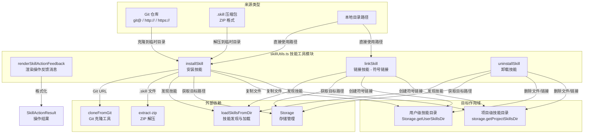
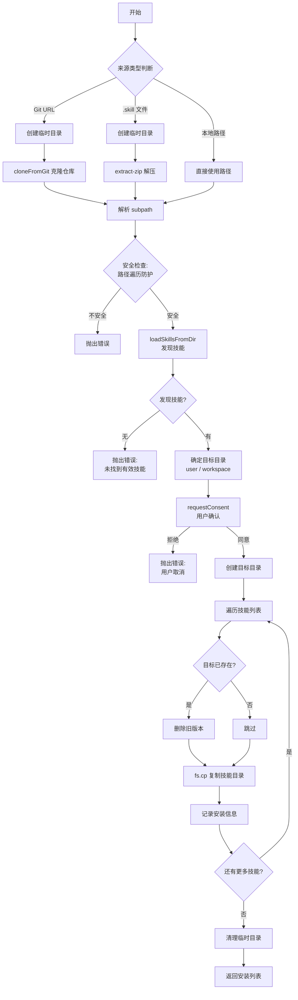

# skillUtils.ts

## 概述

`skillUtils.ts` 是 Gemini CLI 中用于 **技能（Skill）生命周期管理** 的核心工具模块。它提供了技能的安装（install）、链接（link）、卸载（uninstall）以及操作反馈渲染（renderSkillActionFeedback）等功能。

该模块支持从多种来源安装技能：
- **Git 仓库**（HTTP/HTTPS/SSH URL）
- **本地 `.skill` 压缩包**（ZIP 格式）
- **本地目录路径**

同时支持将技能安装到两个不同的作用域：
- **user**（用户级别）：全局可用
- **workspace**（工作区级别）：仅在当前项目可用

## 架构图（Mermaid）



## 核心组件

### 1. `renderSkillActionFeedback` — 渲染技能操作反馈消息

```typescript
export function renderSkillActionFeedback(
  result: SkillActionResult,
  formatScope: (label: string, path: string) => string,
): string
```

**功能**：根据技能操作结果（启用/禁用）生成人类可读的反馈消息字符串。

**参数**：
- `result`：技能操作结果对象（来自 `skillSettings.ts`），包含 `skillName`、`action`、`status`、`error`、`modifiedScopes`、`alreadyInStateScopes` 等字段。
- `formatScope`：格式化回调函数，由调用方提供以控制作用域和路径的渲染样式（如终端加粗/变暗，或 Markdown 格式）。

**返回值处理逻辑**：
1. **错误状态**（`status === 'error'`）：返回错误信息或默认错误消息。
2. **无操作状态**（`status === 'no-op'`）：返回"已经是目标状态"的提示。
3. **成功状态**：
   - 如果影响了 2 个作用域：生成包含两个作用域说明的消息。
   - 如果影响了 1 个作用域：生成包含单个作用域说明的消息。

**设计亮点**：该函数只负责生成核心描述文本，不包含 UI 特定的后续指导（如 "Use /skills reload"），将 UI 层的职责留给调用方。

### 2. `installSkill` — 安装技能

```typescript
export async function installSkill(
  source: string,
  scope: 'user' | 'workspace',
  subpath: string | undefined,
  onLog: (msg: string) => void,
  requestConsent: (skills: SkillDefinition[], targetDir: string) => Promise<boolean>,
): Promise<Array<{ name: string; location: string }>>
```

**功能**：从远程 URL 或本地路径安装技能到指定作用域。

**参数**：
| 参数 | 类型 | 说明 |
|------|------|------|
| `source` | `string` | 技能来源（Git URL / .skill 文件路径 / 本地目录路径） |
| `scope` | `'user' \| 'workspace'` | 安装的目标作用域 |
| `subpath` | `string \| undefined` | 在克隆/解压后的目录中的子路径（可选） |
| `onLog` | `(msg: string) => void` | 日志回调函数 |
| `requestConsent` | `(skills, targetDir) => Promise<boolean>` | 用户确认回调，默认自动同意 |

**执行流程**：



**安全机制**：
- 当使用 Git 克隆或 ZIP 解压时，会检查解析后的 `sourcePath` 是否仍在临时目录范围内，防止目录遍历攻击。
- 使用 `try/finally` 确保临时目录在任何情况下都会被清理。

### 3. `linkSkill` — 链接技能（符号链接）

```typescript
export async function linkSkill(
  source: string,
  scope: 'user' | 'workspace',
  onLog: (msg: string) => void,
  requestConsent: (skills: SkillDefinition[], targetDir: string) => Promise<boolean>,
): Promise<Array<{ name: string; location: string }>>
```

**功能**：通过创建符号链接（symlink）的方式将本地路径的技能链接到目标作用域目录。与 `installSkill` 的复制方式不同，链接方式保持源目录和目标目录的实时同步，适用于本地开发调试场景。

**特殊处理**：
- **重名检测**：在链接前会检查来源目录中是否存在同名技能（`seenNames` Map），如果发现重复的技能名称会抛出详细的错误信息。
- **覆盖逻辑**：如果目标路径已存在（使用 `lstat` 检查，可以检测符号链接本身），会先删除再重新创建符号链接。
- 使用 `fs.symlink(source, dest, 'dir')` 创建目录类型的符号链接。

### 4. `uninstallSkill` — 卸载技能

```typescript
export async function uninstallSkill(
  name: string,
  scope: 'user' | 'workspace',
): Promise<{ location: string } | null>
```

**功能**：按名称卸载指定作用域下的技能。

**执行流程**：
1. 根据 scope 确定目标目录。
2. 使用 `loadSkillsFromDir` 发现目标目录中的所有技能。
3. 查找与指定名称匹配的技能。
4. **找到匹配技能**：删除该技能所在目录，返回其位置。
5. **未找到匹配技能（回退逻辑）**：
   - 检查目标目录下是否存在与名称同名的子目录。
   - 执行路径遍历安全检查。
   - 如果目录存在则删除并返回位置，否则返回 `null`。

**回退机制说明**：这个回退逻辑用于兼容元数据丢失或损坏的情况 —— 即使 `SKILL.md` 文件损坏导致技能无法被正常发现，用户仍然可以通过目录名卸载。

## 依赖关系

### 内部依赖

| 模块 | 导入内容 | 用途 |
|------|----------|------|
| `../config/settings.js` | `SettingScope` | 配置作用域枚举，用于反馈消息渲染 |
| `./skillSettings.js` | `SkillActionResult` (类型) | 技能操作结果类型，用于反馈消息渲染 |
| `@google/gemini-cli-core` | `Storage`, `loadSkillsFromDir`, `SkillDefinition` (类型) | 存储管理、技能发现与加载、技能定义类型 |
| `../config/extensions/github.js` | `cloneFromGit` | Git 仓库克隆功能 |

### 外部依赖

| 包名 | 用途 |
|------|------|
| `extract-zip` | 解压 `.skill` 压缩包（ZIP 格式） |
| `node:fs/promises` | 文件系统异步操作（创建目录、复制、删除、符号链接等） |
| `node:path` | 路径解析与拼接 |
| `node:os` | 获取系统临时目录路径（`os.tmpdir()`） |

## 关键实现细节

1. **临时目录管理**：对于 Git 克隆和 ZIP 解压两种来源，模块会在系统临时目录下创建 `gemini-skill-*` 前缀的临时目录，并在 `finally` 块中确保清理。这保证了即使安装过程中途出错，临时文件也不会残留。

2. **来源类型自动检测**：
   - 以 `git@`、`http://`、`https://` 开头 → Git 仓库
   - 以 `.skill` 结尾（大小写不敏感）→ ZIP 压缩包
   - 其他 → 本地目录路径

3. **路径遍历防护**：在 `installSkill` 和 `uninstallSkill` 中都有路径遍历安全检查（`sourcePath.startsWith(resolvedBaseDir)`），防止恶意的 subpath 参数（如 `../../etc`）突破预期目录范围。

4. **安装 vs 链接的差异**：
   - `installSkill` 使用 `fs.cp`（递归复制），创建独立副本。适用于生产部署。
   - `linkSkill` 使用 `fs.symlink`（符号链接），保持源文件实时同步。适用于开发调试。

5. **覆盖策略**：安装和链接操作都采用"先删后建"的覆盖策略 —— 如果目标路径已存在同名技能，会先递归删除再重新安装/链接，同时通过日志回调通知用户。

6. **用户确认机制**：`installSkill` 和 `linkSkill` 都接受 `requestConsent` 回调参数，允许调用方在安装/链接前向用户展示即将安装的技能列表并请求确认。默认实现为自动同意（`() => Promise.resolve(true)`），方便无交互场景使用。

7. **`renderSkillActionFeedback` 的关注点分离**：该函数将消息内容的生成与格式化渲染分离 —— 通过 `formatScope` 回调让调用方决定如何渲染作用域标签（终端样式 vs 纯文本 vs Markdown），同时不包含后续操作指导，让不同的 UI 层（CLI、非交互模式）自行追加。
