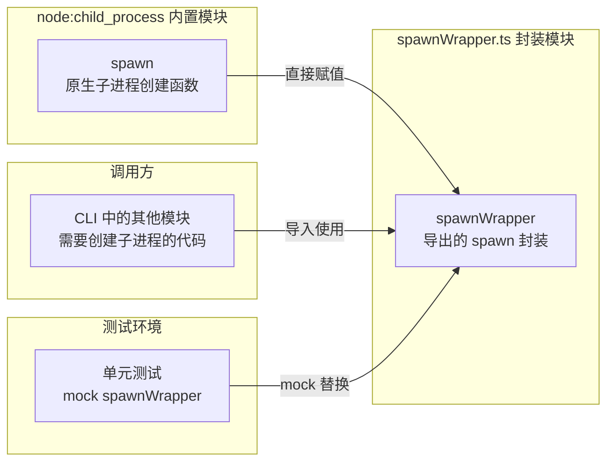

# spawnWrapper.ts

## 概述

`spawnWrapper.ts` 是一个极其简洁的封装模块，它将 Node.js 内置的 `child_process.spawn` 函数重新导出为 `spawnWrapper`。

该模块的核心目的是**为子进程创建提供一个可模拟（mockable）的间接层**。在单元测试中，直接模拟 Node.js 内置模块（如 `child_process`）通常比较困难或不被推荐，通过将 `spawn` 包装在一个独立的模块中，测试代码可以轻松地对 `spawnWrapper` 进行 mock/stub，而不需要修改全局的 `child_process` 模块。

这是一种常见的**依赖注入/间接引用（Indirection）**模式，在需要对系统级 API 进行测试隔离时非常实用。

## 架构图（Mermaid）



## 核心组件

### `spawnWrapper`

```typescript
export const spawnWrapper = spawn;
```

**类型**：与 `child_process.spawn` 完全相同 —— `typeof spawn`。

**功能**：原样导出 `child_process.spawn` 函数。在运行时没有任何额外逻辑或行为变更。

**使用方式**：
```typescript
import { spawnWrapper } from './spawnWrapper.js';

// 用法与 child_process.spawn 完全一致
const child = spawnWrapper('ls', ['-la'], { cwd: '/tmp' });
```

## 依赖关系

### 内部依赖

无内部依赖。

### 外部依赖

| 模块 | 导入内容 | 用途 |
|------|----------|------|
| `node:child_process` | `spawn` | Node.js 原生的子进程创建函数 |

## 关键实现细节

1. **测试友好性**：这是该模块存在的唯一原因。通过引入这一层间接引用，项目中所有需要创建子进程的代码都可以从 `spawnWrapper` 导入而非直接从 `child_process` 导入。在测试时只需 mock 这个模块即可控制所有子进程行为。

2. **零运行时开销**：由于只是简单的变量赋值和重导出，该模块在运行时不会引入任何性能开销。`spawnWrapper` 变量直接指向 `spawn` 函数的引用。

3. **ES 模块兼容性**：使用 `export const` 导出，符合 ES 模块规范。配合项目中的 `.js` 扩展名导入约定（TypeScript 的 `moduleResolution: NodeNext`），确保在编译后的 JavaScript 中正确解析。

4. **常见模式**：在许多 Node.js 项目中都可以看到类似的 wrapper 模块用于封装 `fs`、`child_process`、`os` 等内置模块，以便于测试。这种模式有时也被称为"Seam"（接缝），是 Michael Feathers 在《Working Effectively with Legacy Code》中提出的概念。
