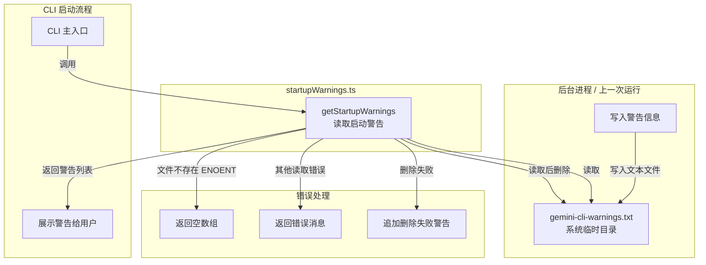

# startupWarnings.ts

## 概述

`startupWarnings.ts` 是 Gemini CLI 中用于 **读取启动时警告信息** 的工具模块。它提供了一种跨进程传递警告消息的简单机制：将警告信息写入系统临时目录下的文本文件 `gemini-cli-warnings.txt`，然后在 CLI 启动时读取并展示给用户。

该模块只暴露了一个异步函数 `getStartupWarnings`，负责读取、解析并清理警告文件。这种"文件信箱"模式通常用于在后台进程（如自动更新检查）与前台 CLI 进程之间传递非紧急的通知信息。

## 架构图（Mermaid）



## 核心组件

### 常量：`warningsFilePath`

```typescript
const warningsFilePath = pathJoin(os.tmpdir(), 'gemini-cli-warnings.txt');
```

警告文件的完整路径，位于操作系统临时目录下。例如：
- **macOS**：`/tmp/gemini-cli-warnings.txt` 或 `/var/folders/.../gemini-cli-warnings.txt`
- **Linux**：`/tmp/gemini-cli-warnings.txt`
- **Windows**：`C:\Users\<user>\AppData\Local\Temp\gemini-cli-warnings.txt`

### 函数：`getStartupWarnings`

```typescript
export async function getStartupWarnings(): Promise<string[]>
```

**功能**：异步读取启动警告文件，解析为警告消息数组，并在读取后尝试删除该文件（一次性消费）。

**返回值**：`Promise<string[]>` — 警告消息字符串数组（可能为空）。

**详细执行流程**：

```mermaid
flowchart TD
    S[开始] --> A[fs.access 检查文件是否存在]
    A -->|文件存在| B[fs.readFile 读取文件内容]
    A -->|抛出异常| C{错误类型判断}

    C -->|ENOENT 文件不存在| D[返回空数组 &#91;&#93;]
    C -->|其他错误 - 权限等| E[返回包含错误描述的数组]

    B --> F[按换行符分割<br/>过滤空行]
    F --> G[fs.unlink 删除警告文件]
    G -->|删除成功| H[返回警告数组]
    G -->|删除失败| I[追加删除失败警告]
    I --> H
```



**错误处理策略**：

| 场景 | 处理方式 | 返回值 |
|------|----------|--------|
| 文件不存在（`ENOENT`） | 静默处理，视为正常情况 | `[]`（空数组） |
| 文件存在但读取出错（权限问题等） | 将错误信息作为警告返回 | `['Error checking/reading warnings file: ...']` |
| 文件读取成功但删除失败 | 追加删除失败警告到结果中 | 原有警告 + `['Warning: Could not delete temporary warnings file.']` |

## 依赖关系

### 内部依赖

| 模块 | 导入内容 | 用途 |
|------|----------|------|
| `@google/gemini-cli-core` | `getErrorMessage` | 从未知错误对象中安全提取错误信息字符串 |

### 外部依赖

| 模块 | 导入内容 | 用途 |
|------|----------|------|
| `node:fs/promises` | 默认导入 `fs` | 异步文件操作（`access`、`readFile`、`unlink`） |
| `node:os` | 默认导入 `os` | 获取系统临时目录路径（`os.tmpdir()`） |
| `node:path` | `join`（别名 `pathJoin`） | 路径拼接 |

## 关键实现细节

1. **一次性消费（Read-Once）模式**：警告文件在被成功读取后会立即被删除（`fs.unlink`），确保同一条警告不会在下次启动时重复展示。这是一种典型的"文件信箱"或"消息队列"简化实现。

2. **异步优先**：整个模块使用 `fs/promises` 异步 API，避免在 CLI 启动路径上进行阻塞式 I/O。这对于保持启动速度非常重要。

3. **优雅的错误降级**：
   - 文件不存在是最常见的正常场景（没有警告需要展示），通过检查 `ENOENT` 错误码来区分。
   - 删除失败不会导致整个函数失败，而是追加一条额外警告。
   - 非文件缺失的读取错误（如权限问题）会被转换为用户可见的警告消息。

4. **文件格式**：警告文件采用简单的纯文本格式，每行一条警告消息，空行会被过滤掉。这种格式简单可靠，便于其他进程追加写入。

5. **跨进程通信机制**：该模块只负责"读取"端。"写入"端通常在其他场景中（如版本更新检查、配置变更检测等），通过简单的文件追加操作将警告写入同一路径。使用系统临时目录作为中转站，因为临时目录的权限通常比较宽松，且对所有进程可访问。

6. **竞态条件考量**：在 `fs.access` 和 `fs.readFile` 之间存在理论上的竞态窗口（文件可能在检查后被删除）。但在实际使用中，由于 CLI 通常是单用户场景，且写入端不会主动删除文件，这种竞态风险极低。即便发生，外层 `catch` 也会妥善处理。
