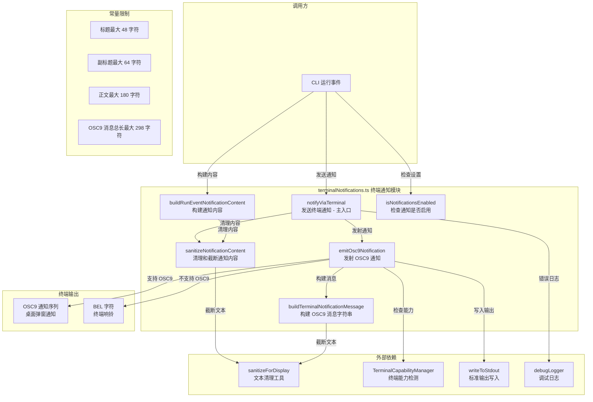
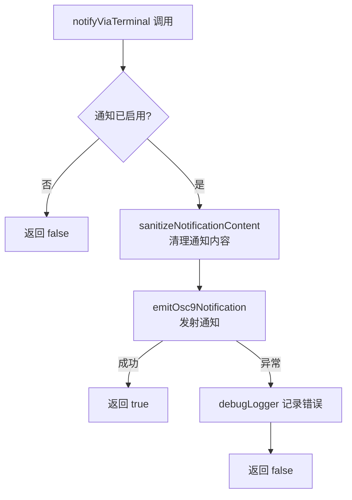

# terminalNotifications.ts

## 概述

`terminalNotifications.ts` 是 Gemini CLI 中用于 **终端桌面通知** 的工具模块。当 CLI 在终端中运行长时间任务时，该模块可以通过终端的 **OSC 9 转义序列**（Operating System Command 9）或 **BEL 字符**（响铃）向用户发送桌面通知，提醒用户关注 CLI 状态。

该模块支持两种通知事件：
- **attention**（需要注意）：CLI 需要用户交互或关注时触发
- **session_complete**（会话完成）：CLI 任务执行完毕时触发

通知功能需要用户在设置中显式启用（`general.enableNotifications = true`），并且依赖终端模拟器对 OSC 9 序列的支持（如 iTerm2、Windows Terminal 等）。

## 架构图（Mermaid）



## 核心组件

### 1. 常量定义

| 常量 | 值 | 说明 |
|------|-----|------|
| `MAX_NOTIFICATION_TITLE_CHARS` | `48` | 通知标题最大字符数 |
| `MAX_NOTIFICATION_SUBTITLE_CHARS` | `64` | 通知副标题最大字符数 |
| `MAX_NOTIFICATION_BODY_CHARS` | `180` | 通知正文最大字符数 |
| `BEL` | `\x07` | ASCII 响铃字符，也作为 OSC 序列的终止符 |
| `OSC9_PREFIX` | `\x1b]9;` | OSC 9 转义序列前缀（ESC + `]9;`） |
| `OSC9_SEPARATOR` | ` \| ` | OSC 9 消息中各部分的分隔符（空格+竖线+空格） |
| `MAX_OSC9_MESSAGE_CHARS` | `298` | OSC 9 消息总长度上限（48 + 64 + 180 + 3 * 2） |

### 2. 类型定义

#### `RunEventNotificationContent`

```typescript
export interface RunEventNotificationContent {
  title: string;
  subtitle?: string;
  body: string;
}
```

通知内容的结构化表示，包含标题、可选副标题和正文。

#### `RunEventNotificationEvent`

```typescript
export type RunEventNotificationEvent =
  | { type: 'attention'; heading?: string; detail?: string }
  | { type: 'session_complete'; detail?: string };
```

通知事件的联合类型，表示两种触发场景：
- **`attention`**：需要用户关注，可自定义标题和详情
- **`session_complete`**：会话完成，可自定义详情

### 3. `sanitizeNotificationContent` — 清理通知内容（内部函数）

```typescript
function sanitizeNotificationContent(
  content: RunEventNotificationContent,
): RunEventNotificationContent
```

**功能**：对通知内容的各个字段进行文本清理和长度截断。

**处理逻辑**：
1. 使用 `sanitizeForDisplay` 对 `title`、`subtitle`、`body` 分别进行清理和截断。
2. 如果清理后标题为空，回退为 `'Gemini CLI'`。
3. 如果清理后副标题为空，设为 `undefined`。
4. 如果清理后正文为空，回退为 `'Open Gemini CLI for details.'`。

### 4. `buildRunEventNotificationContent` — 构建通知内容

```typescript
export function buildRunEventNotificationContent(
  event: RunEventNotificationEvent,
): RunEventNotificationContent
```

**功能**：根据运行事件类型构建结构化的通知内容。

**事件类型映射**：

| 事件类型 | 标题 | 副标题 | 正文 |
|----------|------|--------|------|
| `attention` | `'Gemini CLI needs your attention'` | `event.heading` 或 `'Action required'` | `event.detail` 或 `'Open Gemini CLI to continue.'` |
| `session_complete` | `'Gemini CLI session complete'` | `'Run finished'` | `event.detail` 或 `'The session finished successfully.'` |

### 5. `isNotificationsEnabled` — 检查通知是否启用

```typescript
export function isNotificationsEnabled(settings: LoadedSettings): boolean
```

**功能**：从已加载的配置中读取 `general.enableNotifications` 字段，判断通知功能是否被启用。

**返回值**：只有当 `enableNotifications` 严格等于 `true` 时返回 `true`，其他情况（`undefined`、`false`、未配置）均返回 `false`。这意味着通知功能默认是关闭的，需要用户显式启用。

### 6. `buildTerminalNotificationMessage` — 构建 OSC9 消息（内部函数）

```typescript
function buildTerminalNotificationMessage(
  content: RunEventNotificationContent,
): string
```

**功能**：将结构化的通知内容拼接为 OSC 9 协议要求的单行消息字符串。

**拼接规则**：
1. 将 `title`、`subtitle`（如果存在）、`body` 用 ` | ` 分隔符连接。
2. 过滤掉 falsy 值（如 `undefined` 的 `subtitle`）。
3. 最终对拼接后的字符串再次截断，确保不超过 `MAX_OSC9_MESSAGE_CHARS`。

**示例输出**：
```
Gemini CLI needs your attention | Action required | Please review the changes.
```

### 7. `emitOsc9Notification` — 发射 OSC9 通知（内部函数）

```typescript
function emitOsc9Notification(content: RunEventNotificationContent): void
```

**功能**：通过标准输出发射 OSC 9 终端通知序列。

**执行逻辑**：
1. 调用 `buildTerminalNotificationMessage` 构建消息。
2. 通过 `TerminalCapabilityManager` 检查当前终端是否支持 OSC 9 通知。
3. **支持 OSC 9**：输出完整的 OSC 9 序列 → `ESC]9;<message>BEL`。
4. **不支持 OSC 9**：仅输出 BEL 字符（终端响铃），作为降级方案。

**OSC 9 序列格式**：
```
\x1b]9;<message>\x07
 ^       ^        ^
 ESC     消息内容  BEL(终止符)
```

### 8. `notifyViaTerminal` — 发送终端通知（主入口）

```typescript
export async function notifyViaTerminal(
  notificationsEnabled: boolean,
  content: RunEventNotificationContent,
): Promise<boolean>
```

**功能**：终端通知的公共入口函数，带有启用检查和错误处理。

**参数**：
| 参数 | 类型 | 说明 |
|------|------|------|
| `notificationsEnabled` | `boolean` | 通知功能是否启用 |
| `content` | `RunEventNotificationContent` | 通知内容 |

**返回值**：`Promise<boolean>` — `true` 表示通知发送成功，`false` 表示未发送（功能未启用或发送出错）。

**执行流程**：



## 依赖关系

### 内部依赖

| 模块 | 导入内容 | 用途 |
|------|----------|------|
| `@google/gemini-cli-core` | `debugLogger` | 调试日志记录（记录通知发送失败等错误） |
| `@google/gemini-cli-core` | `writeToStdout` | 向标准输出写入内容（避免干扰 Ink 渲染） |
| `../config/settings.js` | `LoadedSettings` (类型) | 已加载配置类型，用于检查通知设置 |
| `../ui/utils/textUtils.js` | `sanitizeForDisplay` | 文本清理与截断工具函数 |
| `../ui/utils/terminalCapabilityManager.js` | `TerminalCapabilityManager` | 终端能力检测管理器（检测 OSC 9 支持） |

### 外部依赖

无外部第三方依赖。所有依赖均为项目内部模块或 Node.js 内置模块。

## 关键实现细节

1. **OSC 9 协议**：OSC（Operating System Command）9 是一种终端转义序列标准，用于向终端模拟器发送桌面通知。格式为 `ESC]9;<message>BEL`。支持该协议的终端包括：
   - **iTerm2**（macOS）
   - **Windows Terminal**（Windows）
   - **Hyper**
   - **ConEmu / Cmder**
   - 部分其他现代终端模拟器

2. **优雅降级策略**：当终端不支持 OSC 9 时，模块会降级为发送 BEL 字符（`\x07`）。BEL 字符会触发终端的响铃功能（通常表现为系统提示音或终端窗口闪烁），确保用户在任何终端中都能收到某种形式的提醒。

3. **双重清理机制**：通知内容会被清理两次：
   - 第一次在 `buildRunEventNotificationContent` 或 `notifyViaTerminal` 中调用 `sanitizeNotificationContent`，对各字段分别截断。
   - 第二次在 `buildTerminalNotificationMessage` 中对拼接后的完整消息再次截断，确保总长度不超限。

4. **默认关闭设计**：通知功能默认是关闭的（`isNotificationsEnabled` 需要 `enableNotifications === true`）。这是一种保守的设计选择，因为桌面通知可能会打扰用户，特别是在 CI/CD 等自动化环境中。

5. **错误静默处理**：`notifyViaTerminal` 中的错误不会向上抛出，而是通过 `debugLogger` 记录后返回 `false`。通知是一种非关键功能，其失败不应影响 CLI 的核心流程。

6. **内容安全**：所有通知内容都通过 `sanitizeForDisplay` 进行清理，这可以：
   - 移除潜在的控制字符（防止终端转义序列注入）
   - 截断过长的文本（防止 OSC 序列过长导致终端解析问题）
   - 提供空值回退（确保通知始终有有意义的内容）

7. **异步接口设计**：虽然当前的 `emitOsc9Notification` 是同步操作，但 `notifyViaTerminal` 被设计为异步函数（返回 `Promise<boolean>`）。这为未来可能的异步通知机制（如通过系统 API 发送原生通知）预留了扩展空间。

8. **`writeToStdout` 而非 `console.log`**：模块使用 `writeToStdout` 而非 `console.log` 来输出 OSC 序列。这是因为 Gemini CLI 使用 Ink（React-based terminal UI）渲染界面，直接使用 `console.log` 可能会干扰 Ink 的渲染流程，而 `writeToStdout` 是经过协调的低层输出方法。
